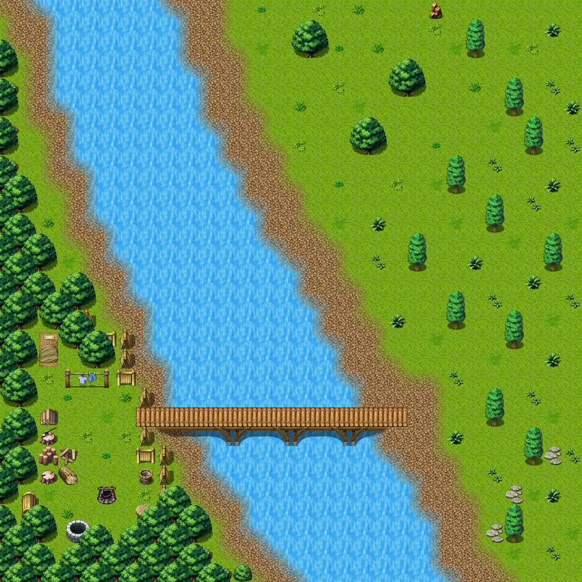

# Waterway5

30×30 tiles · outdoors · part of [World1](index.md)

<label class="lg lg-spawn"><input type="checkbox" data-t="spawn" checked> Monsters / NPCs</label><label class="lg lg-mapchange"><input type="checkbox" data-t="mapchange" checked> Exit to another map</label><label class="lg lg-container"><input type="checkbox" data-t="container" checked> Container</label><label class="lg lg-sign"><input type="checkbox" data-t="sign" checked> Sign</label><label class="lg lg-rest"><input type="checkbox" data-t="rest" checked> Resting place</label><label class="lg lg-key"><input type="checkbox" data-t="key" checked> Blocked / needs key or quest</label><label class="lg lg-script"><input type="checkbox" data-t="script"> Scripted event</label><label class="lg lg-replace"><input type="checkbox" data-t="replace"> Changes after a quest</label>

## Exits

- [Graveyard1](graveyard1.md)
- [Waterway14](waterway14.md)
- [Waterway15](waterway15.md)
- [Waterway4](waterway4.md)
- [Waterway6](waterway6.md)

## Monsters & NPCs here

| Name | HP |
|---|---|
| [Poisonous river frog](../monsters/frog_3.md) | 21 |
| [Strong izthiel](../monsters/izthiel_3.md) | 52 |
| [Izthiel guardian](../monsters/izthiel_4.md) | 54 |
| [Gylew](../monsters/gylew.md) | 180 |
| [Gylew's henchman](../monsters/gylew_henchman.md) | 200 |
| [Gylew's henchman](../monsters/gylew_henchman_aggresive.md) | 219 |

<small>Map ID: `waterway5` · Data from v0.8.18</small>
