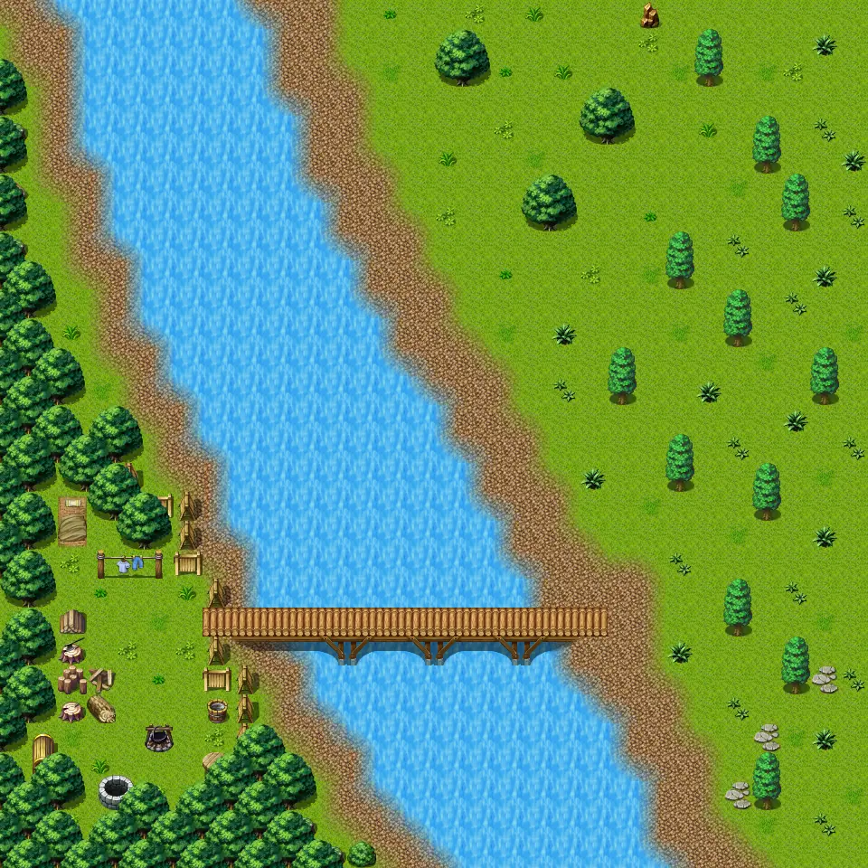

# Waterway5

| | |
|---|---|
| **Map ID** | `waterway5` |
| **Type** | Outdoors |
| **Size** | 30×30 tiles |
| **World map** | [World1](index.md) |
| **Introduced** | v0.7.0 or earlier |
| **NPCs** | 2 |
| **Enemy types** | 4 |
| **Quests** | 2 |

**Waterway5** is an outdoor map. It has 2 NPCs and 4 kinds of enemy. Exits lead to Waterway14, Waterway4, Waterway15, Waterway6 and 1 more.

## Map

<label class="lg"><input type="checkbox" data-t="spawn" checked><b>Red</b>&nbsp;Monsters / NPCs</label><label class="lg"><input type="checkbox" data-t="mapchange" checked><b>Blue</b>&nbsp;Exit to another map</label><label class="lg"><input type="checkbox" data-t="container" checked><b>Yellow</b>&nbsp;Container (click to see contents)</label><label class="lg"><input type="checkbox" data-t="sign" checked><b>Purple</b>&nbsp;Sign</label><label class="lg"><input type="checkbox" data-t="rest" checked><b>Green</b>&nbsp;Resting place</label><label class="lg"><input type="checkbox" data-t="key" checked><b>Orange dashed</b>&nbsp;Blocked until a quest step / item</label><label class="lg"><input type="checkbox" data-t="script"><b>Grey dotted</b>&nbsp;Scripted event</label><label class="lg"><input type="checkbox" data-t="replace"><b>White dotted</b>&nbsp;Changes during a quest</label><label class="lg"><input type="checkbox" data-t="pin" checked><b>Numbers</b>&nbsp;Numbered key points (see the key below the map)</label>

<a class="pin pin-exit" href="#key-1" style="left:88.333%;top:1.667%" title="Exit (north): to [Waterway14](../waterway14.md)">1</a><a class="pin pin-exit" href="#key-2" style="left:53.333%;top:1.667%" title="Exit (north): to [Waterway4](../waterway4.md)">2</a><a class="pin pin-exit" href="#key-3" style="left:98.333%;top:50.000%" title="Exit (east): to [Waterway15](../waterway15.md)">3</a><a class="pin pin-exit" href="#key-4" style="left:90.000%;top:98.333%" title="Exit (south): to [Waterway6](../waterway6.md)">4</a><a class="pin pin-exit" href="#key-5" style="left:1.667%;top:6.667%" title="Exit (northwest): to [Graveyard1](../graveyard1.md)">5</a><a class="pin pin-exit" href="#key-6" style="left:1.667%;top:1.667%" title="Exit (northwest): to [Waterway4](../waterway4.md)">6</a><a class="pin pin-npc" href="#key-7" style="left:11.667%;top:75.000%" title="[Gylew](../../monsters/gylew.md): 1 quest">7</a><a class="pin pin-npc" href="#key-8" style="left:8.333%;top:85.000%" title="[Gylew&#x27;s henchman](../../monsters/gylew_henchman.md): NPC">8</a><a class="pin pin-script" href="#key-9" style="left:15.000%;top:75.000%" title="Quest trigger: Scripted event: advances the quest: The odd coin collector to stage 63 (“I killed Gylew and should return to Forenza with Gylew&#x27;s key.”)">9</a><a class="pin pin-key" href="#key-10" style="left:25.000%;top:71.667%" title="Blocked passage: Unlocked during the quest: Search for Andor (stage 1: “My father Mikhail says that Andor has not been home since yesterday. I should go look for him in the village.”)">10</a>

??? abstract "Key to the numbers on the map"

    | # | What | Details |
    |---|---|---|
    | 1 | Exit (north) | to [Waterway14](../waterway14.md) |
    | 2 | Exit (north) | to [Waterway4](../waterway4.md) |
    | 3 | Exit (east) | to [Waterway15](../waterway15.md) |
    | 4 | Exit (south) | to [Waterway6](../waterway6.md) |
    | 5 | Exit (northwest) | to [Graveyard1](../graveyard1.md) |
    | 6 | Exit (northwest) | to [Waterway4](../waterway4.md) |
    | 7 | [Gylew](../monsters/gylew.md) | 1 quest |
    | 8 | [Gylew's henchman](../monsters/gylew_henchman.md) | NPC |
    | 9 | Quest trigger | Scripted event: advances the quest: The odd coin collector to stage 63 (“I killed Gylew and should return to Forenza with Gylew's key.”) |
    | 10 | Blocked passage | Unlocked during the quest: Search for Andor (stage 1: “My father Mikhail says that Andor has not been home since yesterday. I should go look for him in the village.”) |

Verified against v0.8.18 map data.

## Connections

| Direction | Leads to | Region there | Map # |
|---|---|---|---|
| North | [Waterway14](waterway14.md) | – | 1 |
| North | [Waterway4](waterway4.md) | – | 2 |
| East | [Waterway15](waterway15.md) | – | 3 |
| South | [Waterway6](waterway6.md) | Brimhaven | 4 |
| Northwest | [Graveyard1](graveyard1.md) | – | 5 |
| Northwest | [Waterway4](waterway4.md) | – | 6 |

## NPCs

- [Gylew](../monsters/gylew.md) — quests: [The odd coin collector](../quests/odd_coin_collector.md) (#7)
- [Gylew's henchman](../monsters/gylew_henchman.md) (#8)

## Enemies

| Enemy | HP | Damage | Up to | Notes |
|---|---|---|---|---|
| [Poisonous river frog](../monsters/frog_3.md) | 21 | 0–5 | 4 | – |
| [Strong izthiel](../monsters/izthiel_3.md) | 52 | 2–7 | 4 | – |
| [Izthiel guardian](../monsters/izthiel_4.md) | 54 | 3–7 | 4 | – |
| [Gylew's henchman](../monsters/gylew_henchman_aggresive.md) | 219 | 14–19 | 1 | appears later, during a quest |

<small>“Up to” is the most that can be alive at once from the spawn areas on this map.</small>

## Quests

- [Search for Andor](../quests/andor.md): blocked passage opens at stage 1
- [The odd coin collector](../quests/odd_coin_collector.md): [Gylew](../monsters/gylew.md) is involved; something on this map advances it; stepping on a trigger here sets stage 63
- [laeroth_nondisplay (hidden flag)](../quests/laeroth_nondisplay.md): [Gylew](../monsters/gylew.md) is involved
- [Placeholder for hidden quest stages (not displayed) (hidden flag)](../quests/nondisplay.md): [Gylew](../monsters/gylew.md) is involved

## Points of interest

- **Quest trigger** (#9): Scripted event: advances the quest: The odd coin collector to stage 63 (“I killed Gylew and should return to Forenza with Gylew's key.”)
- **Blocked passage** (#10): Unlocked during the quest: Search for Andor (stage 1: “My father Mikhail says that Andor has not been home since yesterday. I should go look for him in the village.”)

## Version history

| Version | Change |
|---|---|
| [v0.7.0](../versions/0.7.0.md) | Present in v0.7.0 (earliest release tracked) |
| [v0.7.1](../versions/0.7.1.md) | map layout or objects changed |
| [v0.7.2](../versions/0.7.2.md) | map layout or objects changed |
| [v0.8.2](../versions/0.8.2.md) | map layout or objects changed |
| [v0.8.11](../versions/0.8.11.md) | map layout or objects changed |
| [v0.8.12.1](../versions/0.8.12.1.md) | map layout or objects changed |

Verified against v0.8.18 and every earlier release back to v0.7.0 (game data compared release by release).

## Community notes

<small>Written by players, not generated from game data. **Observations**: what players notice in-game · **Lore**: the in-world story · **Trivia**: real-world facts, references, development history · **Theory / speculation**: unconfirmed ideas; may just be unfinished content</small>

### Observations

*Nothing here yet. Know something? [Add it](https://github.com/asdfghjkl628/Andor-s-Trail-Wikiiii/new/main/notes/maps?filename=waterway5.md&value=%23%23%20Observations%0A%0A%3C%21--%20what%20players%20notice%20in-game%20--%3E%0A%0A%23%23%20Lore%0A%0A%3C%21--%20the%20in-world%20story%20--%3E%0A%0A%23%23%20Trivia%0A%0A%3C%21--%20real-world%20facts%2C%20references%2C%20development%20history%20--%3E%0A%0A%23%23%20Theory%20/%20speculation%0A%0A%3C%21--%20unconfirmed%20ideas%3B%20may%20just%20be%20unfinished%20content%20--%3E%0A).*

### Lore

*Nothing here yet. Know something? [Add it](https://github.com/asdfghjkl628/Andor-s-Trail-Wikiiii/new/main/notes/maps?filename=waterway5.md&value=%23%23%20Observations%0A%0A%3C%21--%20what%20players%20notice%20in-game%20--%3E%0A%0A%23%23%20Lore%0A%0A%3C%21--%20the%20in-world%20story%20--%3E%0A%0A%23%23%20Trivia%0A%0A%3C%21--%20real-world%20facts%2C%20references%2C%20development%20history%20--%3E%0A%0A%23%23%20Theory%20/%20speculation%0A%0A%3C%21--%20unconfirmed%20ideas%3B%20may%20just%20be%20unfinished%20content%20--%3E%0A).*

### Trivia

*Nothing here yet. Know something? [Add it](https://github.com/asdfghjkl628/Andor-s-Trail-Wikiiii/new/main/notes/maps?filename=waterway5.md&value=%23%23%20Observations%0A%0A%3C%21--%20what%20players%20notice%20in-game%20--%3E%0A%0A%23%23%20Lore%0A%0A%3C%21--%20the%20in-world%20story%20--%3E%0A%0A%23%23%20Trivia%0A%0A%3C%21--%20real-world%20facts%2C%20references%2C%20development%20history%20--%3E%0A%0A%23%23%20Theory%20/%20speculation%0A%0A%3C%21--%20unconfirmed%20ideas%3B%20may%20just%20be%20unfinished%20content%20--%3E%0A).*

### Theory / speculation

*Nothing here yet. Know something? [Add it](https://github.com/asdfghjkl628/Andor-s-Trail-Wikiiii/new/main/notes/maps?filename=waterway5.md&value=%23%23%20Observations%0A%0A%3C%21--%20what%20players%20notice%20in-game%20--%3E%0A%0A%23%23%20Lore%0A%0A%3C%21--%20the%20in-world%20story%20--%3E%0A%0A%23%23%20Trivia%0A%0A%3C%21--%20real-world%20facts%2C%20references%2C%20development%20history%20--%3E%0A%0A%23%23%20Theory%20/%20speculation%0A%0A%3C%21--%20unconfirmed%20ideas%3B%20may%20just%20be%20unfinished%20content%20--%3E%0A).*

??? info "Technical information"

    | | |
    |---|---|
    | Map ID | `waterway5` |
    | File | `res/xml/waterway5.tmx` |
    | Size | 30×30 tiles (960×960 px) |
    | outdoors property | 1 |
    | Layers drawn | ground, objects, above |
    | Tilesets | map_bed_1, map_border_1, map_bridge_1, map_bridge_2, map_broken_1, map_cavewall_1, map_cavewall_2, map_cavewall_3, map_cavewall_4, map_chair_table_1, map_chair_table_2, map_crate_1, map_cupboard_1, map_curtain_1, map_entrance_1, map_entrance_2, map_fence_1, map_fence_2, map_fence_3, map_fence_4, map_ground_1, map_ground_2, map_ground_3, map_ground_4, map_ground_5, map_ground_6, map_ground_7, map_ground_8, map_house_1, map_house_2, map_indoor_1, map_indoor_2, map_kitchen_1, map_outdoor_1, map_pillar_1, map_pillar_2, map_plant_1, map_plant_2, map_rock_1, map_rock_2, map_roof_1, map_roof_2, map_roof_3, map_shop_1, map_sign_ladder_1, map_table_1, map_trail_1, map_transition_1, map_transition_2, map_transition_3, map_transition_4, map_transition_5, map_tree_1, map_tree_2, map_wall_1, map_wall_2, map_wall_3, map_wall_4, map_window_1, map_window_2 |
    | Map objects | spawn: 8, mapchange: 6, script: 2, key: 1 |
    | World map position | segment `world1`, x 380, y 197 |

<small>Data from v0.8.18</small>
