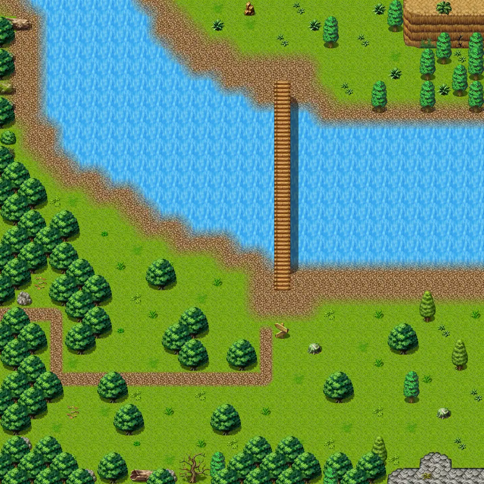
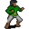

# Waterway 6

| | |
|---|---|
| **Map ID** | `waterway6` |
| **Region** | Near Brimhaven (settlement) |
| **Type** | Outdoors |
| **Size** | 30×30 tiles |
| **World map** | [World 1](index.md) |
| **Introduced** | v0.7.0 or earlier |
| **NPCs** | 1 |
| **Enemy types** | 7 |
| **Quests** | 2 |

**Waterway 6** is an outdoor map, near Brimhaven (settlement). It has 1 NPC and 7 kinds of enemy. Exits lead to Waterway 15, Waterway 5, Waterway 7, Waytobrimhaven 3.

## Map

<label class="lg"><input type="checkbox" data-t="spawn" checked><b>Red</b>&nbsp;Monsters / NPCs</label><label class="lg"><input type="checkbox" data-t="mapchange" checked><b>Blue</b>&nbsp;Exit to another map</label><label class="lg"><input type="checkbox" data-t="container" checked><b>Yellow</b>&nbsp;Container (click to see contents)</label><label class="lg"><input type="checkbox" data-t="sign" checked><b>Purple</b>&nbsp;Sign</label><label class="lg"><input type="checkbox" data-t="rest" checked><b>Green</b>&nbsp;Resting place</label><label class="lg"><input type="checkbox" data-t="key" checked><b>Orange dashed</b>&nbsp;Blocked until a quest step / item</label><label class="lg"><input type="checkbox" data-t="script"><b>Grey dotted</b>&nbsp;Scripted event</label><label class="lg"><input type="checkbox" data-t="replace"><b>White dotted</b>&nbsp;Changes during a quest</label><label class="lg"><input type="checkbox" data-t="pin" checked><b>Numbers</b>&nbsp;Numbered key points (see the key below the map)</label>

<a class="pin pin-exit" href="#key-1" style="left:68.333%;top:1.667%" title="Exit (north): to [Waterway 15](waterway15.md)">1</a><a class="pin pin-exit" href="#key-2" style="left:40.000%;top:1.667%" title="Exit (north): to [Waterway 5](waterway5.md)">2</a><a class="pin pin-exit" href="#key-3" style="left:98.333%;top:76.667%" title="Exit (east): to [Waterway 7](waterway7.md)">3</a><a class="pin pin-exit" href="#key-4" style="left:1.667%;top:65.000%" title="Exit (west): to [Waytobrimhaven 3](waytobrimhaven3.md)">4</a><a id="pin-npc-tt_seraphina" class="pin pin-npc" href="#key-5" style="left:8.333%;top:88.333%" title="[Sly Seraphina](../../monsters/tt_seraphina.md): 2 quests">5</a><a class="pin pin-sign" href="#key-6" style="left:58.333%;top:68.333%" title="Sign: “South: Brimhaven
West: Loneford
East: Lake Laeroth
Southeast: Brightport”">6</a><a class="pin pin-key" href="#key-7" style="left:8.553%;top:85.834%" title="Blocked passage: Unlocked during the quest: Search for Andor (stage 1: “My father Mikhail says that Andor has not been home since yesterday. I should go look for him in the village.”)">7</a>

??? abstract "Key to the numbers on the map"

    | # | What | Details |
    |---|---|---|
    | 1 | Exit (north) | to [Waterway 15](waterway15.md) |
    | 2 | Exit (north) | to [Waterway 5](waterway5.md) |
    | 3 | Exit (east) | to [Waterway 7](waterway7.md) |
    | 4 | Exit (west) | to [Waytobrimhaven 3](waytobrimhaven3.md) |
    | 5 | [Sly Seraphina](../monsters/tt_seraphina.md) | 2 quests |
    | 6 | Sign | “South: Brimhaven West: Loneford East: Lake Laeroth Southeast: Brightport” |
    | 7 | Blocked passage | Unlocked during the quest: Search for Andor (stage 1: “My father Mikhail says that Andor has not been home since yesterday. I should go look for him in the village.”) |

Verified against v0.8.18 map data.

## Connections

| Direction | Leads to | Region there | Map # |
|---|---|---|---|
| North | [Waterway 15](waterway15.md) | – | 1 |
| North | [Waterway 5](waterway5.md) | – | 2 |
| East | [Waterway 7](waterway7.md) | – | 3 |
| West | [Waytobrimhaven 3](waytobrimhaven3.md) | Brimhaven | 4 |

## NPCs

- [Sly Seraphina](../monsters/tt_seraphina.md) — quests: [Search for Andor](../quests/andor.md), [Troubling times](../quests/troubling_times.md) (#5)

## Enemies

| Enemy | HP | Damage | Up to | Notes |
|---|---|---|---|---|
| [Strong larval burrower](../monsters/burrower_3.md) | 44 | 1–25 | 2 | – |
| [Izthiel](../monsters/izthiel_2.md) | 45 | 2–7 | 4 | – |
| [Spotted erumen lizard](../monsters/erumen_2.md) | 45 | 2–9 | 3 | shares spawn with Young erumen lizard |
| [Young erumen lizard](../monsters/erumen_1.md) | 45 | 2–9 | 3 | shares spawn with Spotted erumen lizard |
| [Strong izthiel](../monsters/izthiel_3.md) | 52 | 2–7 | 4 | – |
| [Seraphina's bodyguard](../monsters/tt_guys.md) | 52 | 8–15 | 5 | appears later, during a quest |
| [Izthiel guardian](../monsters/izthiel_4.md) | 54 | 3–7 | 2 | – |

<small>“Up to” is the most that can be alive at once from the spawn areas on this map.</small>

## Quests

- [Search for Andor](../quests/andor.md): [Sly Seraphina](../monsters/tt_seraphina.md) is involved; blocked passage opens at stage 1
- [Troubling times](../quests/troubling_times.md): [Sly Seraphina](../monsters/tt_seraphina.md) is involved

## Points of interest

- **Sign** (#6): “South: Brimhaven West: Loneford East: Lake Laeroth Southeast: Brightport”
- **Blocked passage** (#7): Unlocked during the quest: Search for Andor (stage 1: “My father Mikhail says that Andor has not been home since yesterday. I should go look for him in the village.”)

## Version history

| Version | Change |
|---|---|
| [v0.7.0](../versions/0.7.0.md) | Present in v0.7.0 (earliest release tracked) |
| [v0.7.1](../versions/0.7.1.md) | Map layout or objects changed |
| [v0.7.2](../versions/0.7.2.md) | Map layout or objects changed |
| [v0.7.4](../versions/0.7.4.md) | Map layout or objects changed |
| [v0.8.2](../versions/0.8.2.md) | Map layout or objects changed |
| [v0.8.12.1](../versions/0.8.12.1.md) | Map layout or objects changed |
| [v0.8.13](../versions/0.8.13.md) | Map layout or objects changed |

Verified against v0.8.18 and every earlier release back to v0.7.0 (game data compared release by release).

## Community notes

<small>Written by players, not generated from game data. **Observations**: what players notice in-game · **Lore**: the in-world story · **Trivia**: real-world facts, references, development history · **Theory / speculation**: unconfirmed ideas; may just be unfinished content</small>

### Observations

*No notes yet. Contributions are welcome: [add a note](https://github.com/asdfghjkl628/Andor-s-Trail-Wikiiii/new/main/notes/maps?filename=waterway6.md&value=%23%23%20Observations%0A%0A%3C%21--%20what%20players%20notice%20in-game%20--%3E%0A%0A%23%23%20Lore%0A%0A%3C%21--%20the%20in-world%20story%20--%3E%0A%0A%23%23%20Trivia%0A%0A%3C%21--%20real-world%20facts%2C%20references%2C%20development%20history%20--%3E%0A%0A%23%23%20Theory%20/%20speculation%0A%0A%3C%21--%20unconfirmed%20ideas%3B%20may%20just%20be%20unfinished%20content%20--%3E%0A).*

### Lore

*No notes yet. Contributions are welcome: [add a note](https://github.com/asdfghjkl628/Andor-s-Trail-Wikiiii/new/main/notes/maps?filename=waterway6.md&value=%23%23%20Observations%0A%0A%3C%21--%20what%20players%20notice%20in-game%20--%3E%0A%0A%23%23%20Lore%0A%0A%3C%21--%20the%20in-world%20story%20--%3E%0A%0A%23%23%20Trivia%0A%0A%3C%21--%20real-world%20facts%2C%20references%2C%20development%20history%20--%3E%0A%0A%23%23%20Theory%20/%20speculation%0A%0A%3C%21--%20unconfirmed%20ideas%3B%20may%20just%20be%20unfinished%20content%20--%3E%0A).*

### Trivia

*No notes yet. Contributions are welcome: [add a note](https://github.com/asdfghjkl628/Andor-s-Trail-Wikiiii/new/main/notes/maps?filename=waterway6.md&value=%23%23%20Observations%0A%0A%3C%21--%20what%20players%20notice%20in-game%20--%3E%0A%0A%23%23%20Lore%0A%0A%3C%21--%20the%20in-world%20story%20--%3E%0A%0A%23%23%20Trivia%0A%0A%3C%21--%20real-world%20facts%2C%20references%2C%20development%20history%20--%3E%0A%0A%23%23%20Theory%20/%20speculation%0A%0A%3C%21--%20unconfirmed%20ideas%3B%20may%20just%20be%20unfinished%20content%20--%3E%0A).*

### Theory / speculation

*No notes yet. Contributions are welcome: [add a note](https://github.com/asdfghjkl628/Andor-s-Trail-Wikiiii/new/main/notes/maps?filename=waterway6.md&value=%23%23%20Observations%0A%0A%3C%21--%20what%20players%20notice%20in-game%20--%3E%0A%0A%23%23%20Lore%0A%0A%3C%21--%20the%20in-world%20story%20--%3E%0A%0A%23%23%20Trivia%0A%0A%3C%21--%20real-world%20facts%2C%20references%2C%20development%20history%20--%3E%0A%0A%23%23%20Theory%20/%20speculation%0A%0A%3C%21--%20unconfirmed%20ideas%3B%20may%20just%20be%20unfinished%20content%20--%3E%0A).*

??? info "Technical information"

    | | |
    |---|---|
    | Map ID | `waterway6` |
    | File | `res/xml/waterway6.tmx` |
    | Size | 30×30 tiles (960×960 px) |
    | outdoors property | 1 |
    | Layers drawn | ground, objects, above, top |
    | Tilesets | map_bed_1, map_border_1, map_bridge_1, map_bridge_2, map_broken_1, map_cavewall_1, map_cavewall_2, map_cavewall_3, map_cavewall_4, map_chair_table_1, map_chair_table_2, map_crate_1, map_cupboard_1, map_curtain_1, map_entrance_1, map_entrance_2, map_fence_1, map_fence_2, map_fence_3, map_fence_4, map_ground_1, map_ground_2, map_ground_3, map_ground_4, map_ground_5, map_ground_6, map_ground_7, map_ground_8, map_house_1, map_house_2, map_indoor_1, map_indoor_2, map_kitchen_1, map_outdoor_1, map_pillar_1, map_pillar_2, map_plant_1, map_plant_2, map_rock_1, map_rock_2, map_roof_1, map_roof_2, map_roof_3, map_shop_1, map_sign_ladder_1, map_table_1, map_trail_1, map_transition_1, map_transition_2, map_transition_3, map_transition_4, map_transition_5, map_tree_1, map_tree_2, map_wall_1, map_wall_2, map_wall_3, map_wall_4, map_window_1, map_window_2 |
    | Map objects | spawn: 9, mapchange: 4, sign: 1, key: 1 |
    | World map position | segment `world1`, x 395, y 228 |

<small>Data from v0.8.18</small>
