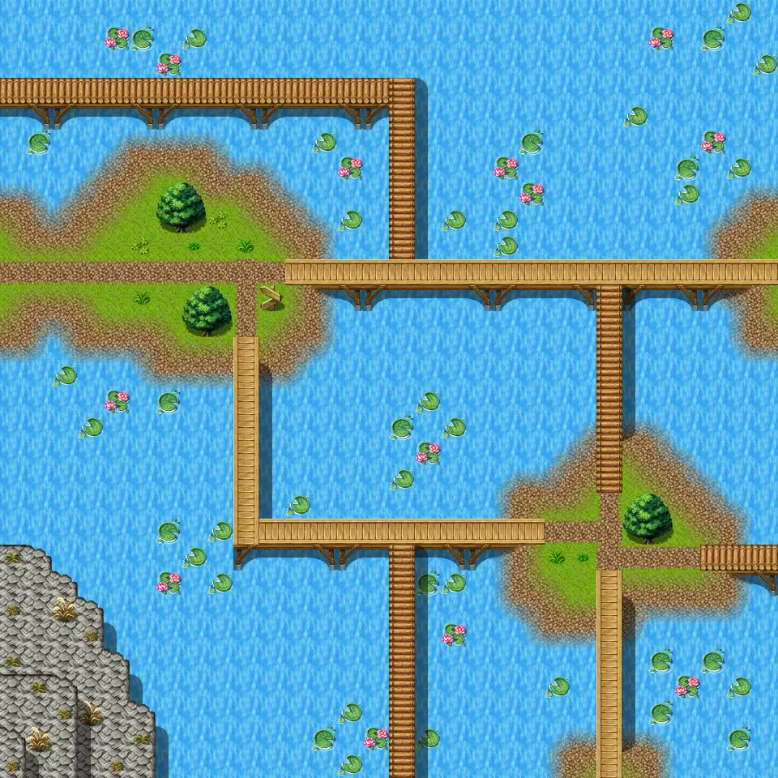

# Waterway9

30×30 tiles · outdoors · part of [World1](index.md)

<label class="lg"><input type="checkbox" data-t="spawn" checked><b>Red</b>&nbsp;Monsters / NPCs</label><label class="lg"><input type="checkbox" data-t="mapchange" checked><b>Blue</b>&nbsp;Exit to another map</label><label class="lg"><input type="checkbox" data-t="container" checked><b>Yellow</b>&nbsp;Container (click to see contents)</label><label class="lg"><input type="checkbox" data-t="sign" checked><b>Purple</b>&nbsp;Sign</label><label class="lg"><input type="checkbox" data-t="rest" checked><b>Green</b>&nbsp;Resting place</label><label class="lg"><input type="checkbox" data-t="key" checked><b>Orange dashed</b>&nbsp;Blocked until a quest step / item</label><label class="lg"><input type="checkbox" data-t="script"><b>Grey dotted</b>&nbsp;Scripted event</label><label class="lg"><input type="checkbox" data-t="replace"><b>White dotted</b>&nbsp;Changes during a quest</label>

## Exits

- [Waterway10](waterway10.md)
- [Waterway11](waterway11.md)
- [Waterway8](waterway8.md)

## Monsters & NPCs here

| Name | HP |
|---|---|
| [Erumen lizard](../monsters/erumen_3.md) | 45 |
| [Izthiel](../monsters/izthiel_2.md) | 45 |
| [Strong izthiel](../monsters/izthiel_3.md) | 52 |
| [Izthiel guardian](../monsters/izthiel_4.md) | 54 |
| [Strong erumen lizard](../monsters/erumen_4.md) | 79 |
| [Vile erumen lizard](../monsters/erumen_5.md) | 89 |
| [Tough erumen lizard](../monsters/erumen_6.md) | 91 |
| [Hardened erumen lizard](../monsters/erumen_7.md) | 93 |

<small>Map ID: `waterway9` · Data from v0.8.18</small>
