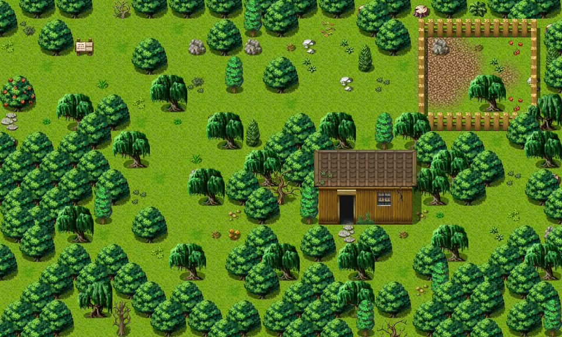
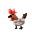
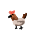
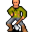

# Waterway forest 2

| | |
|---|---|
| **Map ID** | `waterway_forest2` |
| **Region** | Near Brightport (settlement) |
| **Type** | Outdoors |
| **Size** | 30×18 tiles |
| **World map** | [World 1](index.md) |
| **Introduced** | [v0.8.11](../versions/0.8.11.md) |
| **NPCs** | 2 |
| **Enemy types** | 3 |
| **Quests** | 0 |

**Waterway forest 2** is an outdoor map, near Brightport (settlement). It has 2 NPCs and 3 kinds of enemy. Exits lead to Waterway forest 1, Waytobrightport 22, Korhald cave outdoor 1, Waterway forest 2 house.

## Map

<label class="lg"><input type="checkbox" data-t="spawn" checked><b>Red</b>&nbsp;Monsters / NPCs</label><label class="lg"><input type="checkbox" data-t="mapchange" checked><b>Blue</b>&nbsp;Exit to another map</label><label class="lg"><input type="checkbox" data-t="container" checked><b>Yellow</b>&nbsp;Container (click to see contents)</label><label class="lg"><input type="checkbox" data-t="sign" checked><b>Purple</b>&nbsp;Sign</label><label class="lg"><input type="checkbox" data-t="rest" checked><b>Green</b>&nbsp;Resting place</label><label class="lg"><input type="checkbox" data-t="key" checked><b>Orange dashed</b>&nbsp;Blocked until a quest step / item</label><label class="lg"><input type="checkbox" data-t="script"><b>Grey dotted</b>&nbsp;Scripted event</label><label class="lg"><input type="checkbox" data-t="replace"><b>White dotted</b>&nbsp;Changes during a quest</label><label class="lg"><input type="checkbox" data-t="pin" checked><b>Numbers</b>&nbsp;Numbered key points (see the key below the map)</label>

<a class="pin pin-exit" href="#key-1" style="left:18.333%;top:2.778%" title="Exit (north): to [Waterway forest 1](waterway_forest1.md)">1</a><a class="pin pin-exit" href="#key-2" style="left:20.000%;top:97.222%" title="Exit (south): to [Waytobrightport 22](waytobrightport22.md)">2</a><a class="pin pin-exit" href="#key-3" style="left:1.667%;top:88.889%" title="Exit (southwest): to [Korhald cave outdoor 1](korhald_cave_outdoor1.md)">3</a><a class="pin pin-exit" href="#key-4" style="left:1.667%;top:25.000%" title="Exit (west): to [Korhald cave outdoor 1](korhald_cave_outdoor1.md)">4</a><a class="pin pin-exit" href="#key-5" style="left:61.667%;top:63.889%" title="Exit (door): to [Waterway forest 2 house](waterway_forest2_house.md)">5</a><a id="pin-npc-guard_dog" class="pin pin-npc" href="#key-6" style="left:71.667%;top:19.444%" title="[Guard dog](../../monsters/guard_dog.md): NPC">6</a><a id="pin-npc-isolated_man" class="pin pin-npc" href="#key-7" style="left:71.667%;top:69.444%" title="[Isolated man](../../monsters/isolated_man.md): NPC">7</a><a class="pin pin-sign" href="#key-8" style="left:15.000%;top:13.889%" title="Sign: “Beware of dogs! Trespassers are not tolerated.”">8</a>

??? abstract "Key to the numbers on the map"

    | # | What | Details |
    |---|---|---|
    | 1 | Exit (north) | to [Waterway forest 1](waterway_forest1.md) |
    | 2 | Exit (south) | to [Waytobrightport 22](waytobrightport22.md) |
    | 3 | Exit (southwest) | to [Korhald cave outdoor 1](korhald_cave_outdoor1.md) |
    | 4 | Exit (west) | to [Korhald cave outdoor 1](korhald_cave_outdoor1.md) |
    | 5 | Exit (door) | to [Waterway forest 2 house](waterway_forest2_house.md) |
    | 6 | [Guard dog](../monsters/guard_dog.md) | NPC |
    | 7 | [Isolated man](../monsters/isolated_man.md) | NPC |
    | 8 | Sign | “Beware of dogs! Trespassers are not tolerated.” |

Verified against v0.8.18 map data.

## Connections

| Direction | Leads to | Region there | Map # |
|---|---|---|---|
| North | [Waterway forest 1](waterway_forest1.md) | – | 1 |
| South | [Waytobrightport 22](waytobrightport22.md) | Brightport | 2 |
| Southwest | [Korhald cave outdoor 1](korhald_cave_outdoor1.md) | – | 3 |
| West | [Korhald cave outdoor 1](korhald_cave_outdoor1.md) | – | 4 |
| Door | [Waterway forest 2 house](waterway_forest2_house.md) | – | 5 |

## NPCs

- [Guard dog](../monsters/guard_dog.md) (#6)
- [Isolated man](../monsters/isolated_man.md) (#7)

## Enemies

| Enemy | HP | Damage | Up to | Notes |
|---|---|---|---|---|
| [Hardshell beetle](../monsters/hardshell_beetle.md) | 25 | 0–5 | 2 | – |
| [Erumen lizard](../monsters/erumen_3.md) | 45 | 2–9 | 4 | shares spawn with Strong erumen lizard |
| [Strong erumen lizard](../monsters/erumen_4.md) | 79 | 2–9 | 4 | shares spawn with Erumen lizard |

<small>“Up to” is the most that can be alive at once from the spawn areas on this map.</small>

**Scenery:** [Chicken](../monsters/chicken.md), [Rooster](../monsters/rooster.md)

## Points of interest

- **Sign** (#8): “Beware of dogs! Trespassers are not tolerated.”

## Version history

| Version | Change |
|---|---|
| [v0.8.11](../versions/0.8.11.md) | Added |
| [v0.8.12.1](../versions/0.8.12.1.md) | Map layout or objects changed |
| [v0.8.16.1](../versions/0.8.16.1.md) | Map layout or objects changed |

Verified against v0.8.18 and every earlier release back to v0.7.0 (game data compared release by release).

## Community notes

<small>Written by players, not generated from game data. **Observations**: what players notice in-game · **Lore**: the in-world story · **Trivia**: real-world facts, references, development history · **Theory / speculation**: unconfirmed ideas; may just be unfinished content</small>

### Observations

*No notes yet. Contributions are welcome: [add a note](https://github.com/asdfghjkl628/Andor-s-Trail-Wikiiii/new/main/notes/maps?filename=waterway_forest2.md&value=%23%23%20Observations%0A%0A%3C%21--%20what%20players%20notice%20in-game%20--%3E%0A%0A%23%23%20Lore%0A%0A%3C%21--%20the%20in-world%20story%20--%3E%0A%0A%23%23%20Trivia%0A%0A%3C%21--%20real-world%20facts%2C%20references%2C%20development%20history%20--%3E%0A%0A%23%23%20Theory%20/%20speculation%0A%0A%3C%21--%20unconfirmed%20ideas%3B%20may%20just%20be%20unfinished%20content%20--%3E%0A).*

### Lore

*No notes yet. Contributions are welcome: [add a note](https://github.com/asdfghjkl628/Andor-s-Trail-Wikiiii/new/main/notes/maps?filename=waterway_forest2.md&value=%23%23%20Observations%0A%0A%3C%21--%20what%20players%20notice%20in-game%20--%3E%0A%0A%23%23%20Lore%0A%0A%3C%21--%20the%20in-world%20story%20--%3E%0A%0A%23%23%20Trivia%0A%0A%3C%21--%20real-world%20facts%2C%20references%2C%20development%20history%20--%3E%0A%0A%23%23%20Theory%20/%20speculation%0A%0A%3C%21--%20unconfirmed%20ideas%3B%20may%20just%20be%20unfinished%20content%20--%3E%0A).*

### Trivia

*No notes yet. Contributions are welcome: [add a note](https://github.com/asdfghjkl628/Andor-s-Trail-Wikiiii/new/main/notes/maps?filename=waterway_forest2.md&value=%23%23%20Observations%0A%0A%3C%21--%20what%20players%20notice%20in-game%20--%3E%0A%0A%23%23%20Lore%0A%0A%3C%21--%20the%20in-world%20story%20--%3E%0A%0A%23%23%20Trivia%0A%0A%3C%21--%20real-world%20facts%2C%20references%2C%20development%20history%20--%3E%0A%0A%23%23%20Theory%20/%20speculation%0A%0A%3C%21--%20unconfirmed%20ideas%3B%20may%20just%20be%20unfinished%20content%20--%3E%0A).*

### Theory / speculation

*No notes yet. Contributions are welcome: [add a note](https://github.com/asdfghjkl628/Andor-s-Trail-Wikiiii/new/main/notes/maps?filename=waterway_forest2.md&value=%23%23%20Observations%0A%0A%3C%21--%20what%20players%20notice%20in-game%20--%3E%0A%0A%23%23%20Lore%0A%0A%3C%21--%20the%20in-world%20story%20--%3E%0A%0A%23%23%20Trivia%0A%0A%3C%21--%20real-world%20facts%2C%20references%2C%20development%20history%20--%3E%0A%0A%23%23%20Theory%20/%20speculation%0A%0A%3C%21--%20unconfirmed%20ideas%3B%20may%20just%20be%20unfinished%20content%20--%3E%0A).*

??? info "Technical information"

    | | |
    |---|---|
    | Map ID | `waterway_forest2` |
    | File | `res/xml/waterway_forest2.tmx` |
    | Size | 30×18 tiles (960×576 px) |
    | outdoors property | 1 |
    | Layers drawn | base, ground, objects, above, top |
    | Tilesets | map_bed_1, map_border_1, map_bridge_1, map_bridge_2, map_broken_1, map_cavewall_1, map_cavewall_2, map_cavewall_3, map_cavewall_4, map_chair_table_1, map_chair_table_2, map_crate_1, map_cupboard_1, map_curtain_1, map_entrance_1, map_entrance_2, map_fence_1, map_fence_2, map_fence_3, map_fence_4, map_ground_1, map_ground_2, map_ground_3, map_ground_4, map_ground_5, map_ground_6, map_ground_7, map_ground_8, map_house_1, map_house_2, map_indoor_1, map_indoor_2, map_kitchen_1, map_outdoor_1, map_pillar_1, map_pillar_2, map_plant_1, map_plant_2, map_rock_1, map_rock_2, map_roof_1, map_roof_2, map_roof_3, map_shop_1, map_sign_ladder_1, map_table_1, map_trail_1, map_transition_1, map_transition_2, map_transition_3, map_transition_4, map_transition_5, map_tree_1, map_tree_2, map_tree_3, map_wall_1, map_wall_2, map_wall_3, map_wall_4, map_window_1, map_window_2 |
    | Map objects | spawn: 7, mapchange: 5, sign: 1 |
    | World map position | segment `world1`, x 581, y 278 |

<small>Data from v0.8.18</small>
