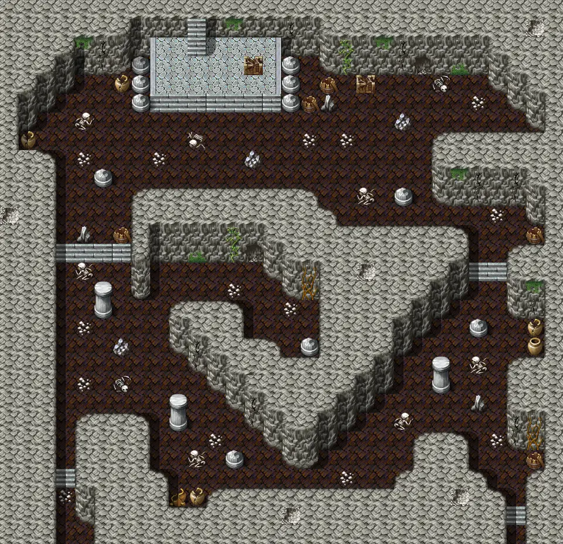

# Waterwayacave1

| | |
|---|---|
| **Map ID** | `waterwayacave1` |
| **Type** | Indoors / underground |
| **Size** | 30×29 tiles |
| **World map** | [Waterwayacave](index.md) |
| **Introduced** | [v0.7.2](../versions/0.7.2.md) |
| **NPCs** | 1 |
| **Enemy types** | 2 |
| **Quests** | 1 |

**Waterwayacave1** is an indoor map. It has 1 NPC and 2 kinds of enemy. Exits lead to Waterwaya5, Waterwayacave2.

## Map

<label class="lg"><input type="checkbox" data-t="spawn" checked><b>Red</b>&nbsp;Monsters / NPCs</label><label class="lg"><input type="checkbox" data-t="mapchange" checked><b>Blue</b>&nbsp;Exit to another map</label><label class="lg"><input type="checkbox" data-t="container" checked><b>Yellow</b>&nbsp;Container (click to see contents)</label><label class="lg"><input type="checkbox" data-t="sign" checked><b>Purple</b>&nbsp;Sign</label><label class="lg"><input type="checkbox" data-t="rest" checked><b>Green</b>&nbsp;Resting place</label><label class="lg"><input type="checkbox" data-t="key" checked><b>Orange dashed</b>&nbsp;Blocked until a quest step / item</label><label class="lg"><input type="checkbox" data-t="script"><b>Grey dotted</b>&nbsp;Scripted event</label><label class="lg"><input type="checkbox" data-t="replace"><b>White dotted</b>&nbsp;Changes during a quest</label><label class="lg"><input type="checkbox" data-t="pin" checked><b>Numbers</b>&nbsp;Numbered key points (see the key below the map)</label>

<a class="pin pin-exit" href="#key-1" style="left:35.000%;top:5.172%" title="Exit (north): to [Waterwaya5](waterwaya5.md)">1</a><a class="pin pin-exit" href="#key-2" style="left:13.333%;top:98.276%" title="Exit (south): to [Waterwayacave2](waterwayacave2.md)">2</a><a class="pin pin-exit" href="#key-2" style="left:91.667%;top:98.276%" title="Exit (south): to [Waterwayacave2](waterwayacave2.md)">2</a><a id="pin-npc-tesrekan_guardian" class="pin pin-npc" href="#key-3" style="left:11.667%;top:84.483%" title="[Dread guardian](../../monsters/tesrekan_guardian.md): NPC">3</a><a class="pin pin-key" href="#key-4" style="left:11.667%;top:81.034%" title="Blocked passage: Unlocked during the quest: hidden story flag “nondisplay_2” (stage 10: “Got Cithurn&#x27;s talisman”)">4</a><a class="pin pin-script" href="#key-5" style="left:38.333%;top:22.414%" title="Quest trigger: Scripted event: advances the quest: Just the beginning to stage 40 (“I found the entrance to the cave.”)">5</a>

??? abstract "Key to the numbers on the map"

    | # | What | Details |
    |---|---|---|
    | 1 | Exit (north) | to [Waterwaya5](waterwaya5.md) |
    | 2 | Exit (south) | to [Waterwayacave2](waterwayacave2.md) |
    | 3 | [Dread guardian](../monsters/tesrekan_guardian.md) | NPC |
    | 4 | Blocked passage | Unlocked during the quest: hidden story flag “nondisplay_2” (stage 10: “Got Cithurn's talisman”) |
    | 5 | Quest trigger | Scripted event: advances the quest: Just the beginning to stage 40 (“I found the entrance to the cave.”) |

Verified against v0.8.18 map data.

## Connections

| Direction | Leads to | Region there | Map # |
|---|---|---|---|
| North | [Waterwaya5](waterwaya5.md) | – | 1 |
| South | [Waterwayacave2](waterwayacave2.md) | – | 2 |

## NPCs

- [Dread guardian](../monsters/tesrekan_guardian.md) — can be fought (#3)

## Enemies

| Enemy | HP | Damage | Up to | Notes |
|---|---|---|---|---|
| [Cave gargoyle](../monsters/waterwaycavebeast.md) | 70 | 5–7 | 8 | – |
| [Rock fiend](../monsters/waterwaycaverockmonster.md) | 80 | 6–8 | 10 | – |

<small>“Up to” is the most that can be alive at once from the spawn areas on this map.</small>

## Quests

- [Just the beginning](../quests/waterwayacave.md): something on this map advances it; stepping on a trigger here sets stage 40
- [Placeholder for hidden quest stages 2 (not displayed) (hidden flag)](../quests/nondisplay_2.md): a scripted event can trigger here from stage 10; blocked passage opens at stage 10

## Points of interest

- **Blocked passage** (#4): Unlocked during the quest: hidden story flag “nondisplay_2” (stage 10: “Got Cithurn's talisman”)
- **Quest trigger** (#5): Scripted event: advances the quest: Just the beginning to stage 40 (“I found the entrance to the cave.”)

## Version history

| Version | Change |
|---|---|
| [v0.7.2](../versions/0.7.2.md) | Added |

Verified against v0.8.18 and every earlier release back to v0.7.0 (game data compared release by release).

## Community notes

<small>Written by players, not generated from game data. **Observations**: what players notice in-game · **Lore**: the in-world story · **Trivia**: real-world facts, references, development history · **Theory / speculation**: unconfirmed ideas; may just be unfinished content</small>

### Observations

*No notes yet. Contributions are welcome: [add a note](https://github.com/asdfghjkl628/Andor-s-Trail-Wikiiii/new/main/notes/maps?filename=waterwayacave1.md&value=%23%23%20Observations%0A%0A%3C%21--%20what%20players%20notice%20in-game%20--%3E%0A%0A%23%23%20Lore%0A%0A%3C%21--%20the%20in-world%20story%20--%3E%0A%0A%23%23%20Trivia%0A%0A%3C%21--%20real-world%20facts%2C%20references%2C%20development%20history%20--%3E%0A%0A%23%23%20Theory%20/%20speculation%0A%0A%3C%21--%20unconfirmed%20ideas%3B%20may%20just%20be%20unfinished%20content%20--%3E%0A).*

### Lore

*No notes yet. Contributions are welcome: [add a note](https://github.com/asdfghjkl628/Andor-s-Trail-Wikiiii/new/main/notes/maps?filename=waterwayacave1.md&value=%23%23%20Observations%0A%0A%3C%21--%20what%20players%20notice%20in-game%20--%3E%0A%0A%23%23%20Lore%0A%0A%3C%21--%20the%20in-world%20story%20--%3E%0A%0A%23%23%20Trivia%0A%0A%3C%21--%20real-world%20facts%2C%20references%2C%20development%20history%20--%3E%0A%0A%23%23%20Theory%20/%20speculation%0A%0A%3C%21--%20unconfirmed%20ideas%3B%20may%20just%20be%20unfinished%20content%20--%3E%0A).*

### Trivia

*No notes yet. Contributions are welcome: [add a note](https://github.com/asdfghjkl628/Andor-s-Trail-Wikiiii/new/main/notes/maps?filename=waterwayacave1.md&value=%23%23%20Observations%0A%0A%3C%21--%20what%20players%20notice%20in-game%20--%3E%0A%0A%23%23%20Lore%0A%0A%3C%21--%20the%20in-world%20story%20--%3E%0A%0A%23%23%20Trivia%0A%0A%3C%21--%20real-world%20facts%2C%20references%2C%20development%20history%20--%3E%0A%0A%23%23%20Theory%20/%20speculation%0A%0A%3C%21--%20unconfirmed%20ideas%3B%20may%20just%20be%20unfinished%20content%20--%3E%0A).*

### Theory / speculation

*No notes yet. Contributions are welcome: [add a note](https://github.com/asdfghjkl628/Andor-s-Trail-Wikiiii/new/main/notes/maps?filename=waterwayacave1.md&value=%23%23%20Observations%0A%0A%3C%21--%20what%20players%20notice%20in-game%20--%3E%0A%0A%23%23%20Lore%0A%0A%3C%21--%20the%20in-world%20story%20--%3E%0A%0A%23%23%20Trivia%0A%0A%3C%21--%20real-world%20facts%2C%20references%2C%20development%20history%20--%3E%0A%0A%23%23%20Theory%20/%20speculation%0A%0A%3C%21--%20unconfirmed%20ideas%3B%20may%20just%20be%20unfinished%20content%20--%3E%0A).*

??? info "Technical information"

    | | |
    |---|---|
    | Map ID | `waterwayacave1` |
    | File | `res/xml/waterwayacave1.tmx` |
    | Size | 30×29 tiles (960×928 px) |
    | outdoors property | – |
    | Layers drawn | ground, objects, above |
    | Tilesets | map_bed_1, map_border_1, map_bridge_1, map_bridge_2, map_broken_1, map_cavewall_1, map_cavewall_2, map_cavewall_3, map_cavewall_4, map_chair_table_1, map_chair_table_2, map_crate_1, map_cupboard_1, map_curtain_1, map_entrance_1, map_entrance_2, map_fence_1, map_fence_2, map_fence_3, map_fence_4, map_ground_1, map_ground_2, map_ground_3, map_ground_4, map_ground_5, map_ground_6, map_ground_7, map_ground_8, map_house_1, map_house_2, map_indoor_1, map_indoor_2, map_kitchen_1, map_outdoor_1, map_pillar_1, map_pillar_2, map_plant_1, map_plant_2, map_rock_1, map_rock_2, map_roof_1, map_roof_2, map_roof_3, map_shop_1, map_sign_ladder_1, map_table_1, map_trail_1, map_transition_1, map_transition_2, map_transition_3, map_transition_4, map_transition_5, map_tree_1, map_tree_2, map_wall_1, map_wall_2, map_wall_3, map_wall_4, map_window_1, map_window_2 |
    | Map objects | spawn: 7, mapchange: 3, script: 2, key: 1 |
    | World map position | segment `waterwayacave`, x 207, y 188 |

<small>Data from v0.8.18</small>
