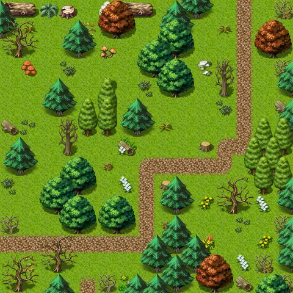

# Way to sullengard east2

15×15 tiles · outdoors · part of [World1](index.md)

<label class="lg lg-spawn"><input type="checkbox" data-t="spawn" checked> Monsters / NPCs</label><label class="lg lg-mapchange"><input type="checkbox" data-t="mapchange" checked> Exit to another map</label><label class="lg lg-container"><input type="checkbox" data-t="container" checked> Container</label><label class="lg lg-sign"><input type="checkbox" data-t="sign" checked> Sign</label><label class="lg lg-rest"><input type="checkbox" data-t="rest" checked> Resting place</label><label class="lg lg-key"><input type="checkbox" data-t="key" checked> Blocked / needs key or quest</label><label class="lg lg-script"><input type="checkbox" data-t="script"> Scripted event</label><label class="lg lg-replace"><input type="checkbox" data-t="replace"> Changes after a quest</label>

## Exits

- [Way to sullengard east1](way_to_sullengard_east1.md)
- [Way to sullengard east2a](way_to_sullengard_east2a.md)
- [Way to sullengard east ravine cabin](way_to_sullengard_east_ravine_cabin.md)

## Monsters & NPCs here

| Name | HP |
|---|---|
| [Poisonous jitterfly](../monsters/poisonous_jitterfly.md) | 97 |
| [Flying tree ant](../monsters/flying_tree_ant.md) | 119 |
| [Yellow tooth slitherer](../monsters/yellow_tooth.md) | 121 |

<small>Map ID: `way_to_sullengard_east2` · Data from v0.8.18</small>
