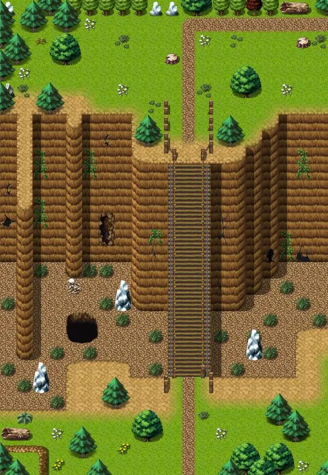

# Way to sullengard east4 bridge

| | |
|---|---|
| **Map ID** | `way_to_sullengard_east4_bridge` |
| **Type** | Outdoors |
| **Size** | 20×29 tiles |
| **World map** | [World1](index.md) |
| **Introduced** | [v0.8.2](../versions/0.8.2.md) |
| **NPCs** | 1 |
| **Enemy types** | 2 |
| **Quests** | 2 |

**Way to sullengard east4 bridge** is an outdoor map. It has 1 NPC and 2 kinds of enemy. Exits lead to Way to sullengard east ravine, Way to sullengard east ravine north, Way to sullengard east4.

## Map

<label class="lg"><input type="checkbox" data-t="spawn" checked><b>Red</b>&nbsp;Monsters / NPCs</label><label class="lg"><input type="checkbox" data-t="mapchange" checked><b>Blue</b>&nbsp;Exit to another map</label><label class="lg"><input type="checkbox" data-t="container" checked><b>Yellow</b>&nbsp;Container (click to see contents)</label><label class="lg"><input type="checkbox" data-t="sign" checked><b>Purple</b>&nbsp;Sign</label><label class="lg"><input type="checkbox" data-t="rest" checked><b>Green</b>&nbsp;Resting place</label><label class="lg"><input type="checkbox" data-t="key" checked><b>Orange dashed</b>&nbsp;Blocked until a quest step / item</label><label class="lg"><input type="checkbox" data-t="script"><b>Grey dotted</b>&nbsp;Scripted event</label><label class="lg"><input type="checkbox" data-t="replace"><b>White dotted</b>&nbsp;Changes during a quest</label><label class="lg"><input type="checkbox" data-t="pin" checked><b>Numbers</b>&nbsp;Numbered key points (see the key below the map)</label>

<a class="pin pin-exit" href="#key-1" style="left:97.500%;top:84.483%" title="Exit (east): to [Way to sullengard east ravine](../way_to_sullengard_east_ravine.md)">1</a><a class="pin pin-exit" href="#key-2" style="left:97.500%;top:13.793%" title="Exit (east): to [Way to sullengard east ravine north](../way_to_sullengard_east_ravine_north.md)">2</a><a class="pin pin-exit" href="#key-3" style="left:92.500%;top:98.276%" title="Exit (southeast): to [Way to sullengard east4](../way_to_sullengard_east4.md)">3</a><a class="pin pin-exit" href="#key-4" style="left:20.000%;top:98.276%" title="Exit (south): to [Way to sullengard east4](../way_to_sullengard_east4.md)">4</a><a class="pin pin-exit" href="#key-4" style="left:50.000%;top:98.276%" title="Exit (south): to [Way to sullengard east4](../way_to_sullengard_east4.md)">4</a><a class="pin pin-npc" href="#key-5" style="left:52.500%;top:18.966%" title="[Grazia](../../monsters/sull_ravine_grazia.md): NPC">5</a><a class="pin pin-script" href="#key-6" style="left:7.500%;top:43.103%" title="Quest trigger: Scripted event: advances the quest: sullengard_nondisplay to stage 110 (+1 more quest(s))">6</a><a class="pin pin-script" href="#key-7" style="left:57.500%;top:81.034%" title="Quest trigger: Scripted event: advances the quest: hidden story flag “sullengard_hidden” to stage 29 (“The PC is south of the ravine bridge.”)">7</a><a class="pin pin-key" href="#key-8" style="left:7.500%;top:20.690%" title="Blocked passage: Unlocked during the quest: Search for Andor (stage 1: “My father Mikhail says that Andor has not been home since yesterday. I should go look for him in the village.”)">8</a><a class="pin pin-key" href="#key-8" style="left:77.500%;top:29.310%" title="Blocked passage: Unlocked during the quest: Search for Andor (stage 1: “My father Mikhail says that Andor has not been home since yesterday. I should go look for him in the village.”)">8</a><a class="pin pin-key" href="#key-8" style="left:55.000%;top:94.828%" title="Blocked passage: Unlocked during the quest: Search for Andor (stage 1: “My father Mikhail says that Andor has not been home since yesterday. I should go look for him in the village.”)">8</a>

??? abstract "Key to the numbers on the map"

    | # | What | Details |
    |---|---|---|
    | 1 | Exit (east) | to [Way to sullengard east ravine](../way_to_sullengard_east_ravine.md) |
    | 2 | Exit (east) | to [Way to sullengard east ravine north](../way_to_sullengard_east_ravine_north.md) |
    | 3 | Exit (southeast) | to [Way to sullengard east4](../way_to_sullengard_east4.md) |
    | 4 | Exit (south) | to [Way to sullengard east4](../way_to_sullengard_east4.md) |
    | 5 | [Grazia](../monsters/sull_ravine_grazia.md) | NPC |
    | 6 | Quest trigger | Scripted event: advances the quest: sullengard_nondisplay to stage 110 (+1 more quest(s)) |
    | 7 | Quest trigger | Scripted event: advances the quest: hidden story flag “sullengard_hidden” to stage 29 (“The PC is south of the ravine bridge.”) |
    | 8 | Blocked passage | Unlocked during the quest: Search for Andor (stage 1: “My father Mikhail says that Andor has not been home since yesterday. I should go look for him in the village.”) |

Verified against v0.8.18 map data.

## Connections

| Direction | Leads to | Region there | Map # |
|---|---|---|---|
| East | [Way to sullengard east ravine](way_to_sullengard_east_ravine.md) | – | 1 |
| East | [Way to sullengard east ravine north](way_to_sullengard_east_ravine_north.md) | – | 2 |
| Southeast | [Way to sullengard east4](way_to_sullengard_east4.md) | – | 3 |
| South | [Way to sullengard east4](way_to_sullengard_east4.md) | – | 4 |

## NPCs

- [Grazia](../monsters/sull_ravine_grazia.md) (#5)

## Enemies

| Enemy | HP | Damage | Up to | Notes |
|---|---|---|---|---|
| [Hardshell beetle](../monsters/hardshell_beetle.md) | 25 | 0–5 | 1 | – |
| [Yellow tooth slitherer](../monsters/yellow_tooth.md) | 121 | 10–16 | 3 | – |

<small>“Up to” is the most that can be alive at once from the spawn areas on this map.</small>

## Quests

- [Search for Andor](../quests/andor.md): blocked passage opens at stage 1
- [Unusual experiences and achievements](../quests/achievements.md): something on this map advances it; stepping on a trigger here sets stage 110
- [sullengard_nondisplay (hidden flag)](../quests/sullengard_hidden.md): [Grazia](../monsters/sull_ravine_grazia.md) is involved; something on this map advances it; stepping on a trigger here sets stage 29

## Points of interest

- **Quest trigger** (#6): Scripted event: advances the quest: sullengard_nondisplay to stage 110 (+1 more quest(s))
- **Quest trigger** (#7): Scripted event: advances the quest: hidden story flag “sullengard_hidden” to stage 29 (“The PC is south of the ravine bridge.”)
- **Blocked passage** (#8): Unlocked during the quest: Search for Andor (stage 1: “My father Mikhail says that Andor has not been home since yesterday. I should go look for him in the village.”)

## Version history

| Version | Change |
|---|---|
| [v0.8.2](../versions/0.8.2.md) | Added |
| [v0.8.4](../versions/0.8.4.md) | map layout or objects changed |
| [v0.8.5](../versions/0.8.5.md) | map layout or objects changed |
| [v0.8.12.1](../versions/0.8.12.1.md) | map layout or objects changed |
| [v0.8.18](../versions/0.8.18.md) | map layout or objects changed |

Verified against v0.8.18 and every earlier release back to v0.7.0 (game data compared release by release).

## Community notes

<small>Written by players, not generated from game data. **Observations**: what players notice in-game · **Lore**: the in-world story · **Trivia**: real-world facts, references, development history · **Theory / speculation**: unconfirmed ideas; may just be unfinished content</small>

### Observations

*Nothing here yet. Know something? [Add it](https://github.com/asdfghjkl628/Andor-s-Trail-Wikiiii/new/main/notes/maps?filename=way_to_sullengard_east4_bridge.md&value=%23%23%20Observations%0A%0A%3C%21--%20what%20players%20notice%20in-game%20--%3E%0A%0A%23%23%20Lore%0A%0A%3C%21--%20the%20in-world%20story%20--%3E%0A%0A%23%23%20Trivia%0A%0A%3C%21--%20real-world%20facts%2C%20references%2C%20development%20history%20--%3E%0A%0A%23%23%20Theory%20/%20speculation%0A%0A%3C%21--%20unconfirmed%20ideas%3B%20may%20just%20be%20unfinished%20content%20--%3E%0A).*

### Lore

*Nothing here yet. Know something? [Add it](https://github.com/asdfghjkl628/Andor-s-Trail-Wikiiii/new/main/notes/maps?filename=way_to_sullengard_east4_bridge.md&value=%23%23%20Observations%0A%0A%3C%21--%20what%20players%20notice%20in-game%20--%3E%0A%0A%23%23%20Lore%0A%0A%3C%21--%20the%20in-world%20story%20--%3E%0A%0A%23%23%20Trivia%0A%0A%3C%21--%20real-world%20facts%2C%20references%2C%20development%20history%20--%3E%0A%0A%23%23%20Theory%20/%20speculation%0A%0A%3C%21--%20unconfirmed%20ideas%3B%20may%20just%20be%20unfinished%20content%20--%3E%0A).*

### Trivia

*Nothing here yet. Know something? [Add it](https://github.com/asdfghjkl628/Andor-s-Trail-Wikiiii/new/main/notes/maps?filename=way_to_sullengard_east4_bridge.md&value=%23%23%20Observations%0A%0A%3C%21--%20what%20players%20notice%20in-game%20--%3E%0A%0A%23%23%20Lore%0A%0A%3C%21--%20the%20in-world%20story%20--%3E%0A%0A%23%23%20Trivia%0A%0A%3C%21--%20real-world%20facts%2C%20references%2C%20development%20history%20--%3E%0A%0A%23%23%20Theory%20/%20speculation%0A%0A%3C%21--%20unconfirmed%20ideas%3B%20may%20just%20be%20unfinished%20content%20--%3E%0A).*

### Theory / speculation

*Nothing here yet. Know something? [Add it](https://github.com/asdfghjkl628/Andor-s-Trail-Wikiiii/new/main/notes/maps?filename=way_to_sullengard_east4_bridge.md&value=%23%23%20Observations%0A%0A%3C%21--%20what%20players%20notice%20in-game%20--%3E%0A%0A%23%23%20Lore%0A%0A%3C%21--%20the%20in-world%20story%20--%3E%0A%0A%23%23%20Trivia%0A%0A%3C%21--%20real-world%20facts%2C%20references%2C%20development%20history%20--%3E%0A%0A%23%23%20Theory%20/%20speculation%0A%0A%3C%21--%20unconfirmed%20ideas%3B%20may%20just%20be%20unfinished%20content%20--%3E%0A).*

??? info "Technical information"

    | | |
    |---|---|
    | Map ID | `way_to_sullengard_east4_bridge` |
    | File | `res/xml/way_to_sullengard_east4_bridge.tmx` |
    | Size | 20×29 tiles (640×928 px) |
    | outdoors property | 1 |
    | Layers drawn | base, ground, objects, above, top |
    | Tilesets | map_bed_1, map_border_1, map_bridge_1, map_bridge_2, map_broken_1, map_cavewall_1, map_cavewall_2, map_cavewall_3, map_cavewall_4, map_chair_table_1, map_chair_table_2, map_crate_1, map_cupboard_1, map_curtain_1, map_entrance_1, map_entrance_2, map_fence_1, map_fence_2, map_fence_3, map_fence_4, map_ground_1, map_ground_2, map_ground_3, map_ground_4, map_ground_5, map_ground_6, map_ground_7, map_ground_8, map_house_1, map_house_2, map_indoor_1, map_indoor_2, map_kitchen_1, map_outdoor_1, map_pillar_1, map_pillar_2, map_plant_1, map_plant_2, map_rock_1, map_rock_2, map_roof_1, map_roof_2, map_roof_3, map_shop_1, map_sign_ladder_1, map_table_1, map_trail_1, map_transition_1, map_transition_2, map_transition_3, map_transition_4, map_transition_5, map_tree_1, map_tree_2, map_wall_1, map_wall_2, map_wall_3, map_wall_4, map_window_1, map_window_2 |
    | Map objects | script: 7, mapchange: 5, spawn: 3, key: 3 |
    | World map position | segment `world1`, x 440, y 525 |

<small>Data from v0.8.18</small>
