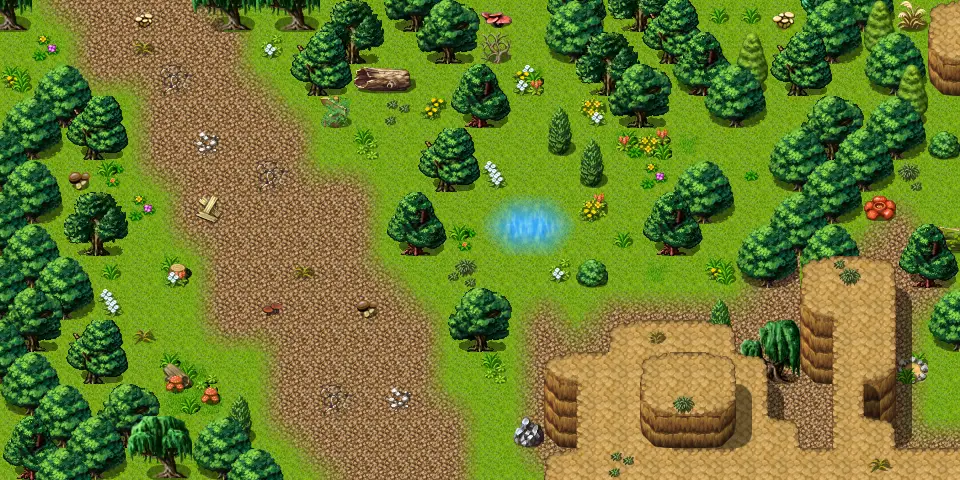

# Wayto feygard duleian 1

30×15 tiles · outdoors · part of [World1](index.md)

<label class="lg lg-spawn"><input type="checkbox" data-t="spawn" checked> Monsters / NPCs</label><label class="lg lg-mapchange"><input type="checkbox" data-t="mapchange" checked> Exit to another map</label><label class="lg lg-container"><input type="checkbox" data-t="container" checked> Container</label><label class="lg lg-sign"><input type="checkbox" data-t="sign" checked> Sign</label><label class="lg lg-rest"><input type="checkbox" data-t="rest" checked> Resting place</label><label class="lg lg-key"><input type="checkbox" data-t="key" checked> Blocked / needs key or quest</label><label class="lg lg-script"><input type="checkbox" data-t="script"> Scripted event</label><label class="lg lg-replace"><input type="checkbox" data-t="replace"> Changes after a quest</label>

## Exits

- [Guynmart wood 19](guynmart_wood_19.md)
- [Way to wexlow1](way_to_wexlow1.md)
- [Way to wexlow2](way_to_wexlow2.md)
- [Wayto feygard duleian 2](wayto_feygard_duleian_2.md)

## Monsters & NPCs here

| Name | HP |
|---|---|
| [Road rondel](../monsters/road_rondel.md) | 0 |
| [Duleian buzzer](../monsters/duleian_hornet.md) | 77 |
| [Road rondel](../monsters/road_rondel_blocker.md) | 120 |
| [Murkcrawler](../monsters/murkcrawler.md) | 122 |

<small>Map ID: `wayto_feygard_duleian_1` · Data from v0.8.18</small>
