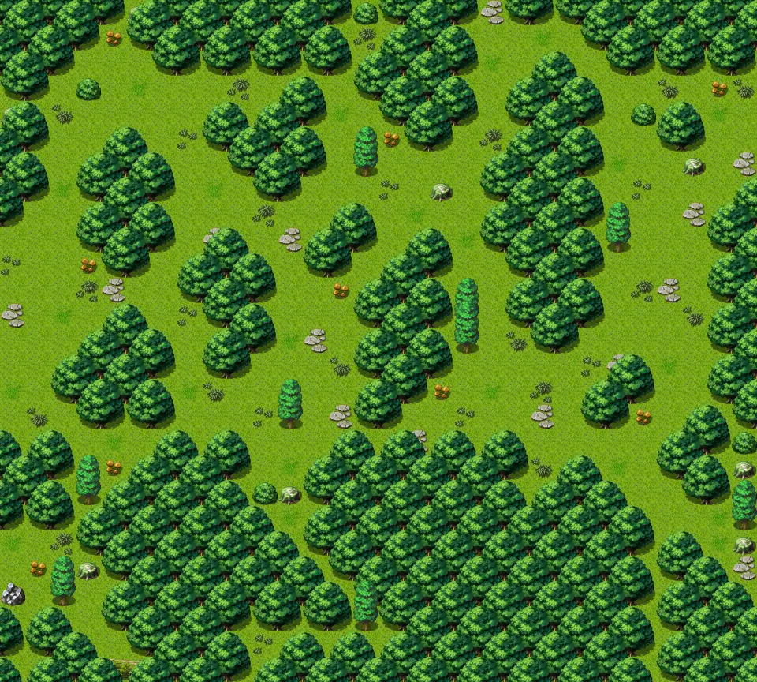

# Waytobrimhaven1

| | |
|---|---|
| **Map ID** | `waytobrimhaven1` |
| **Region** | Near Loneford (settlement) |
| **Type** | Outdoors |
| **Size** | 30×27 tiles |
| **World map** | [World1](index.md) |
| **Introduced** | v0.7.0 or earlier |
| **NPCs** | 1 |
| **Enemy types** | 6 |
| **Quests** | 3 |

**Waytobrimhaven1** is an outdoor map, near Loneford (settlement). It has 1 NPC and 6 kinds of enemy. Exits lead to Waterwayb1, Waytobrimhaven2, Waytobrimhaven4, Waytobrimhaven0.

## Map

<label class="lg"><input type="checkbox" data-t="spawn" checked><b>Red</b>&nbsp;Monsters / NPCs</label><label class="lg"><input type="checkbox" data-t="mapchange" checked><b>Blue</b>&nbsp;Exit to another map</label><label class="lg"><input type="checkbox" data-t="container" checked><b>Yellow</b>&nbsp;Container (click to see contents)</label><label class="lg"><input type="checkbox" data-t="sign" checked><b>Purple</b>&nbsp;Sign</label><label class="lg"><input type="checkbox" data-t="rest" checked><b>Green</b>&nbsp;Resting place</label><label class="lg"><input type="checkbox" data-t="key" checked><b>Orange dashed</b>&nbsp;Blocked until a quest step / item</label><label class="lg"><input type="checkbox" data-t="script"><b>Grey dotted</b>&nbsp;Scripted event</label><label class="lg"><input type="checkbox" data-t="replace"><b>White dotted</b>&nbsp;Changes during a quest</label><label class="lg"><input type="checkbox" data-t="pin" checked><b>Numbers</b>&nbsp;Numbered key points (see the key below the map)</label>

<a class="pin pin-exit" href="#key-1" style="left:65.000%;top:1.852%" title="Exit (north): to [Waterwayb1](waterwayb1.md)">1</a><a class="pin pin-exit" href="#key-2" style="left:98.333%;top:20.370%" title="Exit (east): to [Waytobrimhaven2](waytobrimhaven2.md)">2</a><a class="pin pin-exit" href="#key-3" style="left:98.333%;top:85.185%" title="Exit (east): to [Waytobrimhaven4](waytobrimhaven4.md)">3</a><a class="pin pin-exit" href="#key-4" style="left:1.667%;top:59.259%" title="Exit (west): to [Waytobrimhaven0](waytobrimhaven0.md)">4</a><a id="pin-npc-tt_seraphina" class="pin pin-npc" href="#key-5" style="left:15.000%;top:94.444%" title="[Sly Seraphina](../../monsters/tt_seraphina.md): 2 quests">5</a><a class="pin pin-script" href="#key-6" style="left:95.000%;top:22.222%" title="Quest trigger: Scripted event: advances the quest: hidden story flag “brv_nondisplay” to stage 89 (“89=End flood”)">6</a><a class="pin pin-script" href="#key-7" style="left:31.667%;top:12.963%" title="Quest trigger: Scripted event: advances the quest: A strange looking dagger to stage 160 (“I should take the evidence to Kizzo.”)">7</a><a class="pin pin-key" href="#key-8" style="left:15.219%;top:91.667%" title="Blocked passage: Unlocked during the quest: Search for Andor (stage 1: “My father Mikhail says that Andor has not been home since yesterday. I should go look for him in the village.”)">8</a>

??? abstract "Key to the numbers on the map"

    | # | What | Details |
    |---|---|---|
    | 1 | Exit (north) | to [Waterwayb1](waterwayb1.md) |
    | 2 | Exit (east) | to [Waytobrimhaven2](waytobrimhaven2.md) |
    | 3 | Exit (east) | to [Waytobrimhaven4](waytobrimhaven4.md) |
    | 4 | Exit (west) | to [Waytobrimhaven0](waytobrimhaven0.md) |
    | 5 | [Sly Seraphina](../monsters/tt_seraphina.md) | 2 quests |
    | 6 | Quest trigger | Scripted event: advances the quest: hidden story flag “brv_nondisplay” to stage 89 (“89=End flood”) |
    | 7 | Quest trigger | Scripted event: advances the quest: A strange looking dagger to stage 160 (“I should take the evidence to Kizzo.”) |
    | 8 | Blocked passage | Unlocked during the quest: Search for Andor (stage 1: “My father Mikhail says that Andor has not been home since yesterday. I should go look for him in the village.”) |

Verified against v0.8.18 map data.

## Connections

| Direction | Leads to | Region there | Map # |
|---|---|---|---|
| North | [Waterwayb1](waterwayb1.md) | Loneford | 1 |
| East | [Waytobrimhaven2](waytobrimhaven2.md) | Loneford | 2 |
| East | [Waytobrimhaven4](waytobrimhaven4.md) | Loneford | 3 |
| West | [Waytobrimhaven0](waytobrimhaven0.md) | Loneford | 4 |

## NPCs

- [Sly Seraphina](../monsters/tt_seraphina.md) — quests: [Search for Andor](../quests/andor.md), [Troubling times](../quests/troubling_times.md) (#5)

## Enemies

| Enemy | HP | Damage | Up to | Notes |
|---|---|---|---|---|
| [Grasslands beetle](../monsters/grass_beetle.md) | 34 | 0–5 | 3 | shares spawn with Tough grasslands beetle |
| [Tough grasslands beetle](../monsters/grass_beetle2.md) | 35 | 1–6 | 3 | shares spawn with Grasslands beetle |
| [Rabid hound](../monsters/rabid_hound.md) | 40 | 3–9 | 5 | – |
| [Spotted erumen lizard](../monsters/erumen_2.md) | 45 | 2–9 | 3 | shares spawn with Young erumen lizard |
| [Young erumen lizard](../monsters/erumen_1.md) | 45 | 2–9 | 3 | shares spawn with Spotted erumen lizard |
| [Seraphina's bodyguard](../monsters/tt_guys.md) | 52 | 8–15 | 5 | appears later, during a quest |

<small>“Up to” is the most that can be alive at once from the spawn areas on this map.</small>

## Quests

- [A strange looking dagger](../quests/brv_dagger.md): something on this map advances it; stepping on a trigger here sets stage 160
- [Search for Andor](../quests/andor.md): [Sly Seraphina](../monsters/tt_seraphina.md) is involved; blocked passage opens at stage 1
- [Troubling times](../quests/troubling_times.md): [Sly Seraphina](../monsters/tt_seraphina.md) is involved
- [brv_nondisplay (hidden flag)](../quests/brv_nondisplay.md): something on this map advances it; stepping on a trigger here sets stage 70; stepping on a trigger here sets stage 83; stepping on a trigger here sets stage 89

## Points of interest

- **Quest trigger** (#6): Scripted event: advances the quest: hidden story flag “brv_nondisplay” to stage 89 (“89=End flood”)
- **Quest trigger** (#7): Scripted event: advances the quest: A strange looking dagger to stage 160 (“I should take the evidence to Kizzo.”)
- **Blocked passage** (#8): Unlocked during the quest: Search for Andor (stage 1: “My father Mikhail says that Andor has not been home since yesterday. I should go look for him in the village.”)

## Version history

| Version | Change |
|---|---|
| [v0.7.0](../versions/0.7.0.md) | Present in v0.7.0 (earliest release tracked) |
| [v0.7.1](../versions/0.7.1.md) | map layout or objects changed |
| [v0.7.2](../versions/0.7.2.md) | map layout or objects changed |
| [v0.7.11](../versions/0.7.11.md) | map layout or objects changed |
| [v0.7.12](../versions/0.7.12.md) | map layout or objects changed |
| [v0.8.2](../versions/0.8.2.md) | map layout or objects changed |
| [v0.8.13](../versions/0.8.13.md) | map layout or objects changed |

Verified against v0.8.18 and every earlier release back to v0.7.0 (game data compared release by release).

## Community notes

<small>Written by players, not generated from game data. **Observations**: what players notice in-game · **Lore**: the in-world story · **Trivia**: real-world facts, references, development history · **Theory / speculation**: unconfirmed ideas; may just be unfinished content</small>

### Observations

*No notes yet. Contributions are welcome: [add a note](https://github.com/asdfghjkl628/Andor-s-Trail-Wikiiii/new/main/notes/maps?filename=waytobrimhaven1.md&value=%23%23%20Observations%0A%0A%3C%21--%20what%20players%20notice%20in-game%20--%3E%0A%0A%23%23%20Lore%0A%0A%3C%21--%20the%20in-world%20story%20--%3E%0A%0A%23%23%20Trivia%0A%0A%3C%21--%20real-world%20facts%2C%20references%2C%20development%20history%20--%3E%0A%0A%23%23%20Theory%20/%20speculation%0A%0A%3C%21--%20unconfirmed%20ideas%3B%20may%20just%20be%20unfinished%20content%20--%3E%0A).*

### Lore

*No notes yet. Contributions are welcome: [add a note](https://github.com/asdfghjkl628/Andor-s-Trail-Wikiiii/new/main/notes/maps?filename=waytobrimhaven1.md&value=%23%23%20Observations%0A%0A%3C%21--%20what%20players%20notice%20in-game%20--%3E%0A%0A%23%23%20Lore%0A%0A%3C%21--%20the%20in-world%20story%20--%3E%0A%0A%23%23%20Trivia%0A%0A%3C%21--%20real-world%20facts%2C%20references%2C%20development%20history%20--%3E%0A%0A%23%23%20Theory%20/%20speculation%0A%0A%3C%21--%20unconfirmed%20ideas%3B%20may%20just%20be%20unfinished%20content%20--%3E%0A).*

### Trivia

*No notes yet. Contributions are welcome: [add a note](https://github.com/asdfghjkl628/Andor-s-Trail-Wikiiii/new/main/notes/maps?filename=waytobrimhaven1.md&value=%23%23%20Observations%0A%0A%3C%21--%20what%20players%20notice%20in-game%20--%3E%0A%0A%23%23%20Lore%0A%0A%3C%21--%20the%20in-world%20story%20--%3E%0A%0A%23%23%20Trivia%0A%0A%3C%21--%20real-world%20facts%2C%20references%2C%20development%20history%20--%3E%0A%0A%23%23%20Theory%20/%20speculation%0A%0A%3C%21--%20unconfirmed%20ideas%3B%20may%20just%20be%20unfinished%20content%20--%3E%0A).*

### Theory / speculation

*No notes yet. Contributions are welcome: [add a note](https://github.com/asdfghjkl628/Andor-s-Trail-Wikiiii/new/main/notes/maps?filename=waytobrimhaven1.md&value=%23%23%20Observations%0A%0A%3C%21--%20what%20players%20notice%20in-game%20--%3E%0A%0A%23%23%20Lore%0A%0A%3C%21--%20the%20in-world%20story%20--%3E%0A%0A%23%23%20Trivia%0A%0A%3C%21--%20real-world%20facts%2C%20references%2C%20development%20history%20--%3E%0A%0A%23%23%20Theory%20/%20speculation%0A%0A%3C%21--%20unconfirmed%20ideas%3B%20may%20just%20be%20unfinished%20content%20--%3E%0A).*

??? info "Technical information"

    | | |
    |---|---|
    | Map ID | `waytobrimhaven1` |
    | File | `res/xml/waytobrimhaven1.tmx` |
    | Size | 30×27 tiles (960×864 px) |
    | outdoors property | 1 |
    | Layers drawn | ground, objects, above |
    | Tilesets | map_bed_1, map_border_1, map_bridge_1, map_bridge_2, map_broken_1, map_cavewall_1, map_cavewall_2, map_cavewall_3, map_cavewall_4, map_chair_table_1, map_chair_table_2, map_crate_1, map_cupboard_1, map_curtain_1, map_entrance_1, map_entrance_2, map_fence_1, map_fence_2, map_fence_3, map_fence_4, map_ground_1, map_ground_2, map_ground_3, map_ground_4, map_ground_5, map_ground_6, map_ground_7, map_ground_8, map_house_1, map_house_2, map_indoor_1, map_indoor_2, map_kitchen_1, map_outdoor_1, map_pillar_1, map_pillar_2, map_plant_1, map_plant_2, map_rock_1, map_rock_2, map_roof_1, map_roof_2, map_roof_3, map_shop_1, map_sign_ladder_1, map_table_1, map_trail_1, map_transition_1, map_transition_2, map_transition_3, map_transition_4, map_transition_5, map_tree_1, map_tree_2, map_wall_1, map_wall_2, map_wall_3, map_wall_4, map_window_1, map_window_2 |
    | Map objects | spawn: 5, mapchange: 4, script: 2, key: 1 |
    | World map position | segment `world1`, x 302, y 247 |

<small>Data from v0.8.18</small>
