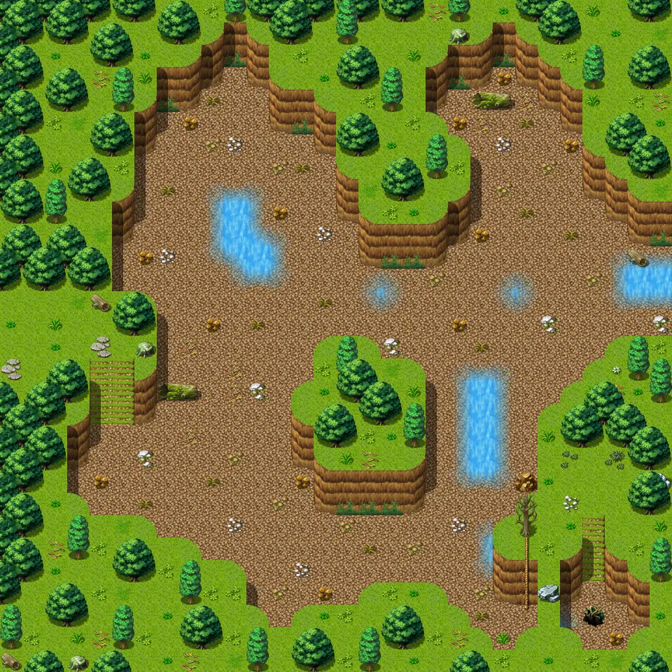

# Waytobrimhaven2

30×30 tiles · outdoors · part of [World1](index.md)

<label class="lg lg-spawn"><input type="checkbox" data-t="spawn" checked> Monsters / NPCs</label><label class="lg lg-mapchange"><input type="checkbox" data-t="mapchange" checked> Exit to another map</label><label class="lg lg-container"><input type="checkbox" data-t="container" checked> Container</label><label class="lg lg-sign"><input type="checkbox" data-t="sign" checked> Sign</label><label class="lg lg-rest"><input type="checkbox" data-t="rest" checked> Resting place</label><label class="lg lg-key"><input type="checkbox" data-t="key" checked> Blocked / needs key or quest</label><label class="lg lg-script"><input type="checkbox" data-t="script"> Scripted event</label><label class="lg lg-replace"><input type="checkbox" data-t="replace"> Changes after a quest</label>

## Exits

- [Waytobrimhaven1](waytobrimhaven1.md)
- [Waytobrimhaven3](waytobrimhaven3.md)
- [Waytobrimhavencave0](waytobrimhavencave0.md)

## Monsters & NPCs here

| Name | HP |
|---|---|
| [Tamarukh](../monsters/tamarukh.md) | 0 |
| [Churrie](../monsters/churrie.md) | 0 |
| [Young erumen lizard](../monsters/erumen_1.md) | 45 |
| [Erumen lizard](../monsters/erumen_3.md) | 45 |
| [Spotted erumen lizard](../monsters/erumen_2.md) | 45 |
| [Bone champion](../monsters/bone_champion.md) | 49 |
| [Strong erumen lizard](../monsters/erumen_4.md) | 79 |
| [Vile erumen lizard](../monsters/erumen_5.md) | 89 |
| [Tough erumen lizard](../monsters/erumen_6.md) | 91 |

<small>Map ID: `waytobrimhaven2` · Data from v0.8.18</small>
