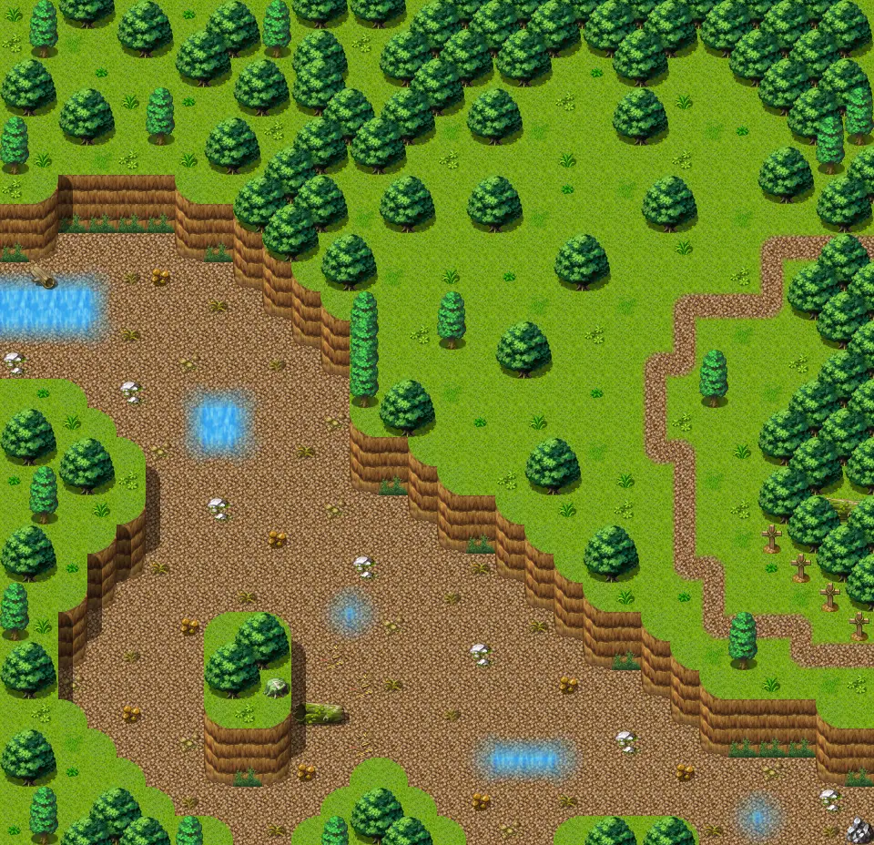
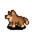

# Waytobrimhaven3

30×29 tiles · outdoors · part of [World1](index.md)

<label class="lg"><input type="checkbox" data-t="spawn" checked><b>Red</b>&nbsp;Monsters / NPCs</label><label class="lg"><input type="checkbox" data-t="mapchange" checked><b>Blue</b>&nbsp;Exit to another map</label><label class="lg"><input type="checkbox" data-t="container" checked><b>Yellow</b>&nbsp;Container (click to see contents)</label><label class="lg"><input type="checkbox" data-t="sign" checked><b>Purple</b>&nbsp;Sign</label><label class="lg"><input type="checkbox" data-t="rest" checked><b>Green</b>&nbsp;Resting place</label><label class="lg"><input type="checkbox" data-t="key" checked><b>Orange dashed</b>&nbsp;Blocked until a quest step / item</label><label class="lg"><input type="checkbox" data-t="script"><b>Grey dotted</b>&nbsp;Scripted event</label><label class="lg"><input type="checkbox" data-t="replace"><b>White dotted</b>&nbsp;Changes during a quest</label>

## Exits

- [Brimhaven4](brimhaven4.md)
- [Waterway6](waterway6.md)
- [Waytobrimhaven2](waytobrimhaven2.md)

## Monsters & NPCs here

| Name | HP |
|---|---|
| [Sly Seraphina](../monsters/tt_seraphina.md) | 0 |
| [Forenza](../monsters/forenza_waytobrimhaven3.md) | 0 |
| [Small rabid dog](../monsters/small_rabid_dog.md) | 6 |
| [Rabid hound](../monsters/rabid_hound.md) | 40 |
| [Spotted erumen lizard](../monsters/erumen_2.md) | 45 |
| [Erumen lizard](../monsters/erumen_3.md) | 45 |
| [Young erumen lizard](../monsters/erumen_1.md) | 45 |
| [Seraphina's bodyguard](../monsters/tt_guys.md) | 52 |
| [Strong erumen lizard](../monsters/erumen_4.md) | 79 |

<small>Map ID: `waytobrimhaven3` · Data from v0.8.18</small>
