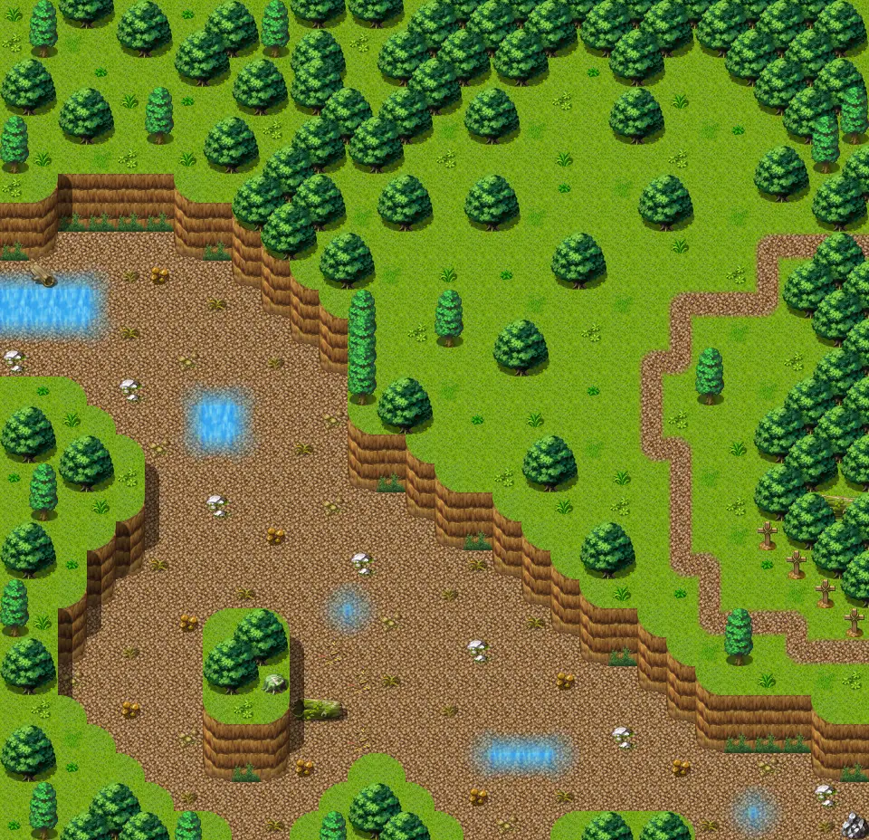

# Waytobrimhaven 3

| | |
|---|---|
| **Map ID** | `waytobrimhaven3` |
| **Region** | Near Brimhaven (settlement) |
| **Type** | Outdoors |
| **Size** | 30×29 tiles |
| **World map** | [World 1](index.md) |
| **Introduced** | v0.7.0 or earlier |
| **NPCs** | 2 |
| **Enemy types** | 7 |
| **Quests** | 4 |

**Waytobrimhaven 3** is an outdoor map, near Brimhaven (settlement). It has 2 NPCs and 7 kinds of enemy. Exits lead to Brimhaven 4, Waterway 6, Waytobrimhaven 2.

## Map

<label class="lg"><input type="checkbox" data-t="spawn" checked><b>Red</b>&nbsp;Monsters / NPCs</label><label class="lg"><input type="checkbox" data-t="mapchange" checked><b>Blue</b>&nbsp;Exit to another map</label><label class="lg"><input type="checkbox" data-t="container" checked><b>Yellow</b>&nbsp;Container (click to see contents)</label><label class="lg"><input type="checkbox" data-t="sign" checked><b>Purple</b>&nbsp;Sign</label><label class="lg"><input type="checkbox" data-t="rest" checked><b>Green</b>&nbsp;Resting place</label><label class="lg"><input type="checkbox" data-t="key" checked><b>Orange dashed</b>&nbsp;Blocked until a quest step / item</label><label class="lg"><input type="checkbox" data-t="script"><b>Grey dotted</b>&nbsp;Scripted event</label><label class="lg"><input type="checkbox" data-t="replace"><b>White dotted</b>&nbsp;Changes during a quest</label><label class="lg"><input type="checkbox" data-t="pin" checked><b>Numbers</b>&nbsp;Numbered key points (see the key below the map)</label>

<a class="pin pin-exit" href="#key-1" style="left:98.333%;top:81.034%" title="Exit (east): to [Brimhaven 4](brimhaven4.md)">1</a><a class="pin pin-exit" href="#key-2" style="left:98.333%;top:29.310%" title="Exit (east): to [Waterway 6](waterway6.md)">2</a><a class="pin pin-exit" href="#key-3" style="left:98.333%;top:94.828%" title="Exit (southeast): to [Brimhaven 4](brimhaven4.md)">3</a><a class="pin pin-exit" href="#key-4" style="left:1.667%;top:41.379%" title="Exit (west): to [Waytobrimhaven 2](waytobrimhaven2.md)">4</a><a id="pin-npc-forenza_waytobrimhaven3" class="pin pin-npc" href="#key-5" style="left:41.667%;top:22.414%" title="[Forenza](../../monsters/forenza.md#v-forenza_waytobrimhaven3): 1 quest">5</a><a id="pin-npc-tt_seraphina" class="pin pin-npc" href="#key-6" style="left:68.333%;top:8.621%" title="[Sly Seraphina](../../monsters/tt_seraphina.md): 2 quests">6</a><a class="pin pin-sign" href="#key-7" style="left:88.333%;top:67.241%" title="Sign: “Here lies the remains of Ilirathos, mother of two.”">7</a><a class="pin pin-sign" href="#key-8" style="left:91.667%;top:70.690%" title="Sign: “Ke&#x27;roos lies here. No one knew him in life since he always kept to himself, but we all thank him for the generous gifts he left behind for Brimhaven.”">8</a><a class="pin pin-sign" href="#key-9" style="left:95.000%;top:74.138%" title="Sign: “Here lies Connat, who spent his life complaining that he was dying. In the end, he was right.”">9</a><a class="pin pin-script" href="#key-10" style="left:86.667%;top:79.310%" title="Quest trigger: Scripted event: advances the quest: A cat and mouse game to stage 90 (“I released the mouse.”)">10</a><a class="pin pin-script" href="#key-10" style="left:90.000%;top:94.828%" title="Quest trigger: Scripted event: advances the quest: A cat and mouse game to stage 90 (“I released the mouse.”)">10</a><a class="pin pin-key" href="#key-11" style="left:68.553%;top:6.035%" title="Blocked passage: Unlocked during the quest: Search for Andor (stage 1: “My father Mikhail says that Andor has not been home since yesterday. I should go look for him in the village.”)">11</a><a class="pin pin-replace" href="#key-12" style="left:50.000%;top:62.069%" title="Changes during a quest: This area changes during the quest: hidden story flag “brv_nondisplay” (stage 83: “83=stage-3 flood”)">12</a><a class="pin pin-replace" href="#key-13" style="left:50.219%;top:59.483%" title="Changes during a quest: This area changes during the quest: hidden story flag “brv_nondisplay” (stage 89: “89=End flood”)">13</a>

??? abstract "Key to the numbers on the map"

    | # | What | Details |
    |---|---|---|
    | 1 | Exit (east) | to [Brimhaven 4](brimhaven4.md) |
    | 2 | Exit (east) | to [Waterway 6](waterway6.md) |
    | 3 | Exit (southeast) | to [Brimhaven 4](brimhaven4.md) |
    | 4 | Exit (west) | to [Waytobrimhaven 2](waytobrimhaven2.md) |
    | 5 | [Forenza](../monsters/forenza.md#v-forenza_waytobrimhaven3) | 1 quest |
    | 6 | [Sly Seraphina](../monsters/tt_seraphina.md) | 2 quests |
    | 7 | Sign | “Here lies the remains of Ilirathos, mother of two.” |
    | 8 | Sign | “Ke'roos lies here. No one knew him in life since he always kept to himself, but we all thank him for the generous gifts he left behind for Brimhaven.” |
    | 9 | Sign | “Here lies Connat, who spent his life complaining that he was dying. In the end, he was right.” |
    | 10 | Quest trigger | Scripted event: advances the quest: A cat and mouse game to stage 90 (“I released the mouse.”) |
    | 11 | Blocked passage | Unlocked during the quest: Search for Andor (stage 1: “My father Mikhail says that Andor has not been home since yesterday. I should go look for him in the village.”) |
    | 12 | Changes during a quest | This area changes during the quest: hidden story flag “brv_nondisplay” (stage 83: “83=stage-3 flood”) |
    | 13 | Changes during a quest | This area changes during the quest: hidden story flag “brv_nondisplay” (stage 89: “89=End flood”) |

Verified against v0.8.18 map data.

## Connections

| Direction | Leads to | Region there | Map # |
|---|---|---|---|
| East | [Brimhaven 4](brimhaven4.md) | Brimhaven | 1 |
| East | [Waterway 6](waterway6.md) | Brimhaven | 2 |
| Southeast | [Brimhaven 4](brimhaven4.md) | Brimhaven | 3 |
| West | [Waytobrimhaven 2](waytobrimhaven2.md) | Loneford | 4 |

## NPCs

- [Forenza](../monsters/forenza.md#v-forenza_waytobrimhaven3) — quests: [The odd coin collector](../quests/odd_coin_collector.md) (#5)
- [Sly Seraphina](../monsters/tt_seraphina.md) — quests: [Search for Andor](../quests/andor.md), [Troubling times](../quests/troubling_times.md) (#6)

## Enemies

| Enemy | HP | Damage | Up to | Notes |
|---|---|---|---|---|
| [Small rabid dog](../monsters/small_rabid_dog.md) | 6 | 2–2 | 4 | – |
| [Rabid hound](../monsters/rabid_hound.md) | 40 | 3–9 | 3 | – |
| [Young erumen lizard](../monsters/erumen_1.md) | 45 | 2–9 | 3 | shares spawn with Spotted erumen lizard |
| [Erumen lizard](../monsters/erumen_3.md) | 45 | 2–9 | 6 | shares spawn with Strong erumen lizard |
| [Spotted erumen lizard](../monsters/erumen_2.md) | 45 | 2–9 | 3 | shares spawn with Young erumen lizard |
| [Seraphina's bodyguard](../monsters/tt_guys.md) | 52 | 8–15 | 5 | appears later, during a quest |
| [Strong erumen lizard](../monsters/erumen_4.md) | 79 | 2–9 | 6 | shares spawn with Erumen lizard |

<small>“Up to” is the most that can be alive at once from the spawn areas on this map.</small>

## Quests

- [A cat and mouse game](../quests/cat_and_mouse.md): something on this map advances it; stepping on a trigger here sets stage 90
- [Search for Andor](../quests/andor.md): [Sly Seraphina](../monsters/tt_seraphina.md) is involved; blocked passage opens at stage 1
- [The odd coin collector](../quests/odd_coin_collector.md): [Forenza](../monsters/forenza.md#v-forenza_waytobrimhaven3) is involved
- [Troubling times](../quests/troubling_times.md): [Sly Seraphina](../monsters/tt_seraphina.md) is involved
- [Brightport story flags (hidden flag)](../quests/brightport_nondisplay.md): [Forenza](../monsters/forenza.md#v-forenza_waytobrimhaven3) is involved
- [Brimhaven story flags (hidden flag)](../quests/brv_nondisplay.md): part of the map changes at stage 83; part of the map changes at stage 89
- [General story flags (hidden flag)](../quests/nondisplay.md): [Forenza](../monsters/forenza.md#v-forenza_waytobrimhaven3) is involved
- [Laeroth story flags (hidden flag)](../quests/laeroth_nondisplay.md): [Forenza](../monsters/forenza.md#v-forenza_waytobrimhaven3) is involved

## Points of interest

- **Sign** (#7): “Here lies the remains of Ilirathos, mother of two.”
- **Sign** (#8): “Ke'roos lies here. No one knew him in life since he always kept to himself, but we all thank him for the generous gifts he left behind for Brimhaven.”
- **Sign** (#9): “Here lies Connat, who spent his life complaining that he was dying. In the end, he was right.”
- **Quest trigger** (#10): Scripted event: advances the quest: A cat and mouse game to stage 90 (“I released the mouse.”)
- **Blocked passage** (#11): Unlocked during the quest: Search for Andor (stage 1: “My father Mikhail says that Andor has not been home since yesterday. I should go look for him in the village.”)
- **Changes during a quest** (#12): This area changes during the quest: hidden story flag “brv_nondisplay” (stage 83: “83=stage-3 flood”)
- **Changes during a quest** (#13): This area changes during the quest: hidden story flag “brv_nondisplay” (stage 89: “89=End flood”)

## Version history

| Version | Change |
|---|---|
| [v0.7.0](../versions/0.7.0.md) | Present in v0.7.0 (earliest release tracked) |
| [v0.7.1](../versions/0.7.1.md) | Map layout or objects changed |
| [v0.7.2](../versions/0.7.2.md) | Map layout or objects changed |
| [v0.7.11](../versions/0.7.11.md) | Map layout or objects changed |
| [v0.7.12](../versions/0.7.12.md) | Map layout or objects changed |
| [v0.7.13](../versions/0.7.13.md) | Map layout or objects changed |
| [v0.8.2](../versions/0.8.2.md) | Map layout or objects changed |
| [v0.8.11](../versions/0.8.11.md) | Map layout or objects changed |
| [v0.8.13](../versions/0.8.13.md) | Map layout or objects changed |

Verified against v0.8.18 and every earlier release back to v0.7.0 (game data compared release by release).

## Community notes

<small>Written by players, not generated from game data. **Observations**: what players notice in-game · **Lore**: the in-world story · **Trivia**: real-world facts, references, development history · **Theory / speculation**: unconfirmed ideas; may just be unfinished content</small>

### Observations

*No notes yet. Contributions are welcome: [add a note](https://github.com/asdfghjkl628/Andor-s-Trail-Wikiiii/new/main/notes/maps?filename=waytobrimhaven3.md&value=%23%23%20Observations%0A%0A%3C%21--%20what%20players%20notice%20in-game%20--%3E%0A%0A%23%23%20Lore%0A%0A%3C%21--%20the%20in-world%20story%20--%3E%0A%0A%23%23%20Trivia%0A%0A%3C%21--%20real-world%20facts%2C%20references%2C%20development%20history%20--%3E%0A%0A%23%23%20Theory%20/%20speculation%0A%0A%3C%21--%20unconfirmed%20ideas%3B%20may%20just%20be%20unfinished%20content%20--%3E%0A).*

### Lore

*No notes yet. Contributions are welcome: [add a note](https://github.com/asdfghjkl628/Andor-s-Trail-Wikiiii/new/main/notes/maps?filename=waytobrimhaven3.md&value=%23%23%20Observations%0A%0A%3C%21--%20what%20players%20notice%20in-game%20--%3E%0A%0A%23%23%20Lore%0A%0A%3C%21--%20the%20in-world%20story%20--%3E%0A%0A%23%23%20Trivia%0A%0A%3C%21--%20real-world%20facts%2C%20references%2C%20development%20history%20--%3E%0A%0A%23%23%20Theory%20/%20speculation%0A%0A%3C%21--%20unconfirmed%20ideas%3B%20may%20just%20be%20unfinished%20content%20--%3E%0A).*

### Trivia

*No notes yet. Contributions are welcome: [add a note](https://github.com/asdfghjkl628/Andor-s-Trail-Wikiiii/new/main/notes/maps?filename=waytobrimhaven3.md&value=%23%23%20Observations%0A%0A%3C%21--%20what%20players%20notice%20in-game%20--%3E%0A%0A%23%23%20Lore%0A%0A%3C%21--%20the%20in-world%20story%20--%3E%0A%0A%23%23%20Trivia%0A%0A%3C%21--%20real-world%20facts%2C%20references%2C%20development%20history%20--%3E%0A%0A%23%23%20Theory%20/%20speculation%0A%0A%3C%21--%20unconfirmed%20ideas%3B%20may%20just%20be%20unfinished%20content%20--%3E%0A).*

### Theory / speculation

*No notes yet. Contributions are welcome: [add a note](https://github.com/asdfghjkl628/Andor-s-Trail-Wikiiii/new/main/notes/maps?filename=waytobrimhaven3.md&value=%23%23%20Observations%0A%0A%3C%21--%20what%20players%20notice%20in-game%20--%3E%0A%0A%23%23%20Lore%0A%0A%3C%21--%20the%20in-world%20story%20--%3E%0A%0A%23%23%20Trivia%0A%0A%3C%21--%20real-world%20facts%2C%20references%2C%20development%20history%20--%3E%0A%0A%23%23%20Theory%20/%20speculation%0A%0A%3C%21--%20unconfirmed%20ideas%3B%20may%20just%20be%20unfinished%20content%20--%3E%0A).*

??? info "Technical information"

    | | |
    |---|---|
    | Map ID | `waytobrimhaven3` |
    | File | `res/xml/waytobrimhaven3.tmx` |
    | Size | 30×29 tiles (960×928 px) |
    | outdoors property | 1 |
    | Layers drawn | ground, objects, above |
    | Tilesets | map_bed_1, map_border_1, map_bridge_1, map_bridge_2, map_broken_1, map_cavewall_1, map_cavewall_2, map_cavewall_3, map_cavewall_4, map_chair_table_1, map_chair_table_2, map_crate_1, map_cupboard_1, map_curtain_1, map_entrance_1, map_entrance_2, map_fence_1, map_fence_2, map_fence_3, map_fence_4, map_ground_1, map_ground_2, map_ground_3, map_ground_4, map_ground_5, map_ground_6, map_ground_7, map_ground_8, map_guynmart, map_house_1, map_house_2, map_indoor_1, map_indoor_2, map_kitchen_1, map_outdoor_1, map_pillar_1, map_pillar_2, map_plant_1, map_plant_2, map_rock_1, map_rock_2, map_roof_1, map_roof_2, map_roof_3, map_shop_1, map_sign_ladder_1, map_table_1, map_trail_1, map_transition_1, map_transition_2, map_transition_3, map_transition_4, map_transition_5, map_tree_1, map_tree_2, map_wall_1, map_wall_2, map_wall_3, map_wall_4, map_window_1, map_window_2 |
    | Map objects | spawn: 9, mapchange: 4, sign: 3, script: 2, replace: 2, key: 1 |
    | World map position | segment `world1`, x 364, y 239 |

<small>Data from v0.8.18</small>
