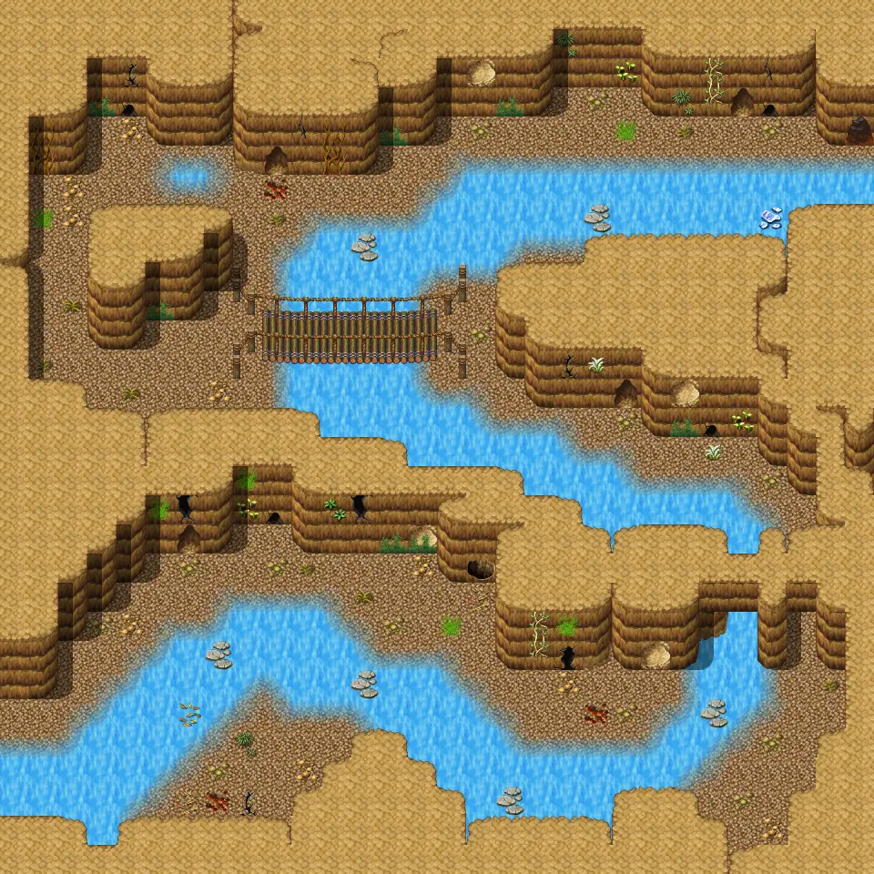
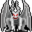

# Waytobrimhavencave2

30×30 tiles · part of [Waytobrimhavencave](index.md)

<label class="lg"><input type="checkbox" data-t="spawn" checked><b>Red</b>&nbsp;Monsters / NPCs</label><label class="lg"><input type="checkbox" data-t="mapchange" checked><b>Blue</b>&nbsp;Exit to another map</label><label class="lg"><input type="checkbox" data-t="container" checked><b>Yellow</b>&nbsp;Container (click to see contents)</label><label class="lg"><input type="checkbox" data-t="sign" checked><b>Purple</b>&nbsp;Sign</label><label class="lg"><input type="checkbox" data-t="rest" checked><b>Green</b>&nbsp;Resting place</label><label class="lg"><input type="checkbox" data-t="key" checked><b>Orange dashed</b>&nbsp;Blocked until a quest step / item</label><label class="lg"><input type="checkbox" data-t="script"><b>Grey dotted</b>&nbsp;Scripted event</label><label class="lg"><input type="checkbox" data-t="replace"><b>White dotted</b>&nbsp;Changes during a quest</label>

## Exits

- [Waytobrimhavencave1](waytobrimhavencave1.md)
- [Waytobrimhavencave3](waytobrimhavencave3.md)

## Monsters & NPCs here

| Name | HP |
|---|---|
| [Large cave rat](../monsters/large_cave_rat.md) | 21 |
| [Bone warrior](../monsters/bone_warrior.md) | 32 |
| [Bone champion](../monsters/bone_champion.md) | 49 |
| [Young allaceph](../monsters/allaceph_1.md) | 90 |
| [Allaceph](../monsters/allaceph_2.md) | 94 |
| [Strong allaceph](../monsters/allaceph_3.md) | 101 |
| [Tough allaceph](../monsters/allaceph_4.md) | 111 |

<small>Map ID: `waytobrimhavencave2` · Data from v0.8.18</small>
