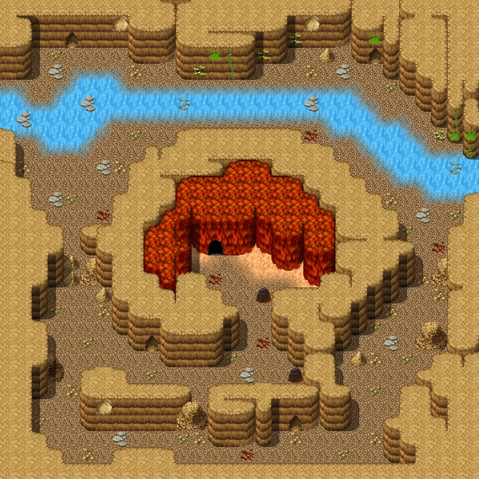

# Waytobrimhavencave3

30×30 tiles · part of [Waytobrimhavencave](index.md)

<label class="lg lg-spawn"><input type="checkbox" data-t="spawn" checked> Monsters / NPCs</label><label class="lg lg-mapchange"><input type="checkbox" data-t="mapchange" checked> Exit to another map</label><label class="lg lg-container"><input type="checkbox" data-t="container" checked> Container</label><label class="lg lg-sign"><input type="checkbox" data-t="sign" checked> Sign</label><label class="lg lg-rest"><input type="checkbox" data-t="rest" checked> Resting place</label><label class="lg lg-key"><input type="checkbox" data-t="key" checked> Blocked / needs key or quest</label><label class="lg lg-script"><input type="checkbox" data-t="script"> Scripted event</label><label class="lg lg-replace"><input type="checkbox" data-t="replace"> Changes after a quest</label>

## Exits

- [Waytobrimhavencave2](waytobrimhavencave2.md)
- [Waytobrimhavencave3b](waytobrimhavencave3b.md)

## Monsters & NPCs here

| Name | HP |
|---|---|
| [Bone champion](../monsters/bone_champion.md) | 49 |
| [Strong allaceph](../monsters/allaceph_3.md) | 101 |
| [Tough allaceph](../monsters/allaceph_4.md) | 111 |
| [Radiant allaceph](../monsters/allaceph_5.md) | 124 |
| [Ancient allaceph](../monsters/allaceph_6.md) | 133 |
| [Ancient allaceph](../monsters/allaceph_cr.md) | 333 |

<small>Map ID: `waytobrimhavencave3` · Data from v0.8.18</small>
