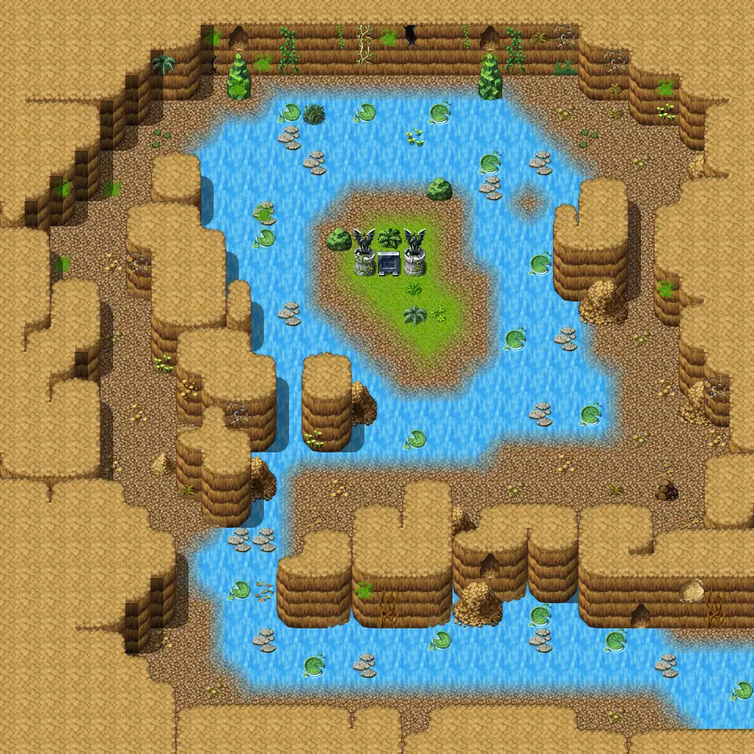

# Waytobrimhavencave4

30×30 tiles · part of [Waytobrimhavencave](index.md)

<label class="lg lg-spawn"><input type="checkbox" data-t="spawn" checked> Monsters / NPCs</label><label class="lg lg-mapchange"><input type="checkbox" data-t="mapchange" checked> Exit to another map</label><label class="lg lg-container"><input type="checkbox" data-t="container" checked> Container</label><label class="lg lg-sign"><input type="checkbox" data-t="sign" checked> Sign</label><label class="lg lg-rest"><input type="checkbox" data-t="rest" checked> Resting place</label><label class="lg lg-key"><input type="checkbox" data-t="key" checked> Blocked / needs key or quest</label><label class="lg lg-script"><input type="checkbox" data-t="script"> Scripted event</label><label class="lg lg-replace"><input type="checkbox" data-t="replace"> Changes after a quest</label>

## Exits

- [Waytobrimhavencave1a](waytobrimhavencave1a.md)

## Monsters & NPCs here

| Name | HP |
|---|---|
| [Large cave rat](../monsters/large_cave_rat.md) | 21 |
| [Bone warrior](../monsters/bone_warrior.md) | 32 |
| [Erumen lizard](../monsters/erumen_3.md) | 45 |
| [Strong erumen lizard](../monsters/erumen_4.md) | 79 |
| [Vile erumen lizard](../monsters/erumen_5.md) | 89 |
| [Tough erumen lizard](../monsters/erumen_6.md) | 91 |
| [Ulirfendor](../monsters/ulirfendor.md) | 288 |

<small>Map ID: `waytobrimhavencave4` · Data from v0.8.18</small>
