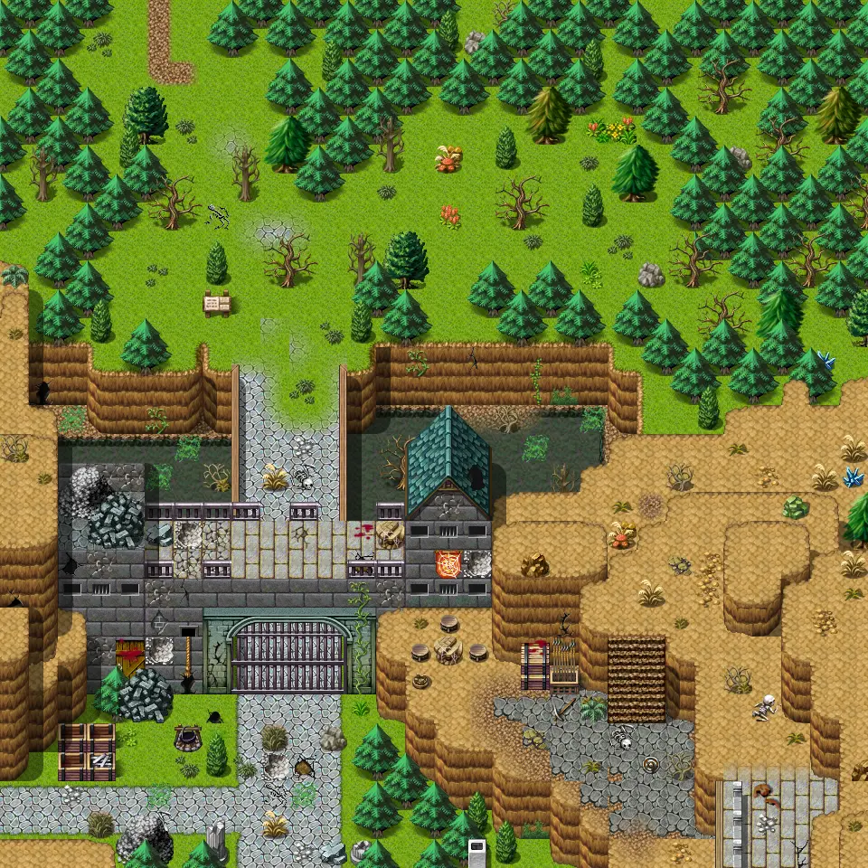

# Waytogalmore0

30×30 tiles · outdoors · part of [World1](index.md)

<label class="lg lg-spawn"><input type="checkbox" data-t="spawn" checked> Monsters / NPCs</label><label class="lg lg-mapchange"><input type="checkbox" data-t="mapchange" checked> Exit to another map</label><label class="lg lg-container"><input type="checkbox" data-t="container" checked> Container</label><label class="lg lg-sign"><input type="checkbox" data-t="sign" checked> Sign</label><label class="lg lg-rest"><input type="checkbox" data-t="rest" checked> Resting place</label><label class="lg lg-key"><input type="checkbox" data-t="key" checked> Blocked / needs key or quest</label><label class="lg lg-script"><input type="checkbox" data-t="script"> Scripted event</label><label class="lg lg-replace"><input type="checkbox" data-t="replace"> Changes after a quest</label>

## Exits

- [Flagstone0](flagstone0.md)
- [Flagstone filler east 2](flagstone_filler_east_2.md)
- [Lake shore road 7](lake_shore_road_7.md)
- [Rat mountain 1](rat_mountain_1.md)
- [Rat mountain 7](rat_mountain_7.md)
- [Waytogalmore1](waytogalmore1.md)
- [Wild18](wild18.md)

## Monsters & NPCs here

| Name | HP |
|---|---|
| [Gyra](../monsters/stn_gyra5.md) | 0 |
| [Gyra](../monsters/stn_gyra3.md) | 0 |
| [Gyra](../monsters/stn_gyra4.md) | 0 |
| [Mikhail](../monsters/mikhail.md) | 0 |
| [Gyra](../monsters/stn_gyra1.md) | 0 |
| [Gyra](../monsters/stn_gyra2.md) | 0 |
| [Colonel Lutarc](../monsters/stn_colonel.md) | 0 |
| [Lizard](../monsters/stn_lizard.md) | 50 |
| [Erwyn's soldier](../monsters/erwyn_soldier2.md) | 65 |
| [Erwyn's soldier](../monsters/erwyn_soldier.md) | 65 |
| [Erwyn's knight](../monsters/erwyn_knight.md) | 75 |
| [Mikhail](../monsters/stn_colonel_mons3.md) | 100 |
| [Lizard](../monsters/stn_colonel_mons1.md) | 100 |
| [Skeleton](../monsters/stn_colonel_mons2.md) | 100 |
| [Bully](../monsters/stn_colonel_mons5.md) | 100 |
| [Mikhail](../monsters/stn_colonel_mons3b.md) | 100 |
| [Giant serpent](../monsters/stn_colonel_mons4.md) | 100 |

<small>Map ID: `waytogalmore0` · Data from v0.8.18</small>
