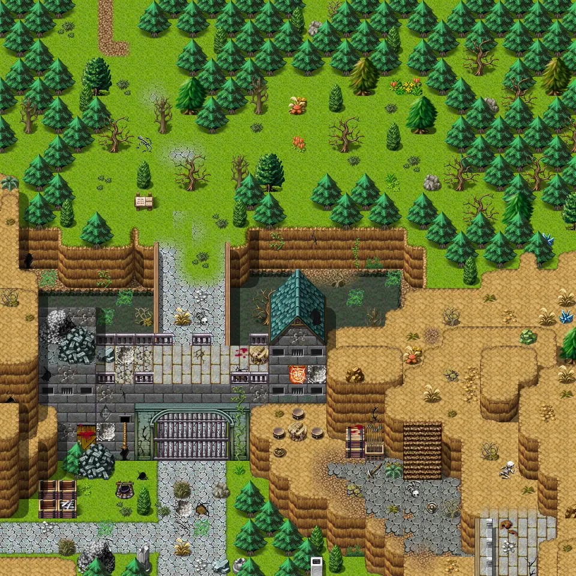

# Waytogalmore 0

| | |
|---|---|
| **Map ID** | `waytogalmore0` |
| **Region** | Near Flagstone Prison (other) |
| **Type** | Outdoors |
| **Size** | 30×30 tiles |
| **World map** | [World 1](index.md) |
| **Introduced** | [v0.7.2](../versions/0.7.2.md) |
| **NPCs** | 10 |
| **Enemy types** | 7 |
| **Quests** | 9 |

**Waytogalmore 0** is an outdoor map, near Flagstone Prison (other). It has 10 NPCs and 7 kinds of enemy. Exits lead to Flagstone 0, Flagstone filler east 2, Lake shore road 7, Rat mountain 1 and 3 more.

## Map

<label class="lg"><input type="checkbox" data-t="spawn" checked><b>Red</b>&nbsp;Monsters / NPCs</label><label class="lg"><input type="checkbox" data-t="mapchange" checked><b>Blue</b>&nbsp;Exit to another map</label><label class="lg"><input type="checkbox" data-t="container" checked><b>Yellow</b>&nbsp;Container (click to see contents)</label><label class="lg"><input type="checkbox" data-t="sign" checked><b>Purple</b>&nbsp;Sign</label><label class="lg"><input type="checkbox" data-t="rest" checked><b>Green</b>&nbsp;Resting place</label><label class="lg"><input type="checkbox" data-t="key" checked><b>Orange dashed</b>&nbsp;Blocked until a quest step / item</label><label class="lg"><input type="checkbox" data-t="script"><b>Grey dotted</b>&nbsp;Scripted event</label><label class="lg"><input type="checkbox" data-t="replace"><b>White dotted</b>&nbsp;Changes during a quest</label><label class="lg"><input type="checkbox" data-t="pin" checked><b>Numbers</b>&nbsp;Numbered key points (see the key below the map)</label>

<a class="pin pin-exit" href="#key-1" style="left:20.000%;top:1.667%" title="Exit (north): to [Flagstone 0](flagstone0.md)">1</a><a class="pin pin-exit" href="#key-2" style="left:98.333%;top:41.667%" title="Exit (east): to [Flagstone filler east 2](flagstone_filler_east_2.md)">2</a><a class="pin pin-exit" href="#key-2" style="left:98.333%;top:48.333%" title="Exit (east): to [Flagstone filler east 2](flagstone_filler_east_2.md)">2</a><a class="pin pin-exit" href="#key-3" style="left:95.000%;top:41.667%" title="Exit (east): to [Lake shore road 7](lake_shore_road_7.md)">3</a><a class="pin pin-exit" href="#key-4" style="left:98.333%;top:76.667%" title="Exit (east): to [Rat mountain 1](rat_mountain_1.md)">4</a><a class="pin pin-exit" href="#key-5" style="left:98.333%;top:55.000%" title="Exit (east): to [Rat mountain 7](rat_mountain_7.md)">5</a><a class="pin pin-exit" href="#key-6" style="left:31.667%;top:98.333%" title="Exit (south): to [Waytogalmore 1](waytogalmore1.md)">6</a><a class="pin pin-exit" href="#key-6" style="left:76.667%;top:98.333%" title="Exit (south): to [Waytogalmore 1](waytogalmore1.md)">6</a><a class="pin pin-exit" href="#key-6" style="left:90.000%;top:98.333%" title="Exit (south): to [Waytogalmore 1](waytogalmore1.md)">6</a><a class="pin pin-exit" href="#key-7" style="left:1.667%;top:93.333%" title="Exit (southwest): to [Wild 18](wild18.md)">7</a><a id="pin-npc-stn_colonel" class="pin pin-npc" href="#key-8" style="left:51.667%;top:71.667%" title="[Colonel Lutarc](../../monsters/stn_colonel.md): 1 quest">8</a><a id="pin-npc-erwyn_knight" class="pin pin-npc" href="#key-9" style="left:31.667%;top:48.333%" title="[Erwyn&#x27;s knight](../../monsters/erwyn_knight.md): NPC">9</a><a id="pin-npc-erwyn_soldier" class="pin pin-npc" href="#key-10" style="left:35.000%;top:88.333%" title="[Erwyn&#x27;s soldier](../../monsters/erwyn_soldier.md): NPC">10</a><a id="pin-npc-erwyn_soldier2" class="pin pin-npc" href="#key-11" style="left:81.667%;top:71.667%" title="[Erwyn&#x27;s soldier](../../monsters/erwyn_soldier.md#v-erwyn_soldier2): NPC">11</a><a id="pin-npc-stn_gyra2" class="pin pin-npc" href="#key-12" style="left:86.728%;top:98.958%" title="[Gyra](../../monsters/stn_gyra.md#v-stn_gyra2): NPC">12</a><a id="pin-npc-stn_gyra1" class="pin pin-npc" href="#key-13" style="left:73.395%;top:98.958%" title="[Gyra](../../monsters/stn_gyra.md#v-stn_gyra1): NPC">13</a><a id="pin-npc-stn_gyra3" class="pin pin-npc" href="#key-14" style="left:31.886%;top:95.834%" title="[Gyra](../../monsters/stn_gyra.md#v-stn_gyra3): NPC">14</a><a id="pin-npc-stn_gyra4" class="pin pin-npc" href="#key-15" style="left:1.042%;top:96.471%" title="[Gyra](../../monsters/stn_gyra.md#v-stn_gyra4): NPC">15</a><a id="pin-npc-stn_gyra5" class="pin pin-npc" href="#key-16" style="left:16.728%;top:3.137%" title="[Gyra](../../monsters/stn_gyra.md#v-stn_gyra5): NPC">16</a><a id="pin-npc-mikhail" class="pin pin-npc" href="#key-17" style="left:51.667%;top:45.000%" title="[Mikhail](../../monsters/mikhail.md): 7 quests">17</a><a class="pin pin-script" href="#key-18" style="left:15.061%;top:6.471%" title="Quest trigger: Scripted event: advances the quest: hidden story flag “stn_nondisplay” to stage 15 (“15=Gyra in waytogalmore0”)">18</a><a class="pin pin-script" href="#key-18" style="left:5.000%;top:91.667%" title="Quest trigger: Scripted event: advances the quest: hidden story flag “stn_nondisplay” to stage 15 (“15=Gyra in waytogalmore0”)">18</a><a class="pin pin-script" href="#key-18" style="left:31.886%;top:92.500%" title="Quest trigger: Scripted event: advances the quest: hidden story flag “stn_nondisplay” to stage 15 (“15=Gyra in waytogalmore0”)">18</a><a class="pin pin-script" href="#key-18" style="left:90.000%;top:95.000%" title="Quest trigger: Scripted event: advances the quest: hidden story flag “stn_nondisplay” to stage 15 (“15=Gyra in waytogalmore0”)">18</a><a class="pin pin-script" href="#key-18" style="left:75.000%;top:95.000%" title="Quest trigger: Scripted event: advances the quest: hidden story flag “stn_nondisplay” to stage 15 (“15=Gyra in waytogalmore0”)">18</a><a class="pin pin-script" href="#key-19" style="left:55.000%;top:75.000%" title="Quest trigger: Scripted event: advances the quest: Colonel Lutarc to stage 10 (“I talked to Colonel Lutarc. He proposed a competition with five of his best fighters.”) (+1 more quest(s))">19</a><a class="pin pin-script" href="#key-19" style="left:48.333%;top:75.000%" title="Quest trigger: Scripted event: advances the quest: Colonel Lutarc to stage 10 (“I talked to Colonel Lutarc. He proposed a competition with five of his best fighters.”) (+1 more quest(s))">19</a><a class="pin pin-script" href="#key-20" style="left:21.667%;top:93.333%" title="Quest trigger: Scripted event: advances the quest: Colonel Lutarc to stage 153 (“I lost this last fight.”) (+1 more quest(s))">20</a><a class="pin pin-script" href="#key-20" style="left:28.733%;top:94.481%" title="Quest trigger: Scripted event: advances the quest: Colonel Lutarc to stage 153 (“I lost this last fight.”) (+1 more quest(s))">20</a><a class="pin pin-script" href="#key-20" style="left:33.333%;top:78.333%" title="Quest trigger: Scripted event: advances the quest: Colonel Lutarc to stage 153 (“I lost this last fight.”) (+1 more quest(s))">20</a><a class="pin pin-script" href="#key-21" style="left:35.219%;top:84.167%" title="Quest trigger: Scripted event: advances the quest: hidden story flag “stn_nondisplay” to stage 51 (“51=Duell in progress - no leave”) (+1 more quest(s))">21</a><a class="pin pin-script" href="#key-22" style="left:33.553%;top:45.834%" title="Quest trigger: Scripted event: advances the quest: hidden story flag “stn_nondisplay” to stage 46 (“46=Castle cleared of soldiers”)">22</a><a class="pin pin-key" href="#key-23" style="left:33.553%;top:75.834%" title="Blocked passage: Closed off once you reach this point in the quest: hidden story flag “stn_nondisplay” (stage 51: “51=Duell in progress - no leave”)">23</a><a class="pin pin-key" href="#key-23" style="left:28.733%;top:97.814%" title="Blocked passage: Closed off once you reach this point in the quest: hidden story flag “stn_nondisplay” (stage 51: “51=Duell in progress - no leave”)">23</a><a class="pin pin-key" href="#key-23" style="left:1.886%;top:90.834%" title="Blocked passage: Closed off once you reach this point in the quest: hidden story flag “stn_nondisplay” (stage 51: “51=Duell in progress - no leave”)">23</a><a class="pin pin-key" href="#key-24" style="left:21.667%;top:78.333%" title="Blocked passage: Unlocked during the quest: base_nondisplay (stage 2: “2=This stage is never set”)">24</a><a class="pin pin-key" href="#key-25" style="left:95.219%;top:39.167%" title="Blocked passage: Unlocked during the quest: hidden story flag “sutdover_hidden” (stage 1: “PC has completed enough of &#x27;A Wicked witch&#x27; to enable mountain teleportation crystals.”)">25</a><a class="pin pin-replace" href="#key-26" style="left:60.000%;top:70.000%" title="Changes during a quest: This area changes during the quest: hidden story flag “stn_nondisplay” (stage 5: “5=North gate open”)">26</a><a class="pin pin-replace" href="#key-27" style="left:60.219%;top:67.500%" title="Changes during a quest: This area changes back during the quest: hidden story flag “stn_nondisplay” (stage 5: “5=North gate open”)">27</a><a class="pin pin-key" href="#key-28" style="left:63.333%;top:63.333%" title="Blocked passage: Closed off once you reach this point in the quest: Search for Andor (stage 1: “My father Mikhail says that Andor has not been home since yesterday. I should go look for him in the village.”)">28</a><a class="pin pin-key" href="#key-28" style="left:88.333%;top:65.000%" title="Blocked passage: Closed off once you reach this point in the quest: Search for Andor (stage 1: “My father Mikhail says that Andor has not been home since yesterday. I should go look for him in the village.”)">28</a>

??? abstract "Key to the numbers on the map"

    | # | What | Details |
    |---|---|---|
    | 1 | Exit (north) | to [Flagstone 0](flagstone0.md) |
    | 2 | Exit (east) | to [Flagstone filler east 2](flagstone_filler_east_2.md) |
    | 3 | Exit (east) | to [Lake shore road 7](lake_shore_road_7.md) |
    | 4 | Exit (east) | to [Rat mountain 1](rat_mountain_1.md) |
    | 5 | Exit (east) | to [Rat mountain 7](rat_mountain_7.md) |
    | 6 | Exit (south) | to [Waytogalmore 1](waytogalmore1.md) |
    | 7 | Exit (southwest) | to [Wild 18](wild18.md) |
    | 8 | [Colonel Lutarc](../monsters/stn_colonel.md) | 1 quest |
    | 9 | [Erwyn's knight](../monsters/erwyn_knight.md) | NPC |
    | 10 | [Erwyn's soldier](../monsters/erwyn_soldier.md) | NPC |
    | 11 | [Erwyn's soldier](../monsters/erwyn_soldier.md#v-erwyn_soldier2) | NPC |
    | 12 | [Gyra](../monsters/stn_gyra.md#v-stn_gyra2) | NPC |
    | 13 | [Gyra](../monsters/stn_gyra.md#v-stn_gyra1) | NPC |
    | 14 | [Gyra](../monsters/stn_gyra.md#v-stn_gyra3) | NPC |
    | 15 | [Gyra](../monsters/stn_gyra.md#v-stn_gyra4) | NPC |
    | 16 | [Gyra](../monsters/stn_gyra.md#v-stn_gyra5) | NPC |
    | 17 | [Mikhail](../monsters/mikhail.md) | 7 quests |
    | 18 | Quest trigger | Scripted event: advances the quest: hidden story flag “stn_nondisplay” to stage 15 (“15=Gyra in waytogalmore0”) |
    | 19 | Quest trigger | Scripted event: advances the quest: Colonel Lutarc to stage 10 (“I talked to Colonel Lutarc. He proposed a competition with five of his best fighters.”) (+1 more quest(s)) |
    | 20 | Quest trigger | Scripted event: advances the quest: Colonel Lutarc to stage 153 (“I lost this last fight.”) (+1 more quest(s)) |
    | 21 | Quest trigger | Scripted event: advances the quest: hidden story flag “stn_nondisplay” to stage 51 (“51=Duell in progress - no leave”) (+1 more quest(s)) |
    | 22 | Quest trigger | Scripted event: advances the quest: hidden story flag “stn_nondisplay” to stage 46 (“46=Castle cleared of soldiers”) |
    | 23 | Blocked passage | Closed off once you reach this point in the quest: hidden story flag “stn_nondisplay” (stage 51: “51=Duell in progress - no leave”) |
    | 24 | Blocked passage | Unlocked during the quest: base_nondisplay (stage 2: “2=This stage is never set”) |
    | 25 | Blocked passage | Unlocked during the quest: hidden story flag “sutdover_hidden” (stage 1: “PC has completed enough of 'A Wicked witch' to enable mountain teleportation crystals.”) |
    | 26 | Changes during a quest | This area changes during the quest: hidden story flag “stn_nondisplay” (stage 5: “5=North gate open”) |
    | 27 | Changes during a quest | This area changes back during the quest: hidden story flag “stn_nondisplay” (stage 5: “5=North gate open”) |
    | 28 | Blocked passage | Closed off once you reach this point in the quest: Search for Andor (stage 1: “My father Mikhail says that Andor has not been home since yesterday. I should go look for him in the village.”) |

Verified against v0.8.18 map data.

## Connections

| Direction | Leads to | Region there | Map # |
|---|---|---|---|
| North | [Flagstone 0](flagstone0.md) | Flagstone Prison | 1 |
| East | [Flagstone filler east 2](flagstone_filler_east_2.md) | Flagstone Prison | 2 |
| East | [Lake shore road 7](lake_shore_road_7.md) | Flagstone Prison | 3 |
| East | [Rat mountain 1](rat_mountain_1.md) | Flagstone Prison | 4 |
| East | [Rat mountain 7](rat_mountain_7.md) | Flagstone Prison | 5 |
| South | [Waytogalmore 1](waytogalmore1.md) | Flagstone Prison | 6 |
| Southwest | [Wild 18](wild18.md) | Flagstone Prison | 7 |

## NPCs

- [Colonel Lutarc](../monsters/stn_colonel.md) — quests: [Colonel Lutarc](../quests/stn_colonel.md) (#8)
- [Erwyn's knight](../monsters/erwyn_knight.md) — can be fought (#9)
- [Erwyn's soldier](../monsters/erwyn_soldier.md) — can be fought (#10)
- [Erwyn's soldier](../monsters/erwyn_soldier.md#v-erwyn_soldier2) — can be fought (#11)
- [Gyra](../monsters/stn_gyra.md#v-stn_gyra2) (#12)
- [Gyra](../monsters/stn_gyra.md#v-stn_gyra1) (#13)
- [Gyra](../monsters/stn_gyra.md#v-stn_gyra3) (#14)
- [Gyra](../monsters/stn_gyra.md#v-stn_gyra4) (#15)
- [Gyra](../monsters/stn_gyra.md#v-stn_gyra5) (#16)
- [Mikhail](../monsters/mikhail.md) — quests: [A familiar shadow](../quests/familiar_shadow.md), [Breakfast bread](../quests/mikhail_bread.md), [Honor your parents](../quests/brv_present.md), [More rats!](../quests/ratdom_mikhail.md), [Rats!](../quests/mikhail_rats.md), [Search for Andor](../quests/andor.md), [Unusual experiences and achievements](../quests/achievements.md) (#17)

## Enemies

| Enemy | HP | Damage | Up to | Notes |
|---|---|---|---|---|
| [Lizard](../monsters/stn_lizard.md) | 50 | 4–7 | 5 | appears later, during a quest |
| [Bully](../monsters/stn_colonel_mons5.md) | 100 | 5–10 | 1 | appears later, during a quest |
| [Skeleton](../monsters/skeleton.md#v-stn_colonel_mons2) | 100 | 1–4 | 1 | appears later, during a quest |
| [Mikhail](../monsters/mikhail.md#v-stn_colonel_mons3b) | 100 | 1–4 | 1 | appears later, during a quest |
| [Lizard](../monsters/stn_lizard.md#v-stn_colonel_mons1) | 100 | 1–4 | 1 | appears later, during a quest |
| [Mikhail](../monsters/mikhail.md#v-stn_colonel_mons3) | 100 | 1–4 | 2 | appears later, during a quest |
| [Giant serpent](../monsters/stn_colonel_mons4.md) | 100 | 1–4 | 1 | appears later, during a quest |

<small>“Up to” is the most that can be alive at once from the spawn areas on this map.</small>

## Quests

- [A familiar shadow](../quests/familiar_shadow.md): [Mikhail](../monsters/mikhail.md) is involved
- [base_nondisplay](../quests/base_nondisplay.md): blocked passage opens at stage 2
- [Breakfast bread](../quests/mikhail_bread.md): [Mikhail](../monsters/mikhail.md) is involved
- [Colonel Lutarc](../quests/stn_colonel.md): [Colonel Lutarc](../monsters/stn_colonel.md) is involved; something on this map advances it; stepping on a trigger here sets stage 10; stepping on a trigger here sets stage 111; stepping on a trigger here sets stage 112; stepping on a trigger here sets stage 113; stepping on a trigger here sets stage 121; stepping on a trigger here sets stage 122; stepping on a trigger here sets stage 123; stepping on a trigger here sets stage 131; stepping on a trigger here sets stage 132; stepping on a trigger here sets stage 133; stepping on a trigger here sets stage 141; stepping on a trigger here sets stage 142; stepping on a trigger here sets stage 143; stepping on a trigger here sets stage 151; stepping on a trigger here sets stage 152; stepping on a trigger here sets stage 153; stepping on a trigger here sets stage 160; stepping on a trigger here sets stage 170; stepping on a trigger here sets stage 171; stepping on a trigger here sets stage 172; stepping on a trigger here sets stage 190; stepping on a trigger here sets stage 20
- [Honor your parents](../quests/brv_present.md): [Mikhail](../monsters/mikhail.md) is involved
- [More rats!](../quests/ratdom_mikhail.md): [Mikhail](../monsters/mikhail.md) is involved
- [Rats!](../quests/mikhail_rats.md): [Mikhail](../monsters/mikhail.md) is involved
- [Search for Andor](../quests/andor.md): [Mikhail](../monsters/mikhail.md) is involved; blocked passage closes at stage 1
- [Unusual experiences and achievements](../quests/achievements.md): [Mikhail](../monsters/mikhail.md) is involved
- [Brimhaven multipurpose story flags (hidden flag)](../quests/brv_nondisplay_multipurpose.md): [Mikhail](../monsters/mikhail.md) is involved
- [Brimhaven warehouse delivery (hidden flag)](../quests/brv_wh_delivery_nondisplay.md): [Mikhail](../monsters/mikhail.md) is involved
- [Darkness in the Daylight and Shadows story flags (hidden flag)](../quests/dds_nd.md): [Mikhail](../monsters/mikhail.md) is involved
- [General story flags (hidden flag)](../quests/nondisplay.md): [Mikhail](../monsters/mikhail.md) is involved
- [Stoutford story flags (hidden flag)](../quests/stn_nondisplay.md): [Colonel Lutarc](../monsters/stn_colonel.md) is involved; [Gyra](../monsters/stn_gyra.md#v-stn_gyra1) is involved; [Gyra](../monsters/stn_gyra.md#v-stn_gyra2) is involved; [Gyra](../monsters/stn_gyra.md#v-stn_gyra3) is involved; [Gyra](../monsters/stn_gyra.md#v-stn_gyra4) is involved; [Gyra](../monsters/stn_gyra.md#v-stn_gyra5) is involved; a scripted event can trigger here from stage 5; blocked passage closes at stage 51; part of the map changes at stage 5; something on this map advances it; stepping on a trigger here sets stage 110; stepping on a trigger here sets stage 120; stepping on a trigger here sets stage 130; stepping on a trigger here sets stage 140; stepping on a trigger here sets stage 15; stepping on a trigger here sets stage 150; stepping on a trigger here sets stage 160; stepping on a trigger here sets stage 46; stepping on a trigger here sets stage 47; stepping on a trigger here sets stage 50; stepping on a trigger here sets stage 51
- [Sutdover story flags (hidden flag)](../quests/sutdover_hidden.md): blocked passage opens at stage 1

## Points of interest

- **Quest trigger** (#18): Scripted event: advances the quest: hidden story flag “stn_nondisplay” to stage 15 (“15=Gyra in waytogalmore0”)
- **Quest trigger** (#19): Scripted event: advances the quest: Colonel Lutarc to stage 10 (“I talked to Colonel Lutarc. He proposed a competition with five of his best fighters.”) (+1 more quest(s))
- **Quest trigger** (#20): Scripted event: advances the quest: Colonel Lutarc to stage 153 (“I lost this last fight.”) (+1 more quest(s))
- **Quest trigger** (#21): Scripted event: advances the quest: hidden story flag “stn_nondisplay” to stage 51 (“51=Duell in progress - no leave”) (+1 more quest(s))
- **Quest trigger** (#22): Scripted event: advances the quest: hidden story flag “stn_nondisplay” to stage 46 (“46=Castle cleared of soldiers”)
- **Blocked passage** (#23): Closed off once you reach this point in the quest: hidden story flag “stn_nondisplay” (stage 51: “51=Duell in progress - no leave”)
- **Blocked passage** (#24): Unlocked during the quest: base_nondisplay (stage 2: “2=This stage is never set”)
- **Blocked passage** (#25): Unlocked during the quest: hidden story flag “sutdover_hidden” (stage 1: “PC has completed enough of 'A Wicked witch' to enable mountain teleportation crystals.”)
- **Changes during a quest** (#26): This area changes during the quest: hidden story flag “stn_nondisplay” (stage 5: “5=North gate open”)
- **Changes during a quest** (#27): This area changes back during the quest: hidden story flag “stn_nondisplay” (stage 5: “5=North gate open”)
- **Blocked passage** (#28): Closed off once you reach this point in the quest: Search for Andor (stage 1: “My father Mikhail says that Andor has not been home since yesterday. I should go look for him in the village.”)

## Version history

| Version | Change |
|---|---|
| [v0.7.2](../versions/0.7.2.md) | Added |
| [v0.8.8](../versions/0.8.8.md) | Map layout or objects changed |
| [v0.8.9](../versions/0.8.9.md) | Map layout or objects changed |
| [v0.8.10](../versions/0.8.10.md) | Map layout or objects changed |
| [v0.8.15](../versions/0.8.15.md) | Map layout or objects changed |

Verified against v0.8.18 and every earlier release back to v0.7.0 (game data compared release by release).

## Community notes

<small>Written by players, not generated from game data. **Observations**: what players notice in-game · **Lore**: the in-world story · **Trivia**: real-world facts, references, development history · **Theory / speculation**: unconfirmed ideas; may just be unfinished content</small>

### Observations

*No notes yet. Contributions are welcome: [add a note](https://github.com/asdfghjkl628/Andor-s-Trail-Wikiiii/new/main/notes/maps?filename=waytogalmore0.md&value=%23%23%20Observations%0A%0A%3C%21--%20what%20players%20notice%20in-game%20--%3E%0A%0A%23%23%20Lore%0A%0A%3C%21--%20the%20in-world%20story%20--%3E%0A%0A%23%23%20Trivia%0A%0A%3C%21--%20real-world%20facts%2C%20references%2C%20development%20history%20--%3E%0A%0A%23%23%20Theory%20/%20speculation%0A%0A%3C%21--%20unconfirmed%20ideas%3B%20may%20just%20be%20unfinished%20content%20--%3E%0A).*

### Lore

*No notes yet. Contributions are welcome: [add a note](https://github.com/asdfghjkl628/Andor-s-Trail-Wikiiii/new/main/notes/maps?filename=waytogalmore0.md&value=%23%23%20Observations%0A%0A%3C%21--%20what%20players%20notice%20in-game%20--%3E%0A%0A%23%23%20Lore%0A%0A%3C%21--%20the%20in-world%20story%20--%3E%0A%0A%23%23%20Trivia%0A%0A%3C%21--%20real-world%20facts%2C%20references%2C%20development%20history%20--%3E%0A%0A%23%23%20Theory%20/%20speculation%0A%0A%3C%21--%20unconfirmed%20ideas%3B%20may%20just%20be%20unfinished%20content%20--%3E%0A).*

### Trivia

*No notes yet. Contributions are welcome: [add a note](https://github.com/asdfghjkl628/Andor-s-Trail-Wikiiii/new/main/notes/maps?filename=waytogalmore0.md&value=%23%23%20Observations%0A%0A%3C%21--%20what%20players%20notice%20in-game%20--%3E%0A%0A%23%23%20Lore%0A%0A%3C%21--%20the%20in-world%20story%20--%3E%0A%0A%23%23%20Trivia%0A%0A%3C%21--%20real-world%20facts%2C%20references%2C%20development%20history%20--%3E%0A%0A%23%23%20Theory%20/%20speculation%0A%0A%3C%21--%20unconfirmed%20ideas%3B%20may%20just%20be%20unfinished%20content%20--%3E%0A).*

### Theory / speculation

*No notes yet. Contributions are welcome: [add a note](https://github.com/asdfghjkl628/Andor-s-Trail-Wikiiii/new/main/notes/maps?filename=waytogalmore0.md&value=%23%23%20Observations%0A%0A%3C%21--%20what%20players%20notice%20in-game%20--%3E%0A%0A%23%23%20Lore%0A%0A%3C%21--%20the%20in-world%20story%20--%3E%0A%0A%23%23%20Trivia%0A%0A%3C%21--%20real-world%20facts%2C%20references%2C%20development%20history%20--%3E%0A%0A%23%23%20Theory%20/%20speculation%0A%0A%3C%21--%20unconfirmed%20ideas%3B%20may%20just%20be%20unfinished%20content%20--%3E%0A).*

??? info "Technical information"

    | | |
    |---|---|
    | Map ID | `waytogalmore0` |
    | File | `res/xml/waytogalmore0.tmx` |
    | Size | 30×30 tiles (960×960 px) |
    | outdoors property | 1 |
    | Layers drawn | base, ground, objects, above, top |
    | Tilesets | map_bed_1, map_border_1, map_bridge_1, map_bridge_2, map_broken_1, map_cavewall_1, map_cavewall_2, map_cavewall_3, map_cavewall_4, map_chair_table_1, map_chair_table_2, map_crate_1, map_cupboard_1, map_curtain_1, map_entrance_1, map_entrance_2, map_fence_1, map_fence_2, map_fence_3, map_fence_4, map_ground_1, map_ground_2, map_ground_3, map_ground_4, map_ground_5, map_ground_6, map_ground_7, map_ground_8, map_house_1, map_house_2, map_indoor_1, map_indoor_2, map_kitchen_1, map_outdoor_1, map_pillar_1, map_pillar_2, map_plant_1, map_plant_2, map_rock_1, map_rock_2, map_roof_1, map_roof_2, map_roof_3, map_shop_1, map_sign_ladder_1, map_table_1, map_trail_1, map_transition_1, map_transition_2, map_transition_3, map_transition_4, map_transition_5, map_tree_1, map_tree_2, map_tree_3, map_wall_1, map_wall_2, map_wall_3, map_wall_4, map_window_1, map_window_2 |
    | Map objects | script: 22, spawn: 17, mapchange: 11, key: 7, replace: 2 |
    | World map position | segment `world1`, x 95, y 500 |

<small>Data from v0.8.18</small>
