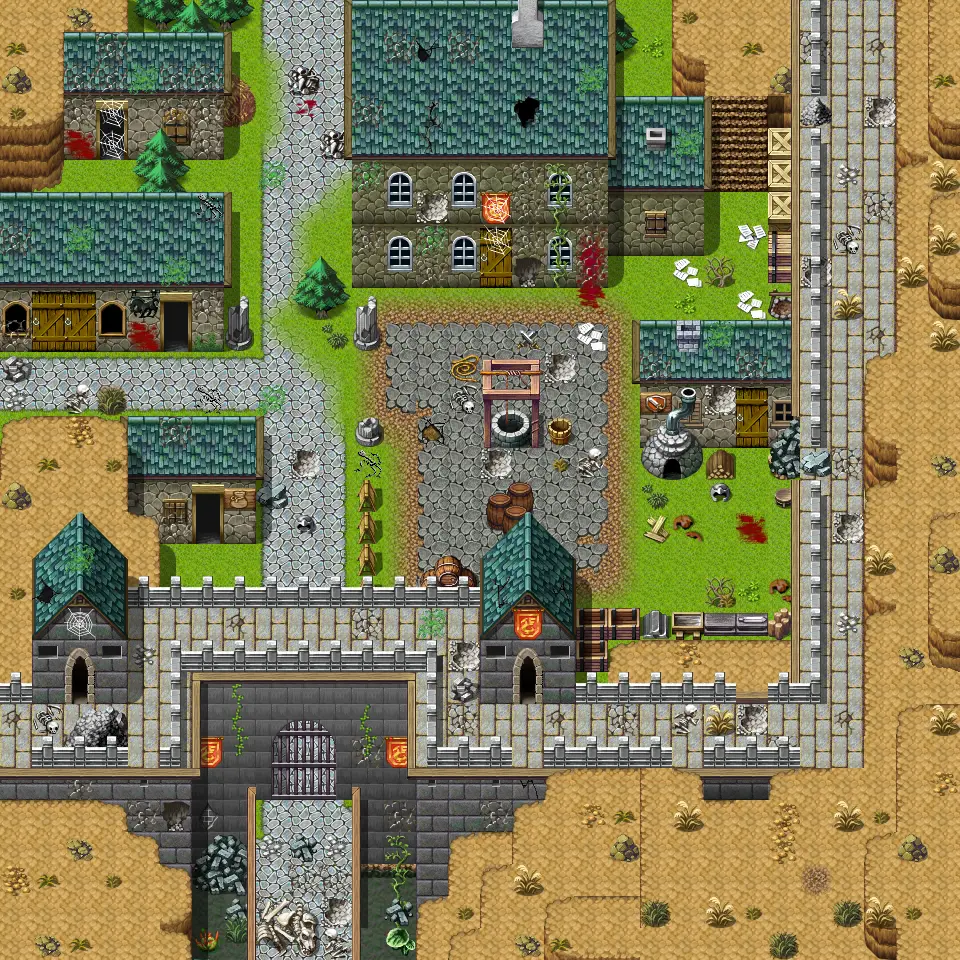

# Waytogalmore1

30×30 tiles · outdoors · part of [World1](index.md)

<label class="lg"><input type="checkbox" data-t="spawn" checked><b>Red</b>&nbsp;Monsters / NPCs</label><label class="lg"><input type="checkbox" data-t="mapchange" checked><b>Blue</b>&nbsp;Exit to another map</label><label class="lg"><input type="checkbox" data-t="container" checked><b>Yellow</b>&nbsp;Container (click to see contents)</label><label class="lg"><input type="checkbox" data-t="sign" checked><b>Purple</b>&nbsp;Sign</label><label class="lg"><input type="checkbox" data-t="rest" checked><b>Green</b>&nbsp;Resting place</label><label class="lg"><input type="checkbox" data-t="key" checked><b>Orange dashed</b>&nbsp;Blocked until a quest step / item</label><label class="lg"><input type="checkbox" data-t="script"><b>Grey dotted</b>&nbsp;Scripted event</label><label class="lg"><input type="checkbox" data-t="replace"><b>White dotted</b>&nbsp;Changes during a quest</label>

## Exits

- [Galmore 9](galmore_9.md)
- [Stoutford castle0](stoutford_castle0.md)
- [Stoutford castle shed](stoutford_castle_shed.md)
- [Stoutford castle shop](stoutford_castle_shop.md)
- [Stoutford castle stable](stoutford_castle_stable.md)
- [Stoutford castle tower0](stoutford_castle_tower0.md)
- [Stoutford castle tower1](stoutford_castle_tower1.md)
- [Waytogalmore0](waytogalmore0.md)
- [Wild22](wild22.md)

## Monsters & NPCs here

| Name | HP |
|---|---|
| [Gyra](../monsters/stn_gyra2.md) | 0 |
| [Gyra](../monsters/stn_gyraC.md) | 0 |
| [Gyra](../monsters/stn_gyra8.md) | 0 |
| [Gyra](../monsters/stn_gyra4.md) | 0 |
| [Gyra](../monsters/stn_gyraB.md) | 0 |
| [Gyra](../monsters/stn_gyra6.md) | 0 |
| [Gyra](../monsters/stn_gyra7.md) | 0 |
| [Gyra](../monsters/stn_gyra5.md) | 0 |
| [Gyra](../monsters/stn_gyra9.md) | 0 |
| [Gyra](../monsters/stn_gyraA.md) | 0 |
| [Gyra](../monsters/stn_gyra1.md) | 0 |
| [Gyra](../monsters/stn_gyra3.md) | 0 |
| [Erwyn's soldier](../monsters/erwyn_soldier3.md) | 65 |
| [Erwyn's soldier](../monsters/erwyn_soldier2.md) | 65 |
| [Erwyn's soldier](../monsters/erwyn_soldier.md) | 65 |
| [Erwyn's knight](../monsters/erwyn_knight.md) | 75 |

<small>Map ID: `waytogalmore1` · Data from v0.8.18</small>
