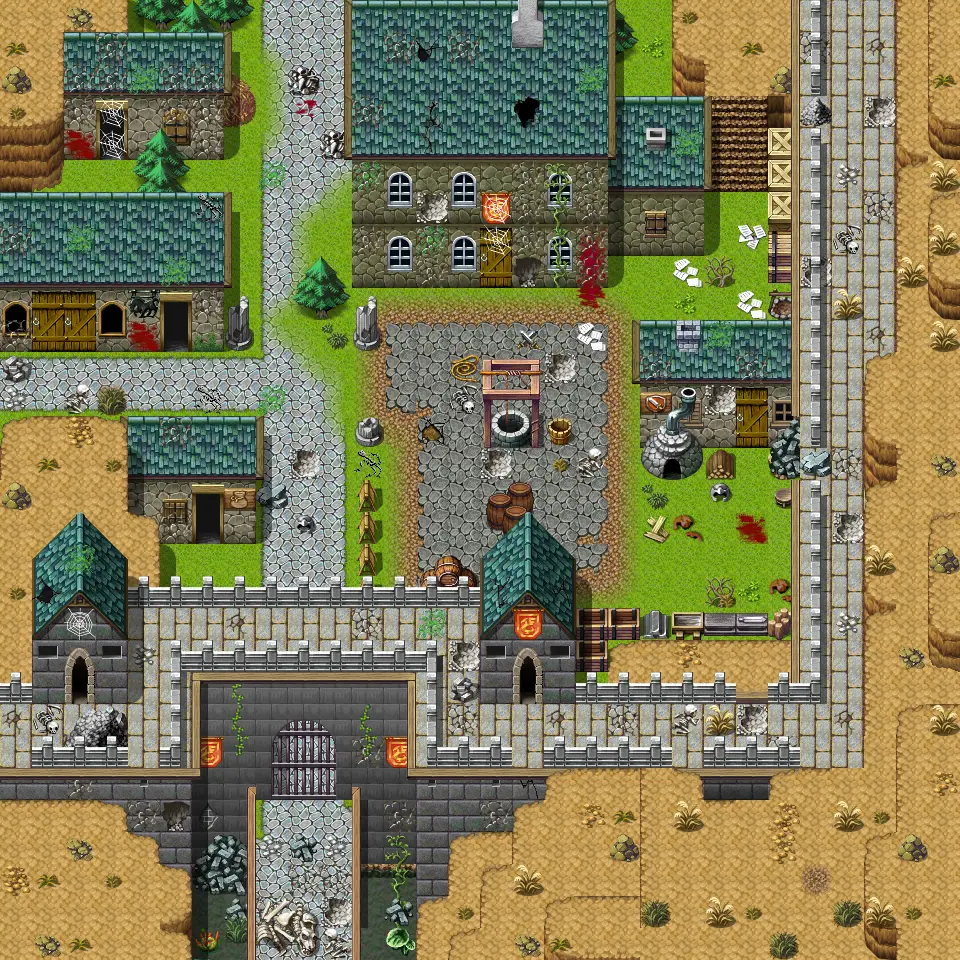

# Waytogalmore1

| | |
|---|---|
| **Map ID** | `waytogalmore1` |
| **Region** | Near Flagstone Prison (other) |
| **Type** | Outdoors |
| **Size** | 30×30 tiles |
| **World map** | [World1](index.md) |
| **Introduced** | [v0.7.2](../versions/0.7.2.md) |
| **NPCs** | 16 |
| **Quests** | 2 |

**Waytogalmore1** is an outdoor map, near Flagstone Prison (other). It has 16 NPCs, and no enemies. Exits lead to Waytogalmore0, Galmore 9, Stoutford castle stable, Wild22 and 5 more.

## Map

<label class="lg"><input type="checkbox" data-t="spawn" checked><b>Red</b>&nbsp;Monsters / NPCs</label><label class="lg"><input type="checkbox" data-t="mapchange" checked><b>Blue</b>&nbsp;Exit to another map</label><label class="lg"><input type="checkbox" data-t="container" checked><b>Yellow</b>&nbsp;Container (click to see contents)</label><label class="lg"><input type="checkbox" data-t="sign" checked><b>Purple</b>&nbsp;Sign</label><label class="lg"><input type="checkbox" data-t="rest" checked><b>Green</b>&nbsp;Resting place</label><label class="lg"><input type="checkbox" data-t="key" checked><b>Orange dashed</b>&nbsp;Blocked until a quest step / item</label><label class="lg"><input type="checkbox" data-t="script"><b>Grey dotted</b>&nbsp;Scripted event</label><label class="lg"><input type="checkbox" data-t="replace"><b>White dotted</b>&nbsp;Changes during a quest</label><label class="lg"><input type="checkbox" data-t="pin" checked><b>Numbers</b>&nbsp;Numbered key points (see the key below the map)</label>

<a class="pin pin-exit" href="#key-1" style="left:31.667%;top:1.667%" title="Exit (north): to [Waytogalmore0](waytogalmore0.md)">1</a><a class="pin pin-exit" href="#key-1" style="left:76.667%;top:1.667%" title="Exit (north): to [Waytogalmore0](waytogalmore0.md)">1</a><a class="pin pin-exit" href="#key-1" style="left:90.000%;top:1.667%" title="Exit (north): to [Waytogalmore0](waytogalmore0.md)">1</a><a class="pin pin-exit" href="#key-2" style="left:31.667%;top:98.333%" title="Exit (south): to [Galmore 9](galmore_9.md)">2</a><a class="pin pin-exit" href="#key-3" style="left:6.667%;top:35.000%" title="Exit (west): to [Stoutford castle stable](stoutford_castle_stable.md)">3</a><a class="pin pin-exit" href="#key-4" style="left:1.667%;top:40.000%" title="Exit (west): to [Wild22](wild22.md)">4</a><a class="pin pin-exit" href="#key-4" style="left:1.667%;top:76.667%" title="Exit (west): to [Wild22](wild22.md)">4</a><a class="pin pin-exit" href="#key-5" style="left:51.667%;top:28.333%" title="Exit (door): to [Stoutford castle0](stoutford_castle0.md)">5</a><a class="pin pin-exit" href="#key-6" style="left:78.333%;top:45.000%" title="Exit (door): to [Stoutford castle shed](stoutford_castle_shed.md)">6</a><a class="pin pin-exit" href="#key-7" style="left:21.667%;top:55.000%" title="Exit (door): to [Stoutford castle shop](stoutford_castle_shop.md)">7</a><a class="pin pin-exit" href="#key-8" style="left:18.333%;top:35.000%" title="Exit (door): to [Stoutford castle stable](stoutford_castle_stable.md)">8</a><a class="pin pin-exit" href="#key-9" style="left:8.333%;top:71.667%" title="Exit (door): to [Stoutford castle tower0](stoutford_castle_tower0.md)">9</a><a class="pin pin-exit" href="#key-10" style="left:55.000%;top:71.667%" title="Exit (door): to [Stoutford castle tower1](stoutford_castle_tower1.md)">10</a><a id="pin-npc-erwyn_knight" class="pin pin-npc" href="#key-11" style="left:65.000%;top:51.667%" title="[Erwyn&#x27;s knight](../../monsters/erwyn_knight.md): NPC">11</a><a id="pin-npc-erwyn_soldier2" class="pin pin-npc" href="#key-12" style="left:88.333%;top:51.667%" title="[Erwyn&#x27;s soldier](../../monsters/erwyn_soldier.md#v-erwyn_soldier2): NPC">12</a><a id="pin-npc-erwyn_soldier3" class="pin pin-npc" href="#key-13" style="left:38.333%;top:41.667%" title="[Erwyn&#x27;s soldier](../../monsters/erwyn_soldier.md#v-erwyn_soldier3): NPC">13</a><a id="pin-npc-erwyn_soldier" class="pin pin-npc" href="#key-14" style="left:65.000%;top:75.000%" title="[Erwyn&#x27;s soldier](../../monsters/erwyn_soldier.md): NPC">14</a><a id="pin-npc-stn_gyra6" class="pin pin-npc" href="#key-15" style="left:33.349%;top:3.860%" title="[Gyra](../../monsters/stn_gyra.md#v-stn_gyra6): NPC">15</a><a id="pin-npc-stn_gyraB" class="pin pin-npc" href="#key-16" style="left:1.886%;top:72.500%" title="[Gyra](../../monsters/stn_gyra.md#v-stn_gyraB): NPC">16</a><a id="pin-npc-stn_gyra4" class="pin pin-npc" href="#key-17" style="left:86.728%;top:3.137%" title="[Gyra](../../monsters/stn_gyra.md#v-stn_gyra4): NPC">17</a><a id="pin-npc-stn_gyra3" class="pin pin-npc" href="#key-18" style="left:73.395%;top:3.137%" title="[Gyra](../../monsters/stn_gyra.md#v-stn_gyra3): NPC">18</a><a id="pin-npc-stn_gyra2" class="pin pin-npc" href="#key-19" style="left:3.395%;top:36.471%" title="[Gyra](../../monsters/stn_gyra.md#v-stn_gyra2): NPC">19</a><a id="pin-npc-stn_gyraA" class="pin pin-npc" href="#key-20" style="left:35.000%;top:95.000%" title="[Gyra](../../monsters/stn_gyra.md#v-stn_gyraA): NPC">20</a><a id="pin-npc-stn_gyra9" class="pin pin-npc" href="#key-21" style="left:21.886%;top:52.500%" title="[Gyra](../../monsters/stn_gyra.md#v-stn_gyra9): NPC">21</a><a id="pin-npc-stn_gyraC" class="pin pin-npc" href="#key-22" style="left:1.042%;top:43.137%" title="[Gyra](../../monsters/stn_gyra.md#v-stn_gyraC): NPC">22</a><a id="pin-npc-stn_gyra7" class="pin pin-npc" href="#key-23" style="left:8.553%;top:69.167%" title="[Gyra](../../monsters/stn_gyra.md#v-stn_gyra7): NPC">23</a><a id="pin-npc-stn_gyra1" class="pin pin-npc" href="#key-24" style="left:51.886%;top:25.834%" title="[Gyra](../../monsters/stn_gyra.md#v-stn_gyra1): NPC">24</a><a id="pin-npc-stn_gyra5" class="pin pin-npc" href="#key-25" style="left:55.219%;top:69.167%" title="[Gyra](../../monsters/stn_gyra.md#v-stn_gyra5): NPC">25</a><a id="pin-npc-stn_gyra8" class="pin pin-npc" href="#key-26" style="left:18.553%;top:32.500%" title="[Gyra](../../monsters/stn_gyra.md#v-stn_gyra8): NPC">26</a><a class="pin pin-script" href="#key-27" style="left:25.000%;top:60.000%" title="Quest trigger: Scripted event: advances the quest: hidden story flag “stn_nondisplay” to stage 14 (“14=Gyra in waytogalmore1”)">27</a><a class="pin pin-script" href="#key-27" style="left:18.333%;top:38.333%" title="Quest trigger: Scripted event: advances the quest: hidden story flag “stn_nondisplay” to stage 14 (“14=Gyra in waytogalmore1”)">27</a><a class="pin pin-script" href="#key-27" style="left:6.667%;top:76.667%" title="Quest trigger: Scripted event: advances the quest: hidden story flag “stn_nondisplay” to stage 14 (“14=Gyra in waytogalmore1”)">27</a><a class="pin pin-script" href="#key-27" style="left:30.000%;top:5.000%" title="Quest trigger: Scripted event: advances the quest: hidden story flag “stn_nondisplay” to stage 14 (“14=Gyra in waytogalmore1”)">27</a><a class="pin pin-script" href="#key-27" style="left:55.000%;top:75.000%" title="Quest trigger: Scripted event: advances the quest: hidden story flag “stn_nondisplay” to stage 14 (“14=Gyra in waytogalmore1”)">27</a><a class="pin pin-script" href="#key-27" style="left:90.000%;top:5.000%" title="Quest trigger: Scripted event: advances the quest: hidden story flag “stn_nondisplay” to stage 14 (“14=Gyra in waytogalmore1”)">27</a><a class="pin pin-script" href="#key-27" style="left:78.333%;top:5.000%" title="Quest trigger: Scripted event: advances the quest: hidden story flag “stn_nondisplay” to stage 14 (“14=Gyra in waytogalmore1”)">27</a><a class="pin pin-script" href="#key-27" style="left:8.333%;top:40.000%" title="Quest trigger: Scripted event: advances the quest: hidden story flag “stn_nondisplay” to stage 14 (“14=Gyra in waytogalmore1”)">27</a><a class="pin pin-script" href="#key-27" style="left:51.667%;top:31.667%" title="Quest trigger: Scripted event: advances the quest: hidden story flag “stn_nondisplay” to stage 14 (“14=Gyra in waytogalmore1”)">27</a><a class="pin pin-key" href="#key-28" style="left:25.000%;top:73.333%" title="Blocked passage: Unlocked during the quest: base_nondisplay (stage 2: “2=This stage is never set”)">28</a><a class="pin pin-replace" href="#key-29" style="left:31.667%;top:78.333%" title="Changes during a quest: This area changes during the quest: hidden story flag “stn_nondisplay” (stage 8: “8=South gate open”)">29</a><a class="pin pin-replace" href="#key-30" style="left:31.886%;top:75.834%" title="Changes during a quest: This area changes back during the quest: hidden story flag “stn_nondisplay” (stage 8: “8=South gate open”)">30</a>

??? abstract "Key to the numbers on the map"

    | # | What | Details |
    |---|---|---|
    | 1 | Exit (north) | to [Waytogalmore0](waytogalmore0.md) |
    | 2 | Exit (south) | to [Galmore 9](galmore_9.md) |
    | 3 | Exit (west) | to [Stoutford castle stable](stoutford_castle_stable.md) |
    | 4 | Exit (west) | to [Wild22](wild22.md) |
    | 5 | Exit (door) | to [Stoutford castle0](stoutford_castle0.md) |
    | 6 | Exit (door) | to [Stoutford castle shed](stoutford_castle_shed.md) |
    | 7 | Exit (door) | to [Stoutford castle shop](stoutford_castle_shop.md) |
    | 8 | Exit (door) | to [Stoutford castle stable](stoutford_castle_stable.md) |
    | 9 | Exit (door) | to [Stoutford castle tower0](stoutford_castle_tower0.md) |
    | 10 | Exit (door) | to [Stoutford castle tower1](stoutford_castle_tower1.md) |
    | 11 | [Erwyn's knight](../monsters/erwyn_knight.md) | NPC |
    | 12 | [Erwyn's soldier](../monsters/erwyn_soldier.md#v-erwyn_soldier2) | NPC |
    | 13 | [Erwyn's soldier](../monsters/erwyn_soldier.md#v-erwyn_soldier3) | NPC |
    | 14 | [Erwyn's soldier](../monsters/erwyn_soldier.md) | NPC |
    | 15 | [Gyra](../monsters/stn_gyra.md#v-stn_gyra6) | NPC |
    | 16 | [Gyra](../monsters/stn_gyra.md#v-stn_gyraB) | NPC |
    | 17 | [Gyra](../monsters/stn_gyra.md#v-stn_gyra4) | NPC |
    | 18 | [Gyra](../monsters/stn_gyra.md#v-stn_gyra3) | NPC |
    | 19 | [Gyra](../monsters/stn_gyra.md#v-stn_gyra2) | NPC |
    | 20 | [Gyra](../monsters/stn_gyra.md#v-stn_gyraA) | NPC |
    | 21 | [Gyra](../monsters/stn_gyra.md#v-stn_gyra9) | NPC |
    | 22 | [Gyra](../monsters/stn_gyra.md#v-stn_gyraC) | NPC |
    | 23 | [Gyra](../monsters/stn_gyra.md#v-stn_gyra7) | NPC |
    | 24 | [Gyra](../monsters/stn_gyra.md#v-stn_gyra1) | NPC |
    | 25 | [Gyra](../monsters/stn_gyra.md#v-stn_gyra5) | NPC |
    | 26 | [Gyra](../monsters/stn_gyra.md#v-stn_gyra8) | NPC |
    | 27 | Quest trigger | Scripted event: advances the quest: hidden story flag “stn_nondisplay” to stage 14 (“14=Gyra in waytogalmore1”) |
    | 28 | Blocked passage | Unlocked during the quest: base_nondisplay (stage 2: “2=This stage is never set”) |
    | 29 | Changes during a quest | This area changes during the quest: hidden story flag “stn_nondisplay” (stage 8: “8=South gate open”) |
    | 30 | Changes during a quest | This area changes back during the quest: hidden story flag “stn_nondisplay” (stage 8: “8=South gate open”) |

Verified against v0.8.18 map data.

## Connections

| Direction | Leads to | Region there | Map # |
|---|---|---|---|
| North | [Waytogalmore0](waytogalmore0.md) | Flagstone Prison | 1 |
| South | [Galmore 9](galmore_9.md) | Flagstone Prison | 2 |
| West | [Stoutford castle stable](stoutford_castle_stable.md) | Flagstone Prison | 3 |
| West | [Wild22](wild22.md) | Stoutford | 4 |
| Door | [Stoutford castle0](stoutford_castle0.md) | Flagstone Prison | 5 |
| Door | [Stoutford castle shed](stoutford_castle_shed.md) | Flagstone Prison | 6 |
| Door | [Stoutford castle shop](stoutford_castle_shop.md) | Flagstone Prison | 7 |
| Door | [Stoutford castle stable](stoutford_castle_stable.md) | Flagstone Prison | 8 |
| Door | [Stoutford castle tower0](stoutford_castle_tower0.md) | Flagstone Prison | 9 |
| Door | [Stoutford castle tower1](stoutford_castle_tower1.md) | Flagstone Prison | 10 |

## NPCs

- [Erwyn's knight](../monsters/erwyn_knight.md) — can be fought (#11)
- [Erwyn's soldier](../monsters/erwyn_soldier.md#v-erwyn_soldier2) — can be fought (#12)
- [Erwyn's soldier](../monsters/erwyn_soldier.md#v-erwyn_soldier3) — can be fought (#13)
- [Erwyn's soldier](../monsters/erwyn_soldier.md) — can be fought (#14)
- [Gyra](../monsters/stn_gyra.md#v-stn_gyra6) (#15)
- [Gyra](../monsters/stn_gyra.md#v-stn_gyraB) (#16)
- [Gyra](../monsters/stn_gyra.md#v-stn_gyra4) (#17)
- [Gyra](../monsters/stn_gyra.md#v-stn_gyra3) (#18)
- [Gyra](../monsters/stn_gyra.md#v-stn_gyra2) (#19)
- [Gyra](../monsters/stn_gyra.md#v-stn_gyraA) (#20)
- [Gyra](../monsters/stn_gyra.md#v-stn_gyra9) (#21)
- [Gyra](../monsters/stn_gyra.md#v-stn_gyraC) (#22)
- [Gyra](../monsters/stn_gyra.md#v-stn_gyra7) (#23)
- [Gyra](../monsters/stn_gyra.md#v-stn_gyra1) (#24)
- [Gyra](../monsters/stn_gyra.md#v-stn_gyra5) (#25)
- [Gyra](../monsters/stn_gyra.md#v-stn_gyra8) (#26)

## Quests

- [base_nondisplay](../quests/base_nondisplay.md): blocked passage opens at stage 2
- [Lost girl looking for lost things](../quests/stn_quest_gyra.md): something on this map advances it
- [stn_nondisplay (hidden flag)](../quests/stn_nondisplay.md): [Gyra](../monsters/stn_gyra.md#v-stn_gyra1) is involved; [Gyra](../monsters/stn_gyra.md#v-stn_gyra2) is involved; [Gyra](../monsters/stn_gyra.md#v-stn_gyra3) is involved; [Gyra](../monsters/stn_gyra.md#v-stn_gyra4) is involved; [Gyra](../monsters/stn_gyra.md#v-stn_gyra5) is involved; [Gyra](../monsters/stn_gyra.md#v-stn_gyra6) is involved; [Gyra](../monsters/stn_gyra.md#v-stn_gyra7) is involved; [Gyra](../monsters/stn_gyra.md#v-stn_gyra8) is involved; [Gyra](../monsters/stn_gyra.md#v-stn_gyra9) is involved; [Gyra](../monsters/stn_gyra.md#v-stn_gyraA) is involved; [Gyra](../monsters/stn_gyra.md#v-stn_gyraB) is involved; [Gyra](../monsters/stn_gyra.md#v-stn_gyraC) is involved; a scripted event can trigger here from stage 29; part of the map changes at stage 8; something on this map advances it; stepping on a trigger here sets stage 14

## Points of interest

- **Quest trigger** (#27): Scripted event: advances the quest: hidden story flag “stn_nondisplay” to stage 14 (“14=Gyra in waytogalmore1”)
- **Blocked passage** (#28): Unlocked during the quest: base_nondisplay (stage 2: “2=This stage is never set”)
- **Changes during a quest** (#29): This area changes during the quest: hidden story flag “stn_nondisplay” (stage 8: “8=South gate open”)
- **Changes during a quest** (#30): This area changes back during the quest: hidden story flag “stn_nondisplay” (stage 8: “8=South gate open”)

## Version history

| Version | Change |
|---|---|
| [v0.7.2](../versions/0.7.2.md) | Added |
| [v0.7.8](../versions/0.7.8.md) | map layout or objects changed |
| [v0.8.8](../versions/0.8.8.md) | map layout or objects changed |
| [v0.8.14](../versions/0.8.14.md) | map layout or objects changed |
| [v0.8.18](../versions/0.8.18.md) | map layout or objects changed |

Verified against v0.8.18 and every earlier release back to v0.7.0 (game data compared release by release).

## Community notes

<small>Written by players, not generated from game data. **Observations**: what players notice in-game · **Lore**: the in-world story · **Trivia**: real-world facts, references, development history · **Theory / speculation**: unconfirmed ideas; may just be unfinished content</small>

### Observations

*No notes yet. Contributions are welcome: [add a note](https://github.com/asdfghjkl628/Andor-s-Trail-Wikiiii/new/main/notes/maps?filename=waytogalmore1.md&value=%23%23%20Observations%0A%0A%3C%21--%20what%20players%20notice%20in-game%20--%3E%0A%0A%23%23%20Lore%0A%0A%3C%21--%20the%20in-world%20story%20--%3E%0A%0A%23%23%20Trivia%0A%0A%3C%21--%20real-world%20facts%2C%20references%2C%20development%20history%20--%3E%0A%0A%23%23%20Theory%20/%20speculation%0A%0A%3C%21--%20unconfirmed%20ideas%3B%20may%20just%20be%20unfinished%20content%20--%3E%0A).*

### Lore

*No notes yet. Contributions are welcome: [add a note](https://github.com/asdfghjkl628/Andor-s-Trail-Wikiiii/new/main/notes/maps?filename=waytogalmore1.md&value=%23%23%20Observations%0A%0A%3C%21--%20what%20players%20notice%20in-game%20--%3E%0A%0A%23%23%20Lore%0A%0A%3C%21--%20the%20in-world%20story%20--%3E%0A%0A%23%23%20Trivia%0A%0A%3C%21--%20real-world%20facts%2C%20references%2C%20development%20history%20--%3E%0A%0A%23%23%20Theory%20/%20speculation%0A%0A%3C%21--%20unconfirmed%20ideas%3B%20may%20just%20be%20unfinished%20content%20--%3E%0A).*

### Trivia

*No notes yet. Contributions are welcome: [add a note](https://github.com/asdfghjkl628/Andor-s-Trail-Wikiiii/new/main/notes/maps?filename=waytogalmore1.md&value=%23%23%20Observations%0A%0A%3C%21--%20what%20players%20notice%20in-game%20--%3E%0A%0A%23%23%20Lore%0A%0A%3C%21--%20the%20in-world%20story%20--%3E%0A%0A%23%23%20Trivia%0A%0A%3C%21--%20real-world%20facts%2C%20references%2C%20development%20history%20--%3E%0A%0A%23%23%20Theory%20/%20speculation%0A%0A%3C%21--%20unconfirmed%20ideas%3B%20may%20just%20be%20unfinished%20content%20--%3E%0A).*

### Theory / speculation

*No notes yet. Contributions are welcome: [add a note](https://github.com/asdfghjkl628/Andor-s-Trail-Wikiiii/new/main/notes/maps?filename=waytogalmore1.md&value=%23%23%20Observations%0A%0A%3C%21--%20what%20players%20notice%20in-game%20--%3E%0A%0A%23%23%20Lore%0A%0A%3C%21--%20the%20in-world%20story%20--%3E%0A%0A%23%23%20Trivia%0A%0A%3C%21--%20real-world%20facts%2C%20references%2C%20development%20history%20--%3E%0A%0A%23%23%20Theory%20/%20speculation%0A%0A%3C%21--%20unconfirmed%20ideas%3B%20may%20just%20be%20unfinished%20content%20--%3E%0A).*

??? info "Technical information"

    | | |
    |---|---|
    | Map ID | `waytogalmore1` |
    | File | `res/xml/waytogalmore1.tmx` |
    | Size | 30×30 tiles (960×960 px) |
    | outdoors property | 1 |
    | Layers drawn | base, ground, objects, above, top |
    | Tilesets | map_bed_1, map_border_1, map_bridge_1, map_bridge_2, map_broken_1, map_cavewall_1, map_cavewall_2, map_cavewall_3, map_cavewall_4, map_chair_table_1, map_chair_table_2, map_crate_1, map_cupboard_1, map_curtain_1, map_entrance_1, map_entrance_2, map_fence_1, map_fence_2, map_fence_3, map_fence_4, map_ground_1, map_ground_2, map_ground_3, map_ground_4, map_ground_5, map_ground_6, map_ground_7, map_ground_8, map_guynmart, map_house_1, map_house_2, map_indoor_1, map_indoor_2, map_kitchen_1, map_outdoor_1, map_pillar_1, map_pillar_2, map_plant_1, map_plant_2, map_plant_3, map_rock_1, map_rock_2, map_roof_1, map_roof_2, map_roof_3, map_shop_1, map_sign_ladder_1, map_table_1, map_trail_1, map_transition_1, map_transition_2, map_transition_3, map_transition_4, map_transition_5, map_tree_1, map_tree_2, map_wall_1, map_wall_2, map_wall_3, map_wall_4, map_window_1, map_window_2 |
    | Map objects | spawn: 16, mapchange: 13, script: 10, replace: 2, key: 1 |
    | World map position | segment `world1`, x 95, y 531 |

<small>Data from v0.8.18</small>
