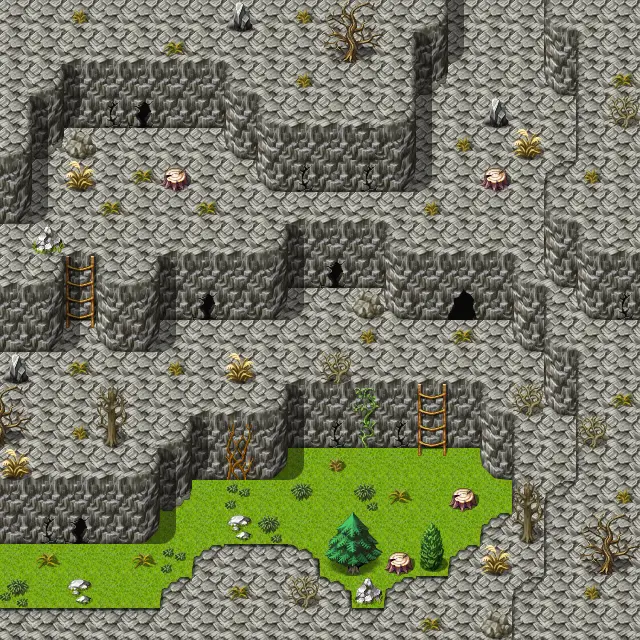

# Waytolake1

20×20 tiles · outdoors · part of [World1](index.md)

<label class="lg lg-spawn"><input type="checkbox" data-t="spawn" checked> Monsters / NPCs</label><label class="lg lg-mapchange"><input type="checkbox" data-t="mapchange" checked> Exit to another map</label><label class="lg lg-container"><input type="checkbox" data-t="container" checked> Container</label><label class="lg lg-sign"><input type="checkbox" data-t="sign" checked> Sign</label><label class="lg lg-rest"><input type="checkbox" data-t="rest" checked> Resting place</label><label class="lg lg-key"><input type="checkbox" data-t="key" checked> Blocked / needs key or quest</label><label class="lg lg-script"><input type="checkbox" data-t="script"> Scripted event</label><label class="lg lg-replace"><input type="checkbox" data-t="replace"> Changes after a quest</label>

## Exits

- [Waytolake0](waytolake0.md)
- [Waytolake2](waytolake2.md)

## Monsters & NPCs here

| Name | HP |
|---|---|
| [Puny plaguecrawler](../monsters/plaguesp_1.md) | 55 |
| [Plaguecrawler](../monsters/plaguesp_2.md) | 57 |
| [Tough plaguecrawler](../monsters/plaguesp_3.md) | 59 |
| [Black plaguecrawler](../monsters/plaguesp_4.md) | 61 |
| [Plaguestrider](../monsters/plaguesp_5.md) | 62 |
| [Hardshell plaguestrider](../monsters/plaguesp_6.md) | 63 |

<small>Map ID: `waytolake1` · Data from v0.8.18</small>
