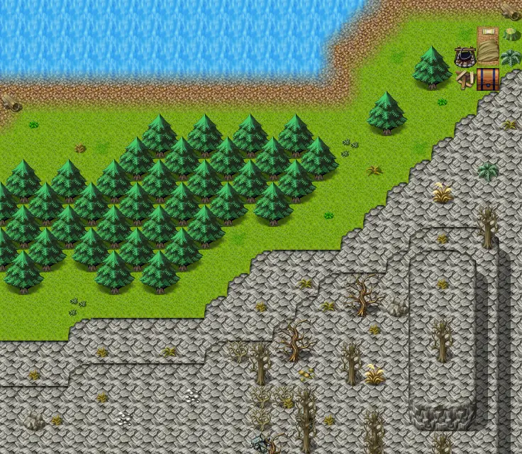

# Waytolake11

23×20 tiles · outdoors · part of [World1](index.md)

<label class="lg lg-spawn"><input type="checkbox" data-t="spawn" checked> Monsters / NPCs</label><label class="lg lg-mapchange"><input type="checkbox" data-t="mapchange" checked> Exit to another map</label><label class="lg lg-container"><input type="checkbox" data-t="container" checked> Container</label><label class="lg lg-sign"><input type="checkbox" data-t="sign" checked> Sign</label><label class="lg lg-rest"><input type="checkbox" data-t="rest" checked> Resting place</label><label class="lg lg-key"><input type="checkbox" data-t="key" checked> Blocked / needs key or quest</label><label class="lg lg-script"><input type="checkbox" data-t="script"> Scripted event</label><label class="lg lg-replace"><input type="checkbox" data-t="replace"> Changes after a quest</label>

## Exits

- [Waytolake10](waytolake10.md)
- [Waytolake12](waytolake12.md)

## Monsters & NPCs here

| Name | HP |
|---|---|
| [Especially sweet berries](../monsters/wild_berry3.md) | 0 |
| [Teksin](../monsters/teksin.md) | 0 |
| [Horse](../monsters/guynmart_horse.md) | 0 |
| [Tough plaguestrider](../monsters/plaguesp_7.md) | 64 |
| [Wooly plaguestrider](../monsters/plaguesp_8.md) | 65 |
| [Tough wooly plaguestrider](../monsters/plaguesp_9.md) | 66 |
| [Strong mountain wolf](../monsters/mwolf_7.md) | 73 |
| [Ferocious mountain wolf](../monsters/mwolf_8.md) | 78 |
| [Maonit troll](../monsters/maonit_1.md) | 255 |
| [Giant maonit troll](../monsters/maonit_2.md) | 270 |
| [Tough maonit brute](../monsters/maonit_5.md) | 310 |
| [Strong maonit brute](../monsters/maonit_6.md) | 320 |

<small>Map ID: `waytolake11` · Data from v0.8.18</small>
