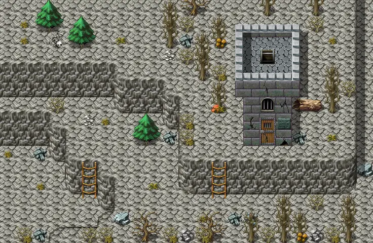

# Waytolake 12

| | |
|---|---|
| **Map ID** | `waytolake12` |
| **Type** | Indoors / underground |
| **Size** | 23×15 tiles |
| **World map** | [World 1](index.md) |
| **Introduced** | [v0.7.4](../versions/0.7.4.md) |
| **NPCs** | 1 |
| **Enemy types** | 11 |
| **Quests** | 2 |

**Waytolake 12** is an indoor map. It has 1 NPC and 11 kinds of enemy. Exits lead to Waytolake 11, Mountainlake 0, Waytolake 9, Waytolake 10 and 2 more.

## Map

<label class="lg"><input type="checkbox" data-t="spawn" checked><b>Red</b>&nbsp;Monsters / NPCs</label><label class="lg"><input type="checkbox" data-t="mapchange" checked><b>Blue</b>&nbsp;Exit to another map</label><label class="lg"><input type="checkbox" data-t="container" checked><b>Yellow</b>&nbsp;Container (click to see contents)</label><label class="lg"><input type="checkbox" data-t="sign" checked><b>Purple</b>&nbsp;Sign</label><label class="lg"><input type="checkbox" data-t="rest" checked><b>Green</b>&nbsp;Resting place</label><label class="lg"><input type="checkbox" data-t="key" checked><b>Orange dashed</b>&nbsp;Blocked until a quest step / item</label><label class="lg"><input type="checkbox" data-t="script"><b>Grey dotted</b>&nbsp;Scripted event</label><label class="lg"><input type="checkbox" data-t="replace"><b>White dotted</b>&nbsp;Changes during a quest</label><label class="lg"><input type="checkbox" data-t="pin" checked><b>Numbers</b>&nbsp;Numbered key points (see the key below the map)</label>

<a class="pin pin-exit" href="#key-1" style="left:26.087%;top:3.333%" title="Exit (north): to [Waytolake 11](waytolake11.md)">1</a><a class="pin pin-exit" href="#key-2" style="left:97.826%;top:86.667%" title="Exit (southeast): to [Mountainlake 0](mountainlake0.md)">2</a><a class="pin pin-exit" href="#key-3" style="left:2.174%;top:90.000%" title="Exit (southwest): to [Waytolake 9](waytolake9.md)">3</a><a class="pin pin-exit" href="#key-4" style="left:2.174%;top:70.000%" title="Exit (west): to [Waytolake 10](waytolake10.md)">4</a><a class="pin pin-exit" href="#key-5" style="left:2.174%;top:13.333%" title="Exit (northwest): to [Waytolake 10](waytolake10.md)">5</a><a class="pin pin-exit" href="#key-6" style="left:71.739%;top:56.667%" title="Exit (stairs / passage): to [Lookout lower](lookout_lower.md)">6</a><a class="pin pin-exit" href="#key-7" style="left:71.739%;top:23.333%" title="Exit (stairs / passage): to [Lookout upper](lookout_upper.md)">7</a><a id="pin-npc-dds_oldhermit" class="pin pin-npc" href="#key-8" style="left:84.783%;top:56.667%" title="[Old hermit](../../monsters/dds_oldhermit.md): 1 quest">8</a><a class="pin pin-sign" href="#key-9" style="left:76.087%;top:63.333%" title="Sign: “The sign is old and worn, but you can make out the words &quot;Lake Laeroth watchtower&quot;.”">9</a><a class="pin pin-script" href="#key-10" style="left:63.043%;top:60.000%" title="Quest trigger: Scripted event: advances the quest: Unusual experiences and achievements to stage 40 (“Birdwatching: I spotted a falcon high above the Lake Laeroth watchtower.”)">10</a><a class="pin pin-key" href="#key-11" style="left:71.739%;top:10.000%" title="Blocked passage: Unlocked during the quest: hidden story flag “nondisplay_2” (stage 220: “You will never get this quest stage (used for lookout)”)">11</a><a class="pin pin-key" href="#key-11" style="left:71.739%;top:36.667%" title="Blocked passage: Unlocked during the quest: hidden story flag “nondisplay_2” (stage 220: “You will never get this quest stage (used for lookout)”)">11</a><a class="pin pin-key" href="#key-11" style="left:65.217%;top:36.667%" title="Blocked passage: Unlocked during the quest: hidden story flag “nondisplay_2” (stage 220: “You will never get this quest stage (used for lookout)”)">11</a><a class="pin pin-key" href="#key-11" style="left:78.261%;top:36.667%" title="Blocked passage: Unlocked during the quest: hidden story flag “nondisplay_2” (stage 220: “You will never get this quest stage (used for lookout)”)">11</a><a class="pin pin-key" href="#key-11" style="left:78.261%;top:10.000%" title="Blocked passage: Unlocked during the quest: hidden story flag “nondisplay_2” (stage 220: “You will never get this quest stage (used for lookout)”)">11</a><a class="pin pin-key" href="#key-11" style="left:65.217%;top:10.000%" title="Blocked passage: Unlocked during the quest: hidden story flag “nondisplay_2” (stage 220: “You will never get this quest stage (used for lookout)”)">11</a><a class="pin pin-key" href="#key-11" style="left:63.043%;top:16.667%" title="Blocked passage: Unlocked during the quest: hidden story flag “nondisplay_2” (stage 220: “You will never get this quest stage (used for lookout)”)">11</a><a class="pin pin-key" href="#key-11" style="left:63.043%;top:23.333%" title="Blocked passage: Unlocked during the quest: hidden story flag “nondisplay_2” (stage 220: “You will never get this quest stage (used for lookout)”)">11</a><a class="pin pin-key" href="#key-11" style="left:63.043%;top:30.000%" title="Blocked passage: Unlocked during the quest: hidden story flag “nondisplay_2” (stage 220: “You will never get this quest stage (used for lookout)”)">11</a><a class="pin pin-key" href="#key-11" style="left:80.435%;top:16.667%" title="Blocked passage: Unlocked during the quest: hidden story flag “nondisplay_2” (stage 220: “You will never get this quest stage (used for lookout)”)">11</a><a class="pin pin-key" href="#key-11" style="left:80.435%;top:23.333%" title="Blocked passage: Unlocked during the quest: hidden story flag “nondisplay_2” (stage 220: “You will never get this quest stage (used for lookout)”)">11</a><a class="pin pin-key" href="#key-11" style="left:80.435%;top:30.000%" title="Blocked passage: Unlocked during the quest: hidden story flag “nondisplay_2” (stage 220: “You will never get this quest stage (used for lookout)”)">11</a>

??? abstract "Key to the numbers on the map"

    | # | What | Details |
    |---|---|---|
    | 1 | Exit (north) | to [Waytolake 11](waytolake11.md) |
    | 2 | Exit (southeast) | to [Mountainlake 0](mountainlake0.md) |
    | 3 | Exit (southwest) | to [Waytolake 9](waytolake9.md) |
    | 4 | Exit (west) | to [Waytolake 10](waytolake10.md) |
    | 5 | Exit (northwest) | to [Waytolake 10](waytolake10.md) |
    | 6 | Exit (stairs / passage) | to [Lookout lower](lookout_lower.md) |
    | 7 | Exit (stairs / passage) | to [Lookout upper](lookout_upper.md) |
    | 8 | [Old hermit](../monsters/dds_oldhermit.md) | 1 quest |
    | 9 | Sign | “The sign is old and worn, but you can make out the words "Lake Laeroth watchtower".” |
    | 10 | Quest trigger | Scripted event: advances the quest: Unusual experiences and achievements to stage 40 (“Birdwatching: I spotted a falcon high above the Lake Laeroth watchtower.”) |
    | 11 | Blocked passage | Unlocked during the quest: hidden story flag “nondisplay_2” (stage 220: “You will never get this quest stage (used for lookout)”) |

Verified against v0.8.18 map data.

## Connections

| Direction | Leads to | Region there | Map # |
|---|---|---|---|
| North | [Waytolake 11](waytolake11.md) | – | 1 |
| Southeast | [Mountainlake 0](mountainlake0.md) | – | 2 |
| Southwest | [Waytolake 9](waytolake9.md) | – | 3 |
| West | [Waytolake 10](waytolake10.md) | – | 4 |
| Northwest | [Waytolake 10](waytolake10.md) | – | 5 |
| Stairs / passage | [Lookout lower](lookout_lower.md) | – | 6 |
| Stairs / passage | [Lookout upper](lookout_upper.md) | – | 7 |

## NPCs

- [Old hermit](../monsters/dds_oldhermit.md) — quests: [Darkness in the Daylight](../quests/darkness_in_daylight.md) (#8)

## Enemies

| Enemy | HP | Damage | Up to | Notes |
|---|---|---|---|---|
| [Mountain fox](../monsters/mwolf_4.md) | 60 | 3–8 | 3 | shares spawn with Ferocious mountain fox, Rabid mountain wolf |
| [Black plaguecrawler](../monsters/plaguesp_4.md) | 61 | 1–6 | 3 | shares spawn with Hardshell plaguestrider, Plaguestrider |
| [Plaguestrider](../monsters/plaguesp_5.md) | 62 | 2–6 | 3 | shares spawn with Black plaguecrawler, Hardshell plaguestrider |
| [Hardshell plaguestrider](../monsters/plaguesp_6.md) | 63 | 2–6 | 3 | shares spawn with Black plaguecrawler, Plaguestrider |
| [Tough plaguestrider](../monsters/plaguesp_7.md) | 64 | 2–6 | 3 | shares spawn with Tough wooly plaguestrider, Wooly plaguestrider |
| [Ferocious mountain fox](../monsters/mwolf_5.md) | 64 | 3–8 | 3 | shares spawn with Mountain fox, Rabid mountain wolf |
| [Wooly plaguestrider](../monsters/plaguesp_8.md) | 65 | 2–6 | 3 | shares spawn with Tough plaguestrider, Tough wooly plaguestrider |
| [Tough wooly plaguestrider](../monsters/plaguesp_9.md) | 66 | 2–7 | 3 | shares spawn with Tough plaguestrider, Wooly plaguestrider |
| [Rabid mountain wolf](../monsters/mwolf_6.md) | 67 | 3–9 | 3 | shares spawn with Ferocious mountain fox, Mountain fox |
| [Strong maonit troll](../monsters/maonit_3.md) | 285 | 1–20 | 2 | shares spawn with Maonit brute |
| [Maonit brute](../monsters/maonit_4.md) | 290 | 1–20 | 2 | shares spawn with Strong maonit troll |

<small>“Up to” is the most that can be alive at once from the spawn areas on this map.</small>

## Quests

- [Darkness in the Daylight](../quests/darkness_in_daylight.md): [Old hermit](../monsters/dds_oldhermit.md) is involved
- [Unusual experiences and achievements](../quests/achievements.md): something on this map advances it; stepping on a trigger here sets stage 40
- [General story flags 2 (hidden flag)](../quests/nondisplay_2.md): blocked passage opens at stage 220; something on this map advances it

## Points of interest

- **Sign** (#9): “The sign is old and worn, but you can make out the words "Lake Laeroth watchtower".”
- **Quest trigger** (#10): Scripted event: advances the quest: Unusual experiences and achievements to stage 40 (“Birdwatching: I spotted a falcon high above the Lake Laeroth watchtower.”)
- **Blocked passage** (#11): Unlocked during the quest: hidden story flag “nondisplay_2” (stage 220: “You will never get this quest stage (used for lookout)”)

## Version history

| Version | Change |
|---|---|
| [v0.7.4](../versions/0.7.4.md) | Added |
| [v0.7.13](../versions/0.7.13.md) | Map layout or objects changed |
| [v0.8.2](../versions/0.8.2.md) | Map layout or objects changed |
| [v0.8.5](../versions/0.8.5.md) | Map layout or objects changed |
| [v0.8.14](../versions/0.8.14.md) | Map layout or objects changed |

Verified against v0.8.18 and every earlier release back to v0.7.0 (game data compared release by release).

## Community notes

<small>Written by players, not generated from game data. **Observations**: what players notice in-game · **Lore**: the in-world story · **Trivia**: real-world facts, references, development history · **Theory / speculation**: unconfirmed ideas; may just be unfinished content</small>

### Observations

*No notes yet. Contributions are welcome: [add a note](https://github.com/asdfghjkl628/Andor-s-Trail-Wikiiii/new/main/notes/maps?filename=waytolake12.md&value=%23%23%20Observations%0A%0A%3C%21--%20what%20players%20notice%20in-game%20--%3E%0A%0A%23%23%20Lore%0A%0A%3C%21--%20the%20in-world%20story%20--%3E%0A%0A%23%23%20Trivia%0A%0A%3C%21--%20real-world%20facts%2C%20references%2C%20development%20history%20--%3E%0A%0A%23%23%20Theory%20/%20speculation%0A%0A%3C%21--%20unconfirmed%20ideas%3B%20may%20just%20be%20unfinished%20content%20--%3E%0A).*

### Lore

*No notes yet. Contributions are welcome: [add a note](https://github.com/asdfghjkl628/Andor-s-Trail-Wikiiii/new/main/notes/maps?filename=waytolake12.md&value=%23%23%20Observations%0A%0A%3C%21--%20what%20players%20notice%20in-game%20--%3E%0A%0A%23%23%20Lore%0A%0A%3C%21--%20the%20in-world%20story%20--%3E%0A%0A%23%23%20Trivia%0A%0A%3C%21--%20real-world%20facts%2C%20references%2C%20development%20history%20--%3E%0A%0A%23%23%20Theory%20/%20speculation%0A%0A%3C%21--%20unconfirmed%20ideas%3B%20may%20just%20be%20unfinished%20content%20--%3E%0A).*

### Trivia

*No notes yet. Contributions are welcome: [add a note](https://github.com/asdfghjkl628/Andor-s-Trail-Wikiiii/new/main/notes/maps?filename=waytolake12.md&value=%23%23%20Observations%0A%0A%3C%21--%20what%20players%20notice%20in-game%20--%3E%0A%0A%23%23%20Lore%0A%0A%3C%21--%20the%20in-world%20story%20--%3E%0A%0A%23%23%20Trivia%0A%0A%3C%21--%20real-world%20facts%2C%20references%2C%20development%20history%20--%3E%0A%0A%23%23%20Theory%20/%20speculation%0A%0A%3C%21--%20unconfirmed%20ideas%3B%20may%20just%20be%20unfinished%20content%20--%3E%0A).*

### Theory / speculation

*No notes yet. Contributions are welcome: [add a note](https://github.com/asdfghjkl628/Andor-s-Trail-Wikiiii/new/main/notes/maps?filename=waytolake12.md&value=%23%23%20Observations%0A%0A%3C%21--%20what%20players%20notice%20in-game%20--%3E%0A%0A%23%23%20Lore%0A%0A%3C%21--%20the%20in-world%20story%20--%3E%0A%0A%23%23%20Trivia%0A%0A%3C%21--%20real-world%20facts%2C%20references%2C%20development%20history%20--%3E%0A%0A%23%23%20Theory%20/%20speculation%0A%0A%3C%21--%20unconfirmed%20ideas%3B%20may%20just%20be%20unfinished%20content%20--%3E%0A).*

??? info "Technical information"

    | | |
    |---|---|
    | Map ID | `waytolake12` |
    | File | `res/xml/waytolake12.tmx` |
    | Size | 23×15 tiles (736×480 px) |
    | outdoors property | – |
    | Layers drawn | ground, objects, above, top |
    | Tilesets | map_bed_1, map_border_1, map_bridge_1, map_bridge_2, map_broken_1, map_cavewall_1, map_cavewall_2, map_cavewall_3, map_cavewall_4, map_chair_table_1, map_chair_table_2, map_crate_1, map_cupboard_1, map_curtain_1, map_entrance_1, map_entrance_2, map_fence_1, map_fence_2, map_fence_3, map_fence_4, map_ground_1, map_ground_2, map_ground_3, map_ground_4, map_ground_5, map_ground_6, map_ground_7, map_ground_8, map_guynmart, map_house_1, map_house_2, map_indoor_1, map_indoor_2, map_kitchen_1, map_outdoor_1, map_pillar_1, map_pillar_2, map_plant_1, map_plant_2, map_rock_1, map_rock_2, map_roof_1, map_roof_2, map_roof_3, map_shop_1, map_sign_ladder_1, map_table_1, map_trail_1, map_transition_1, map_transition_2, map_transition_3, map_transition_4, map_transition_5, map_tree_1, map_tree_2, map_wall_1, map_wall_2, map_wall_3, map_wall_4, map_window_1, map_window_2 |
    | Map objects | key: 12, mapchange: 7, spawn: 5, sign: 1, script: 1 |
    | World map position | segment `world1`, x 678, y 174 |

<small>Data from v0.8.18</small>
