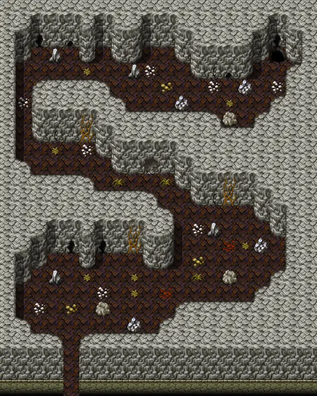

# Waytolake4

20×25 tiles

<label class="lg lg-spawn"><input type="checkbox" data-t="spawn" checked> Monsters / NPCs</label><label class="lg lg-mapchange"><input type="checkbox" data-t="mapchange" checked> Exit to another map</label><label class="lg lg-container"><input type="checkbox" data-t="container" checked> Container</label><label class="lg lg-sign"><input type="checkbox" data-t="sign" checked> Sign</label><label class="lg lg-rest"><input type="checkbox" data-t="rest" checked> Resting place</label><label class="lg lg-key"><input type="checkbox" data-t="key" checked> Blocked / needs key or quest</label><label class="lg lg-script"><input type="checkbox" data-t="script"> Scripted event</label><label class="lg lg-replace"><input type="checkbox" data-t="replace"> Changes after a quest</label>

## Exits

- [Waytolake3](waytolake3.md)
- [Waytolake5](waytolake5.md)

## Monsters & NPCs here

| Name | HP |
|---|---|
| [Puny plaguecrawler](../monsters/plaguesp_1.md) | 55 |
| [Plaguecrawler](../monsters/plaguesp_2.md) | 57 |
| [Tough plaguecrawler](../monsters/plaguesp_3.md) | 59 |
| [Tough plaguestrider](../monsters/plaguesp_7.md) | 64 |
| [Wooly plaguestrider](../monsters/plaguesp_8.md) | 65 |
| [Plaguestrider servant](../monsters/plaguesp_12.md) | 65 |
| [Tough wooly plaguestrider](../monsters/plaguesp_9.md) | 66 |
| [Vile plaguestrider](../monsters/plaguesp_10.md) | 67 |
| [Nesting plaguestrider](../monsters/plaguesp_11.md) | 68 |

<small>Map ID: `waytolake4` · Data from v0.8.18</small>
