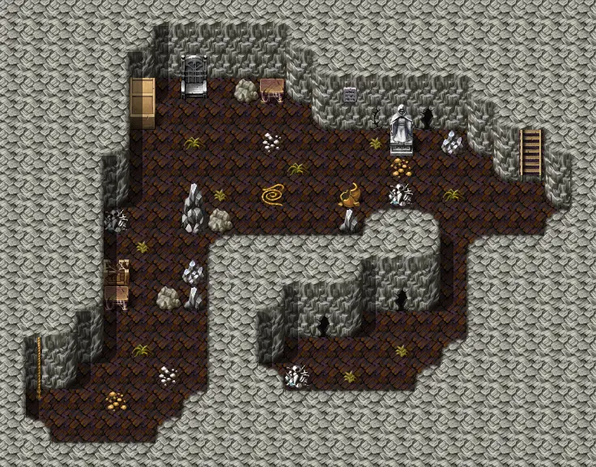

# Waytolake5

23×18 tiles

<label class="lg"><input type="checkbox" data-t="spawn" checked><b>Red</b>&nbsp;Monsters / NPCs</label><label class="lg"><input type="checkbox" data-t="mapchange" checked><b>Blue</b>&nbsp;Exit to another map</label><label class="lg"><input type="checkbox" data-t="container" checked><b>Yellow</b>&nbsp;Container (click to see contents)</label><label class="lg"><input type="checkbox" data-t="sign" checked><b>Purple</b>&nbsp;Sign</label><label class="lg"><input type="checkbox" data-t="rest" checked><b>Green</b>&nbsp;Resting place</label><label class="lg"><input type="checkbox" data-t="key" checked><b>Orange dashed</b>&nbsp;Blocked until a quest step / item</label><label class="lg"><input type="checkbox" data-t="script"><b>Grey dotted</b>&nbsp;Scripted event</label><label class="lg"><input type="checkbox" data-t="replace"><b>White dotted</b>&nbsp;Changes during a quest</label>

## Exits

- [Mountainlake0](mountainlake0.md)
- [Waytolake4](waytolake4.md)

## Monsters & NPCs here

| Name | HP |
|---|---|
| [Plaguestrider master](../monsters/plaguesp_13.md) | 65 |
| [Plaguestrider servant](../monsters/plaguesp_12.md) | 65 |
| [Vile plaguestrider](../monsters/plaguesp_10.md) | 67 |
| [Nesting plaguestrider](../monsters/plaguesp_11.md) | 68 |
| [Plaguestrider master](../monsters/plaguesp_cr.md) | 365 |

<small>Map ID: `waytolake5` · Data from v0.8.18</small>
