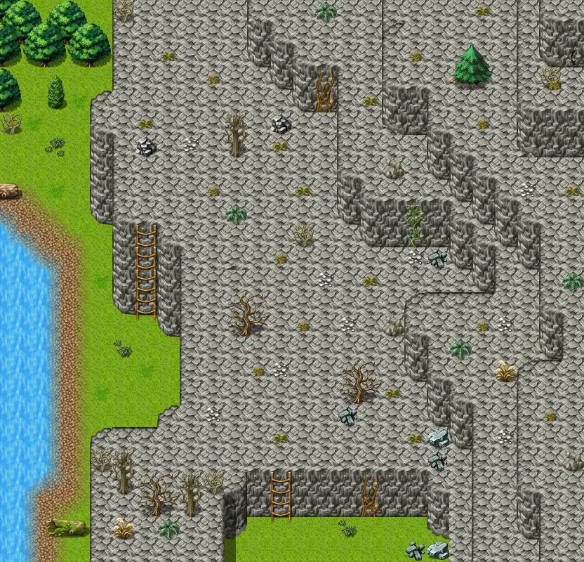

# Waytolake7

26×25 tiles · outdoors · part of [World1](index.md)

<label class="lg lg-spawn"><input type="checkbox" data-t="spawn" checked> Monsters / NPCs</label><label class="lg lg-mapchange"><input type="checkbox" data-t="mapchange" checked> Exit to another map</label><label class="lg lg-container"><input type="checkbox" data-t="container" checked> Container</label><label class="lg lg-sign"><input type="checkbox" data-t="sign" checked> Sign</label><label class="lg lg-rest"><input type="checkbox" data-t="rest" checked> Resting place</label><label class="lg lg-key"><input type="checkbox" data-t="key" checked> Blocked / needs key or quest</label><label class="lg lg-script"><input type="checkbox" data-t="script"> Scripted event</label><label class="lg lg-replace"><input type="checkbox" data-t="replace"> Changes after a quest</label>

## Exits

- [Waterway11 east](waterway11_east.md)
- [Waytolake7b](waytolake7b.md)
- [Waytolake8](waytolake8.md)

## Monsters & NPCs here

| Name | HP |
|---|---|
| [Small scaradon](../monsters/scaradon_2.md) | 35 |
| [Scaradon](../monsters/scaradon_3.md) | 35 |
| [Tough scaradon](../monsters/scaradon_4.md) | 37 |
| [Hardshell scaradon](../monsters/scaradon_5.md) | 38 |
| [Young erumen lizard](../monsters/erumen_1.md) | 45 |
| [Spotted erumen lizard](../monsters/erumen_2.md) | 45 |
| [Puny plaguecrawler](../monsters/plaguesp_1.md) | 55 |
| [Vile erumen lizard](../monsters/erumen_5.md) | 89 |
| [Tough erumen lizard](../monsters/erumen_6.md) | 91 |
| [Hardened erumen lizard](../monsters/erumen_7.md) | 93 |

<small>Map ID: `waytolake7` · Data from v0.8.18</small>
