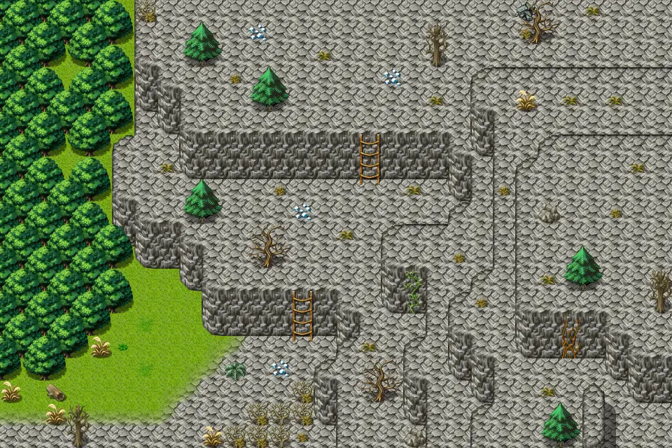

# Waytolake9

30×20 tiles · outdoors · part of [World1](index.md)

<label class="lg lg-spawn"><input type="checkbox" data-t="spawn" checked> Monsters / NPCs</label><label class="lg lg-mapchange"><input type="checkbox" data-t="mapchange" checked> Exit to another map</label><label class="lg lg-container"><input type="checkbox" data-t="container" checked> Container</label><label class="lg lg-sign"><input type="checkbox" data-t="sign" checked> Sign</label><label class="lg lg-rest"><input type="checkbox" data-t="rest" checked> Resting place</label><label class="lg lg-key"><input type="checkbox" data-t="key" checked> Blocked / needs key or quest</label><label class="lg lg-script"><input type="checkbox" data-t="script"> Scripted event</label><label class="lg lg-replace"><input type="checkbox" data-t="replace"> Changes after a quest</label>

## Exits

- [Waytolake10](waytolake10.md)
- [Waytolake12](waytolake12.md)
- [Waytolake6](waytolake6.md)
- [Waytolake8](waytolake8.md)

## Monsters & NPCs here

| Name | HP |
|---|---|
| [Mountain wolf pup](../monsters/mwolf_1.md) | 45 |
| [Young mountain wolf](../monsters/mwolf_2.md) | 52 |
| [Puny plaguecrawler](../monsters/plaguesp_1.md) | 55 |
| [Young mountain fox](../monsters/mwolf_3.md) | 56 |
| [Plaguecrawler](../monsters/plaguesp_2.md) | 57 |
| [Tough plaguecrawler](../monsters/plaguesp_3.md) | 59 |
| [Mountain fox](../monsters/mwolf_4.md) | 60 |
| [Black plaguecrawler](../monsters/plaguesp_4.md) | 61 |
| [Plaguestrider](../monsters/plaguesp_5.md) | 62 |
| [Hardshell plaguestrider](../monsters/plaguesp_6.md) | 63 |
| [Ferocious mountain fox](../monsters/mwolf_5.md) | 64 |
| [Rabid mountain wolf](../monsters/mwolf_6.md) | 67 |
| [Maonit troll](../monsters/maonit_1.md) | 255 |
| [Giant maonit troll](../monsters/maonit_2.md) | 270 |

<small>Map ID: `waytolake9` · Data from v0.8.18</small>
