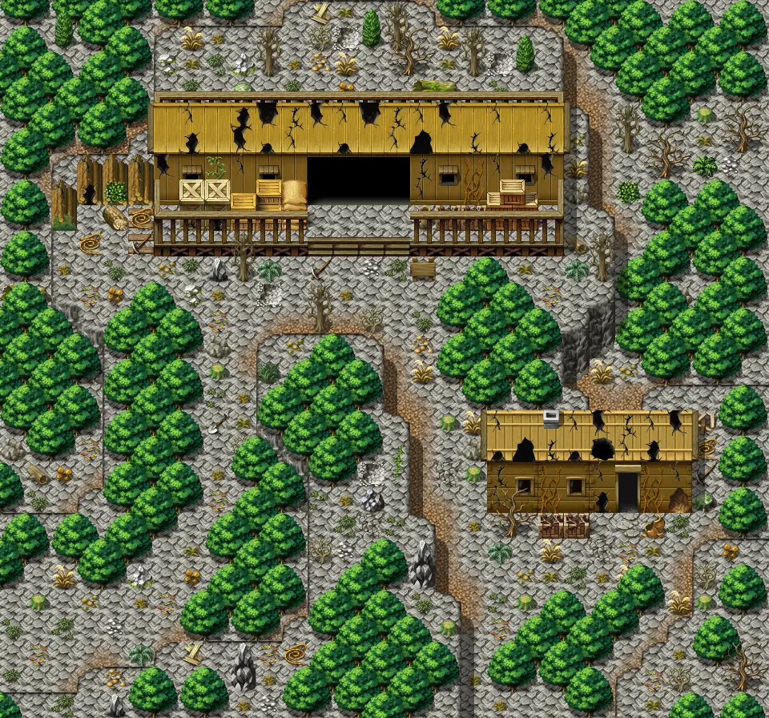

# Waytolostmine2

30×28 tiles · outdoors · part of [World1](index.md)

<label class="lg lg-spawn"><input type="checkbox" data-t="spawn" checked> Monsters / NPCs</label><label class="lg lg-mapchange"><input type="checkbox" data-t="mapchange" checked> Exit to another map</label><label class="lg lg-container"><input type="checkbox" data-t="container" checked> Container</label><label class="lg lg-sign"><input type="checkbox" data-t="sign" checked> Sign</label><label class="lg lg-rest"><input type="checkbox" data-t="rest" checked> Resting place</label><label class="lg lg-key"><input type="checkbox" data-t="key" checked> Blocked / needs key or quest</label><label class="lg lg-script"><input type="checkbox" data-t="script"> Scripted event</label><label class="lg lg-replace"><input type="checkbox" data-t="replace"> Changes after a quest</label>

## Exits

- [Minerhouse4](minerhouse4.md)
- [Minerhouse5](minerhouse5.md)
- [Waytolostmine1](waytolostmine1.md)
- [Waytolostmine3](waytolostmine3.md)

## Monsters & NPCs here

| Name | HP |
|---|---|
| [Puny Charwood goblin](../monsters/charwdg1.md) | 53 |
| [Carrion centipede](../monsters/ccentip0.md) | 54 |
| [Charwood goblin scout](../monsters/charwdg2.md) | 56 |
| [Ravenous carrion centipede](../monsters/ccentip1.md) | 56 |
| [Bloated carrion centipede](../monsters/ccentip2.md) | 59 |
| [Starving Charwood goblin](../monsters/charwdg3.md) | 64 |
| [Charwood goblin](../monsters/charwdg4.md) | 73 |
| [Charwood goblin fighter](../monsters/charwdg5.md) | 81 |
| [Tough Charwood goblin](../monsters/charwdg6.md) | 92 |
| [Aggressive Charwood goblin](../monsters/charwdg7.md) | 103 |
| [Strong Charwood goblin](../monsters/charwdg8.md) | 112 |
| [Mazarth beast](../monsters/mazarth1.md) | 129 |

<small>Map ID: `waytolostmine2` · Data from v0.8.18</small>
