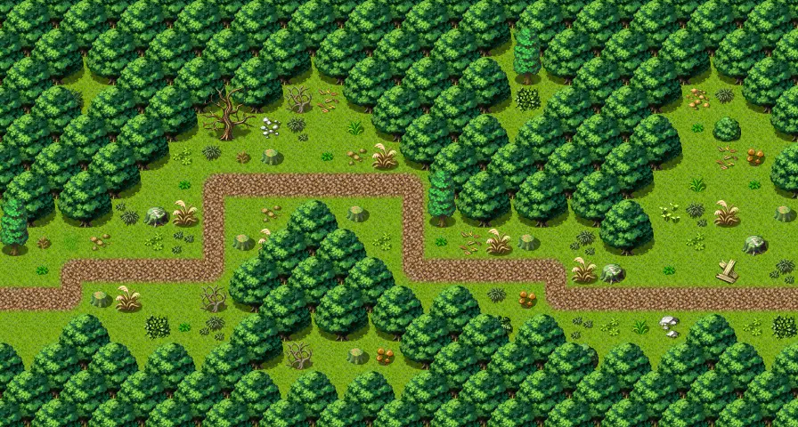

# Waytominingtown0

28×15 tiles · outdoors · part of [World1](index.md)

<label class="lg lg-spawn"><input type="checkbox" data-t="spawn" checked> Monsters / NPCs</label><label class="lg lg-mapchange"><input type="checkbox" data-t="mapchange" checked> Exit to another map</label><label class="lg lg-container"><input type="checkbox" data-t="container" checked> Container</label><label class="lg lg-sign"><input type="checkbox" data-t="sign" checked> Sign</label><label class="lg lg-rest"><input type="checkbox" data-t="rest" checked> Resting place</label><label class="lg lg-key"><input type="checkbox" data-t="key" checked> Blocked / needs key or quest</label><label class="lg lg-script"><input type="checkbox" data-t="script"> Scripted event</label><label class="lg lg-replace"><input type="checkbox" data-t="replace"> Changes after a quest</label>

## Exits

- [Roadbeforecrossroads6](roadbeforecrossroads6.md)
- [Waytominingtown1](waytominingtown1.md)

## Monsters & NPCs here

| Name | HP |
|---|---|
| [Young forest fox](../monsters/forestfox2.md) | 31 |
| [Forest fox](../monsters/forestfox3.md) | 35 |
| [Tough redfoot beast](../monsters/redft0.md) | 39 |
| [Strong redfoot beast](../monsters/redft1.md) | 43 |
| [Bloodthirsty redfoot beast](../monsters/redft2.md) | 47 |

<small>Map ID: `waytominingtown0` · Data from v0.8.18</small>
