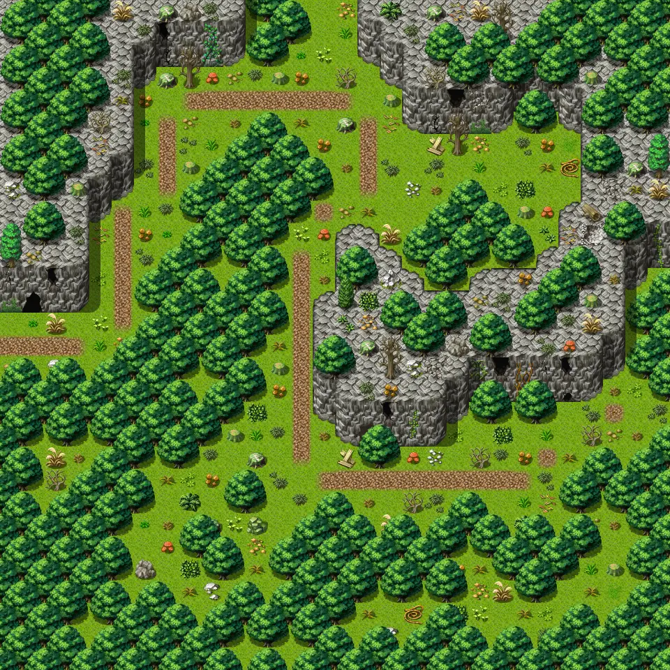
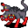

# Waytominingtown3

30×30 tiles · outdoors · part of [World1](index.md)

<label class="lg"><input type="checkbox" data-t="spawn" checked><b>Red</b>&nbsp;Monsters / NPCs</label><label class="lg"><input type="checkbox" data-t="mapchange" checked><b>Blue</b>&nbsp;Exit to another map</label><label class="lg"><input type="checkbox" data-t="container" checked><b>Yellow</b>&nbsp;Container (click to see contents)</label><label class="lg"><input type="checkbox" data-t="sign" checked><b>Purple</b>&nbsp;Sign</label><label class="lg"><input type="checkbox" data-t="rest" checked><b>Green</b>&nbsp;Resting place</label><label class="lg"><input type="checkbox" data-t="key" checked><b>Orange dashed</b>&nbsp;Blocked until a quest step / item</label><label class="lg"><input type="checkbox" data-t="script"><b>Grey dotted</b>&nbsp;Scripted event</label><label class="lg"><input type="checkbox" data-t="replace"><b>White dotted</b>&nbsp;Changes during a quest</label>

## Exits

- [Waytobrightport0](waytobrightport0.md)
- [Waytolostmine0](waytolostmine0.md)
- [Waytominingtown2](waytominingtown2.md)

## Monsters & NPCs here

| Name | HP |
|---|---|
| [Tough redfoot beast](../monsters/redft0.md) | 39 |
| [Strong redfoot beast](../monsters/redft1.md) | 43 |
| [Bloodthirsty redfoot beast](../monsters/redft2.md) | 47 |
| [Carrion centipede](../monsters/ccentip0.md) | 54 |
| [Ravenous carrion centipede](../monsters/ccentip1.md) | 56 |
| [Bloated carrion centipede](../monsters/ccentip2.md) | 59 |
| [Vicious redfoot beast](../monsters/redft_cr.md) | 347 |

<small>Map ID: `waytominingtown3` · Data from v0.8.18</small>
