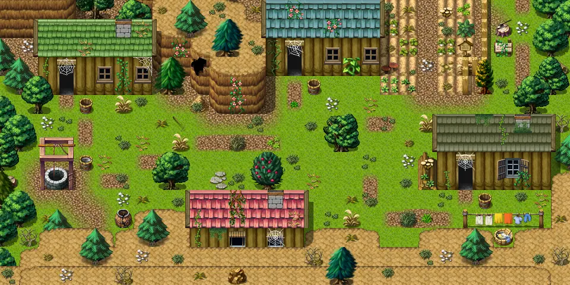

# Wexlow village

30×15 tiles · outdoors · part of [World1](index.md)

<label class="lg lg-spawn"><input type="checkbox" data-t="spawn" checked> Monsters / NPCs</label><label class="lg lg-mapchange"><input type="checkbox" data-t="mapchange" checked> Exit to another map</label><label class="lg lg-container"><input type="checkbox" data-t="container" checked> Container</label><label class="lg lg-sign"><input type="checkbox" data-t="sign" checked> Sign</label><label class="lg lg-rest"><input type="checkbox" data-t="rest" checked> Resting place</label><label class="lg lg-key"><input type="checkbox" data-t="key" checked> Blocked / needs key or quest</label><label class="lg lg-script"><input type="checkbox" data-t="script"> Scripted event</label><label class="lg lg-replace"><input type="checkbox" data-t="replace"> Changes after a quest</label>

## Exits

- [Way to wexlow3](way_to_wexlow3.md)
- [Wexlow village n house](wexlow_village_n_house.md)
- [Wexlow village nw house](wexlow_village_nw_house.md)
- [Wexlow village se house](wexlow_village_se_house.md)
- [Wexlow village sw house](wexlow_village_sw_house.md)

## Monsters & NPCs here

| Name | HP |
|---|---|
| [Osric](../monsters/wexlow_osric.md) | 0 |
| [Unknown well voice](../monsters/well_voice.md) | 0 |
| [Godwin](../monsters/village_godwin.md) | 0 |
| [Theodora](../monsters/village_theodora.md) | 0 |
| [Godelieve](../monsters/village_godelieve_hidden.md) | 0 |
| [Theobald](../monsters/village_theobald.md) | 0 |
| [Rat](../monsters/crossroads_rat.md) | 5 |
| [Village ant](../monsters/village_ant.md) | 54 |

<small>Map ID: `wexlow_village` · Data from v0.8.18</small>
