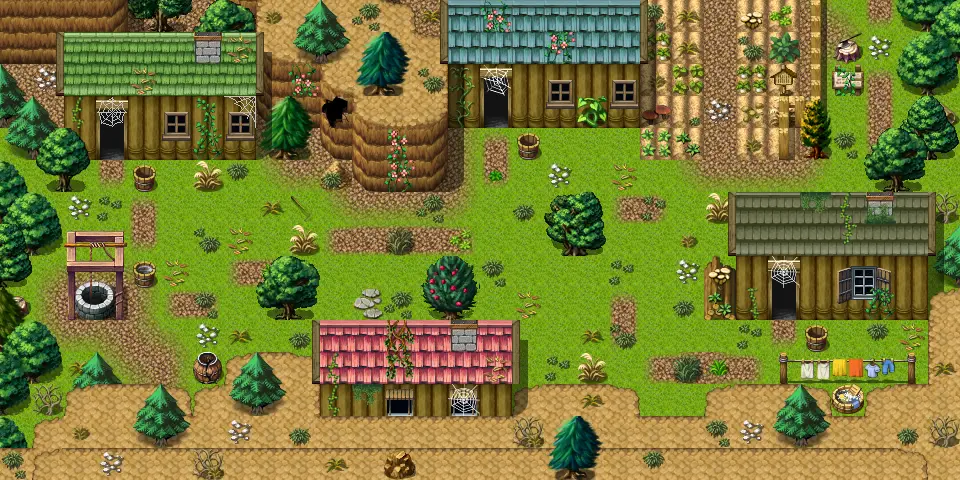

# Wexlow village

| | |
|---|---|
| **Map ID** | `wexlow_village` |
| **Region** | In Wexlow Village (settlement) |
| **Type** | Outdoors |
| **Size** | 30×15 tiles |
| **World map** | [World 1](index.md) |
| **Introduced** | [v0.8.12.1](../versions/0.8.12.1.md) |
| **NPCs** | 4 |
| **Enemy types** | 2 |
| **Quests** | 1 |

**Wexlow village** is an outdoor map, in Wexlow Village (settlement). It has 4 NPCs and 2 kinds of enemy. Exits lead to Way to wexlow 3, Wexlow village north house, Wexlow village north-west house, Wexlow village south-east house and 1 more.

## Map

<label class="lg"><input type="checkbox" data-t="spawn" checked><b>Red</b>&nbsp;Monsters / NPCs</label><label class="lg"><input type="checkbox" data-t="mapchange" checked><b>Blue</b>&nbsp;Exit to another map</label><label class="lg"><input type="checkbox" data-t="container" checked><b>Yellow</b>&nbsp;Container (click to see contents)</label><label class="lg"><input type="checkbox" data-t="sign" checked><b>Purple</b>&nbsp;Sign</label><label class="lg"><input type="checkbox" data-t="rest" checked><b>Green</b>&nbsp;Resting place</label><label class="lg"><input type="checkbox" data-t="key" checked><b>Orange dashed</b>&nbsp;Blocked until a quest step / item</label><label class="lg"><input type="checkbox" data-t="script"><b>Grey dotted</b>&nbsp;Scripted event</label><label class="lg"><input type="checkbox" data-t="replace"><b>White dotted</b>&nbsp;Changes during a quest</label><label class="lg"><input type="checkbox" data-t="pin" checked><b>Numbers</b>&nbsp;Numbered key points (see the key below the map)</label>

<a class="pin pin-exit" href="#key-1" style="left:90.000%;top:3.333%" title="Exit (north): to [Way to wexlow 3](way_to_wexlow3.md)">1</a><a class="pin pin-exit" href="#key-2" style="left:51.667%;top:23.333%" title="Exit (door): to [Wexlow village north house](wexlow_village_n_house.md)">2</a><a class="pin pin-exit" href="#key-3" style="left:11.667%;top:30.000%" title="Exit (door): to [Wexlow village north-west house](wexlow_village_nw_house.md)">3</a><a class="pin pin-exit" href="#key-4" style="left:81.667%;top:63.333%" title="Exit (door): to [Wexlow village south-east house](wexlow_village_se_house.md)">4</a><a class="pin pin-exit" href="#key-5" style="left:38.333%;top:70.000%" title="Exit (door): to [Wexlow village south-west house](wexlow_village_sw_house.md)">5</a><a id="pin-npc-village_godwin" class="pin pin-npc" href="#key-6" style="left:25.000%;top:36.667%" title="[Godwin](../../monsters/village_godwin.md): NPC">6</a><a id="pin-npc-wexlow_osric" class="pin pin-npc" href="#key-7" style="left:58.333%;top:56.667%" title="[Osric](../../monsters/wexlow_osric.md): NPC">7</a><a id="pin-npc-village_theobald" class="pin pin-npc" href="#key-8" style="left:58.333%;top:36.667%" title="[Theobald](../../monsters/village_theobald.md): NPC">8</a><a id="pin-npc-village_theodora" class="pin pin-npc" href="#key-9" style="left:75.000%;top:16.667%" title="[Theodora](../../monsters/village_theodora.md): NPC">9</a><a class="pin pin-script" href="#key-10" style="left:10.000%;top:63.333%" title="Quest trigger: Scripted event: advances the quest: Echoes of enchantment to stage 1 (“At the Wexlow well, I angered something evil and powerful (named Gamjee, I think) to the point that it pulled me down into the well. I&#x27;ve landed at the well&#x27;s bottom severely injured, but alive.”) (+1 more quest(s))">10</a><a class="pin pin-sign" href="#key-11" style="left:88.333%;top:16.667%" title="Sign: “Welcome to Wexlow Village.

~Glory be to Feygard”">11</a>

??? abstract "Key to the numbers on the map"

    | # | What | Details |
    |---|---|---|
    | 1 | Exit (north) | to [Way to wexlow 3](way_to_wexlow3.md) |
    | 2 | Exit (door) | to [Wexlow village north house](wexlow_village_n_house.md) |
    | 3 | Exit (door) | to [Wexlow village north-west house](wexlow_village_nw_house.md) |
    | 4 | Exit (door) | to [Wexlow village south-east house](wexlow_village_se_house.md) |
    | 5 | Exit (door) | to [Wexlow village south-west house](wexlow_village_sw_house.md) |
    | 6 | [Godwin](../monsters/village_godwin.md) | NPC |
    | 7 | [Osric](../monsters/wexlow_osric.md) | NPC |
    | 8 | [Theobald](../monsters/village_theobald.md) | NPC |
    | 9 | [Theodora](../monsters/village_theodora.md) | NPC |
    | 10 | Quest trigger | Scripted event: advances the quest: Echoes of enchantment to stage 1 (“At the Wexlow well, I angered something evil and powerful (named Gamjee, I think) to the point that it pulled me down into the well. I've landed at the well's bottom severely injured, but alive.”) (+1 more quest(s)) |
    | 11 | Sign | “Welcome to Wexlow Village.  ~Glory be to Feygard” |

Verified against v0.8.18 map data.

## Connections

| Direction | Leads to | Region there | Map # |
|---|---|---|---|
| North | [Way to wexlow 3](way_to_wexlow3.md) | Wexlow Village | 1 |
| Door | [Wexlow village north house](wexlow_village_n_house.md) | Wexlow Village | 2 |
| Door | [Wexlow village north-west house](wexlow_village_nw_house.md) | Wexlow Village | 3 |
| Door | [Wexlow village south-east house](wexlow_village_se_house.md) | Wexlow Village | 4 |
| Door | [Wexlow village south-west house](wexlow_village_sw_house.md) | Wexlow Village | 5 |

## NPCs

- [Godwin](../monsters/village_godwin.md) (#6)
- [Osric](../monsters/wexlow_osric.md) (#7)
- [Theobald](../monsters/village_theobald.md) (#8)
- [Theodora](../monsters/village_theodora.md) (#9)

## Enemies

| Enemy | HP | Damage | Up to | Notes |
|---|---|---|---|---|
| [Rat](../monsters/vermin0.md#v-crossroads_rat) | 5 | 1–1 | 1 | – |
| [Village ant](../monsters/village_ant.md) | 54 | 1–4 | 17 | – |

<small>“Up to” is the most that can be alive at once from the spawn areas on this map.</small>

**Scenery:** [Godelieve](../monsters/village_godelieve.md#v-village_godelieve_hidden), [Unknown well voice](../monsters/well_voice.md)

## Quests

- [Echoes of enchantment](../quests/echoes_of_enchantment.md): something on this map advances it; stepping on a trigger here sets stage 1
- [Feygard story flags (hidden flag)](../quests/feygard_nondisplayed.md): [Godwin](../monsters/village_godwin.md) is involved; something on this map advances it; stepping on a trigger here sets stage 2

## Points of interest

- **Quest trigger** (#10): Scripted event: advances the quest: Echoes of enchantment to stage 1 (“At the Wexlow well, I angered something evil and powerful (named Gamjee, I think) to the point that it pulled me down into the well. I've landed at the well's bottom severely injured, but alive.”) (+1 more quest(s))
- **Sign** (#11): “Welcome to Wexlow Village.  ~Glory be to Feygard”

## Version history

| Version | Change |
|---|---|
| [v0.8.12.1](../versions/0.8.12.1.md) | Added |
| [v0.8.18](../versions/0.8.18.md) | Map layout or objects changed |

Verified against v0.8.18 and every earlier release back to v0.7.0 (game data compared release by release).

## Community notes

<small>Written by players, not generated from game data. **Observations**: what players notice in-game · **Lore**: the in-world story · **Trivia**: real-world facts, references, development history · **Theory / speculation**: unconfirmed ideas; may just be unfinished content</small>

### Observations

*No notes yet. Contributions are welcome: [add a note](https://github.com/asdfghjkl628/Andor-s-Trail-Wikiiii/new/main/notes/maps?filename=wexlow_village.md&value=%23%23%20Observations%0A%0A%3C%21--%20what%20players%20notice%20in-game%20--%3E%0A%0A%23%23%20Lore%0A%0A%3C%21--%20the%20in-world%20story%20--%3E%0A%0A%23%23%20Trivia%0A%0A%3C%21--%20real-world%20facts%2C%20references%2C%20development%20history%20--%3E%0A%0A%23%23%20Theory%20/%20speculation%0A%0A%3C%21--%20unconfirmed%20ideas%3B%20may%20just%20be%20unfinished%20content%20--%3E%0A).*

### Lore

*No notes yet. Contributions are welcome: [add a note](https://github.com/asdfghjkl628/Andor-s-Trail-Wikiiii/new/main/notes/maps?filename=wexlow_village.md&value=%23%23%20Observations%0A%0A%3C%21--%20what%20players%20notice%20in-game%20--%3E%0A%0A%23%23%20Lore%0A%0A%3C%21--%20the%20in-world%20story%20--%3E%0A%0A%23%23%20Trivia%0A%0A%3C%21--%20real-world%20facts%2C%20references%2C%20development%20history%20--%3E%0A%0A%23%23%20Theory%20/%20speculation%0A%0A%3C%21--%20unconfirmed%20ideas%3B%20may%20just%20be%20unfinished%20content%20--%3E%0A).*

### Trivia

*No notes yet. Contributions are welcome: [add a note](https://github.com/asdfghjkl628/Andor-s-Trail-Wikiiii/new/main/notes/maps?filename=wexlow_village.md&value=%23%23%20Observations%0A%0A%3C%21--%20what%20players%20notice%20in-game%20--%3E%0A%0A%23%23%20Lore%0A%0A%3C%21--%20the%20in-world%20story%20--%3E%0A%0A%23%23%20Trivia%0A%0A%3C%21--%20real-world%20facts%2C%20references%2C%20development%20history%20--%3E%0A%0A%23%23%20Theory%20/%20speculation%0A%0A%3C%21--%20unconfirmed%20ideas%3B%20may%20just%20be%20unfinished%20content%20--%3E%0A).*

### Theory / speculation

*No notes yet. Contributions are welcome: [add a note](https://github.com/asdfghjkl628/Andor-s-Trail-Wikiiii/new/main/notes/maps?filename=wexlow_village.md&value=%23%23%20Observations%0A%0A%3C%21--%20what%20players%20notice%20in-game%20--%3E%0A%0A%23%23%20Lore%0A%0A%3C%21--%20the%20in-world%20story%20--%3E%0A%0A%23%23%20Trivia%0A%0A%3C%21--%20real-world%20facts%2C%20references%2C%20development%20history%20--%3E%0A%0A%23%23%20Theory%20/%20speculation%0A%0A%3C%21--%20unconfirmed%20ideas%3B%20may%20just%20be%20unfinished%20content%20--%3E%0A).*

??? info "Technical information"

    | | |
    |---|---|
    | Map ID | `wexlow_village` |
    | File | `res/xml/wexlow_village.tmx` |
    | Size | 30×15 tiles (960×480 px) |
    | outdoors property | 1 |
    | Layers drawn | base, ground, objects, above, top |
    | Tilesets | map_bed_1, map_border_1, map_bridge_1, map_bridge_2, map_broken_1, map_cavewall_1, map_cavewall_2, map_cavewall_3, map_cavewall_4, map_chair_table_1, map_chair_table_2, map_crate_1, map_cupboard_1, map_curtain_1, map_entrance_1, map_entrance_2, map_fence_1, map_fence_2, map_fence_3, map_fence_4, map_ground_1, map_ground_2, map_ground_3, map_ground_4, map_ground_5, map_ground_6, map_ground_7, map_ground_8, map_house_1, map_house_2, map_indoor_1, map_indoor_2, map_kitchen_1, map_outdoor_1, map_pillar_1, map_pillar_2, map_plant_1, map_plant_2, map_rock_1, map_rock_2, map_roof_1, map_roof_2, map_roof_3, map_shop_1, map_sign_ladder_1, map_table_1, map_trail_1, map_transition_1, map_transition_2, map_transition_3, map_transition_4, map_transition_5, map_tree_1, map_tree_2, map_tree_3, map_wall_1, map_wall_2, map_wall_3, map_wall_4, map_window_1, map_window_2 |
    | Map objects | spawn: 16, mapchange: 5, script: 1, sign: 1 |
    | World map position | segment `world1`, x 39, y 128 |

<small>Data from v0.8.18</small>
