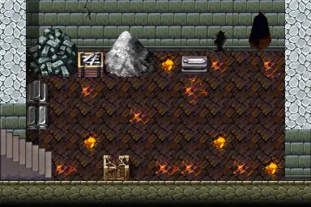

# White house basement

| | |
|---|---|
| **Map ID** | `white_house_basement` |
| **Region** | In Fallhaven (settlement) |
| **Type** | Indoors / underground |
| **Size** | 12×8 tiles |
| **Introduced** | [v0.8.18](../versions/0.8.18.md) |
| **Enemy types** | 1 |
| **Quests** | 2 |

**White house basement** is an indoor map, in Fallhaven (settlement). It has no NPCs and 1 kind of enemy. Exits lead to White house.

## Map

<label class="lg"><input type="checkbox" data-t="spawn" checked><b>Red</b>&nbsp;Monsters / NPCs</label><label class="lg"><input type="checkbox" data-t="mapchange" checked><b>Blue</b>&nbsp;Exit to another map</label><label class="lg"><input type="checkbox" data-t="container" checked><b>Yellow</b>&nbsp;Container (click to see contents)</label><label class="lg"><input type="checkbox" data-t="sign" checked><b>Purple</b>&nbsp;Sign</label><label class="lg"><input type="checkbox" data-t="rest" checked><b>Green</b>&nbsp;Resting place</label><label class="lg"><input type="checkbox" data-t="key" checked><b>Orange dashed</b>&nbsp;Blocked until a quest step / item</label><label class="lg"><input type="checkbox" data-t="script"><b>Grey dotted</b>&nbsp;Scripted event</label><label class="lg"><input type="checkbox" data-t="replace"><b>White dotted</b>&nbsp;Changes during a quest</label><label class="lg"><input type="checkbox" data-t="pin" checked><b>Numbers</b>&nbsp;Numbered key points (see the key below the map)</label>

<a class="pin pin-exit" href="#key-1" style="left:4.167%;top:68.750%" title="Exit (west): to [White house](../white_house.md)">1</a><a class="pin pin-script" href="#key-2" style="left:12.500%;top:75.000%" title="Quest trigger: Scripted event: advances the quest: hidden story flag “undertell_hidden” to stage 50 (“50 = PC has &quot;talked&quot; to the white house dragon.”) (+2 more quest(s))">2</a><a class="pin pin-script" href="#key-3" style="left:58.333%;top:62.500%" title="Quest trigger: Scripted event: advances the quest: The fifth master to stage 75 (“Using Falkour&#x27;s claw, I unlocked the ancient box. Inside were the five pages of the Kazaul ritual the Masters desired.”)">3</a><a class="pin pin-key" href="#key-4" style="left:79.167%;top:43.750%" title="Blocked passage: Closed off once you reach this point in the quest: Lost treasures (stage 200: “Nocmar forged the heartsteel once again and rewarded me with a weapon type of my choice, reforged in the lost art.”)">4</a>

??? abstract "Key to the numbers on the map"

    | # | What | Details |
    |---|---|---|
    | 1 | Exit (west) | to [White house](../white_house.md) |
    | 2 | Quest trigger | Scripted event: advances the quest: hidden story flag “undertell_hidden” to stage 50 (“50 = PC has "talked" to the white house dragon.”) (+2 more quest(s)) |
    | 3 | Quest trigger | Scripted event: advances the quest: The fifth master to stage 75 (“Using Falkour's claw, I unlocked the ancient box. Inside were the five pages of the Kazaul ritual the Masters desired.”) |
    | 4 | Blocked passage | Closed off once you reach this point in the quest: Lost treasures (stage 200: “Nocmar forged the heartsteel once again and rewarded me with a weapon type of my choice, reforged in the lost art.”) |

Verified against v0.8.18 map data.

## Connections

| Direction | Leads to | Region there | Map # |
|---|---|---|---|
| West | [White house](white_house.md) | Fallhaven | 1 |

## Enemies

| Enemy | HP | Damage | Up to | Notes |
|---|---|---|---|---|
| [Falkour the Forge Dragon](../monsters/wh_dragon.md) | 0 | 0–0 | 1 | – |

<small>“Up to” is the most that can be alive at once from the spawn areas on this map.</small>

## Quests

- [Lost treasures](../quests/nocmar.md): blocked passage closes at stage 200; something on this map advances it; stepping on a trigger here sets stage 110
- [The fifth master](../quests/fifth_master.md): something on this map advances it; stepping on a trigger here sets stage 70; stepping on a trigger here sets stage 72; stepping on a trigger here sets stage 75
- [hidden_lava_burning_rounds (hidden flag)](../quests/lava_burning.md): a scripted event can trigger here from stage 1; a scripted event can trigger here from stage 3; a scripted event can trigger here from stage 4; a scripted event can trigger here from stage 7
- [hidden_undertell (hidden flag)](../quests/undertell_hidden.md): something on this map advances it; stepping on a trigger here sets stage 50

## Points of interest

- **Quest trigger** (#2): Scripted event: advances the quest: hidden story flag “undertell_hidden” to stage 50 (“50 = PC has "talked" to the white house dragon.”) (+2 more quest(s))
- **Quest trigger** (#3): Scripted event: advances the quest: The fifth master to stage 75 (“Using Falkour's claw, I unlocked the ancient box. Inside were the five pages of the Kazaul ritual the Masters desired.”)
- **Blocked passage** (#4): Closed off once you reach this point in the quest: Lost treasures (stage 200: “Nocmar forged the heartsteel once again and rewarded me with a weapon type of my choice, reforged in the lost art.”)

## Version history

| Version | Change |
|---|---|
| [v0.8.18](../versions/0.8.18.md) | Added |

Verified against v0.8.18 and every earlier release back to v0.7.0 (game data compared release by release).

## Community notes

<small>Written by players, not generated from game data. **Observations**: what players notice in-game · **Lore**: the in-world story · **Trivia**: real-world facts, references, development history · **Theory / speculation**: unconfirmed ideas; may just be unfinished content</small>

### Observations

*Nothing here yet. Know something? [Add it](https://github.com/asdfghjkl628/Andor-s-Trail-Wikiiii/new/main/notes/maps?filename=white_house_basement.md&value=%23%23%20Observations%0A%0A%3C%21--%20what%20players%20notice%20in-game%20--%3E%0A%0A%23%23%20Lore%0A%0A%3C%21--%20the%20in-world%20story%20--%3E%0A%0A%23%23%20Trivia%0A%0A%3C%21--%20real-world%20facts%2C%20references%2C%20development%20history%20--%3E%0A%0A%23%23%20Theory%20/%20speculation%0A%0A%3C%21--%20unconfirmed%20ideas%3B%20may%20just%20be%20unfinished%20content%20--%3E%0A).*

### Lore

*Nothing here yet. Know something? [Add it](https://github.com/asdfghjkl628/Andor-s-Trail-Wikiiii/new/main/notes/maps?filename=white_house_basement.md&value=%23%23%20Observations%0A%0A%3C%21--%20what%20players%20notice%20in-game%20--%3E%0A%0A%23%23%20Lore%0A%0A%3C%21--%20the%20in-world%20story%20--%3E%0A%0A%23%23%20Trivia%0A%0A%3C%21--%20real-world%20facts%2C%20references%2C%20development%20history%20--%3E%0A%0A%23%23%20Theory%20/%20speculation%0A%0A%3C%21--%20unconfirmed%20ideas%3B%20may%20just%20be%20unfinished%20content%20--%3E%0A).*

### Trivia

*Nothing here yet. Know something? [Add it](https://github.com/asdfghjkl628/Andor-s-Trail-Wikiiii/new/main/notes/maps?filename=white_house_basement.md&value=%23%23%20Observations%0A%0A%3C%21--%20what%20players%20notice%20in-game%20--%3E%0A%0A%23%23%20Lore%0A%0A%3C%21--%20the%20in-world%20story%20--%3E%0A%0A%23%23%20Trivia%0A%0A%3C%21--%20real-world%20facts%2C%20references%2C%20development%20history%20--%3E%0A%0A%23%23%20Theory%20/%20speculation%0A%0A%3C%21--%20unconfirmed%20ideas%3B%20may%20just%20be%20unfinished%20content%20--%3E%0A).*

### Theory / speculation

*Nothing here yet. Know something? [Add it](https://github.com/asdfghjkl628/Andor-s-Trail-Wikiiii/new/main/notes/maps?filename=white_house_basement.md&value=%23%23%20Observations%0A%0A%3C%21--%20what%20players%20notice%20in-game%20--%3E%0A%0A%23%23%20Lore%0A%0A%3C%21--%20the%20in-world%20story%20--%3E%0A%0A%23%23%20Trivia%0A%0A%3C%21--%20real-world%20facts%2C%20references%2C%20development%20history%20--%3E%0A%0A%23%23%20Theory%20/%20speculation%0A%0A%3C%21--%20unconfirmed%20ideas%3B%20may%20just%20be%20unfinished%20content%20--%3E%0A).*

??? info "Technical information"

    | | |
    |---|---|
    | Map ID | `white_house_basement` |
    | File | `res/xml/white_house_basement.tmx` |
    | Size | 12×8 tiles (384×256 px) |
    | outdoors property | – |
    | Layers drawn | base, ground, objects, above |
    | Tilesets | map_bed_1, map_border_1, map_bridge_1, map_bridge_2, map_broken_1, map_cavewall_1, map_cavewall_2, map_cavewall_3, map_cavewall_4, map_chair_table_1, map_chair_table_2, map_crate_1, map_cupboard_1, map_curtain_1, map_entrance_1, map_entrance_2, map_fence_1, map_fence_2, map_fence_3, map_fence_4, map_ground_1, map_ground_2, map_ground_3, map_ground_4, map_ground_5, map_ground_6, map_ground_7, map_ground_8, map_house_1, map_house_2, map_indoor_1, map_indoor_2, map_kitchen_1, map_outdoor_1, map_pillar_1, map_pillar_2, map_plant_1, map_plant_2, map_rock_1, map_rock_2, map_roof_1, map_roof_2, map_roof_3, map_shop_1, map_sign_ladder_1, map_table_1, map_trail_1, map_transition_1, map_transition_2, map_transition_3, map_transition_4, map_transition_5, map_tree_1, map_tree_2, map_wall_1, map_wall_2, map_wall_3, map_wall_4, map_window_1, map_window_2 |
    | Map objects | script: 12, mapchange: 1, spawn: 1, key: 1 |
    | World map position | – |

<small>Data from v0.8.18</small>
