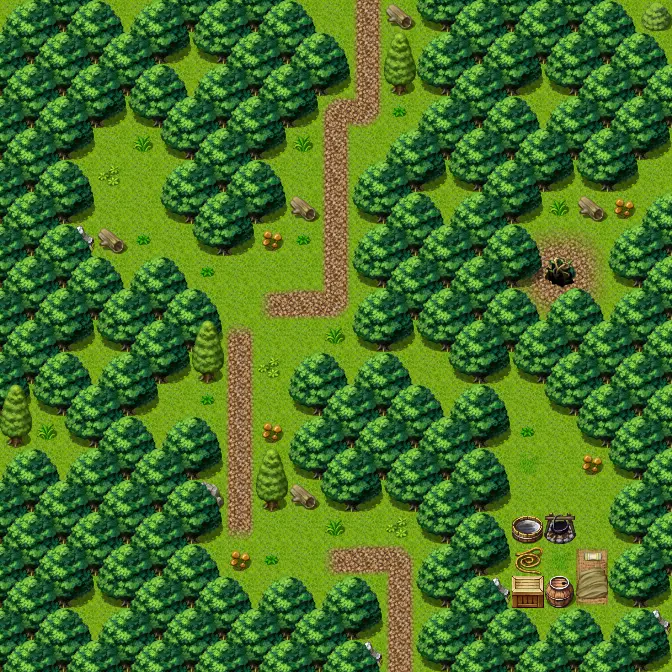

# Wild0

21×21 tiles · outdoors · part of [World1](index.md)

<label class="lg lg-spawn"><input type="checkbox" data-t="spawn" checked> Monsters / NPCs</label><label class="lg lg-mapchange"><input type="checkbox" data-t="mapchange" checked> Exit to another map</label><label class="lg lg-container"><input type="checkbox" data-t="container" checked> Container</label><label class="lg lg-sign"><input type="checkbox" data-t="sign" checked> Sign</label><label class="lg lg-rest"><input type="checkbox" data-t="rest" checked> Resting place</label><label class="lg lg-key"><input type="checkbox" data-t="key" checked> Blocked / needs key or quest</label><label class="lg lg-script"><input type="checkbox" data-t="script"> Scripted event</label><label class="lg lg-replace"><input type="checkbox" data-t="replace"> Changes after a quest</label>

## Exits

- [Crossroads](crossroads.md)
- [Wild1](wild1.md)
- [Woodcave0](woodcave0.md)
- [Woodcave1](woodcave1.md)

## Monsters & NPCs here

| Name | HP |
|---|---|
| [Erinith](../monsters/erinith.md) | 0 |
| [Forest wasp](../monsters/forest_wasp.md) | 6 |
| [Small rabid dog](../monsters/small_rabid_dog.md) | 6 |
| [Rabid boar](../monsters/rabid_boar.md) | 20 |
| [Rabid fox](../monsters/rabid_fox.md) | 25 |
| [Young larval burrower](../monsters/young_larval_burrower.md) | 30 |

<small>Map ID: `wild0` · Data from v0.8.18</small>
