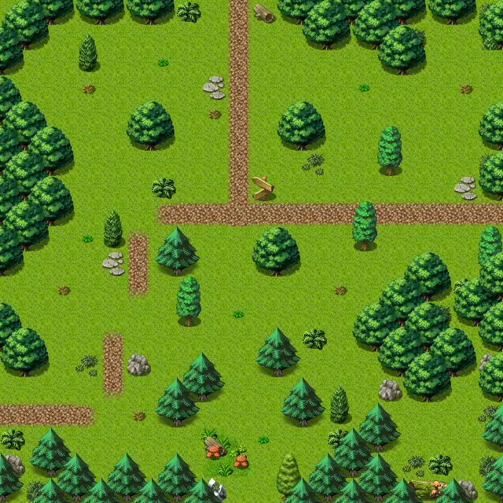

# Wild10

20×20 tiles · outdoors · part of [World1](index.md)

<label class="lg lg-spawn"><input type="checkbox" data-t="spawn" checked> Monsters / NPCs</label><label class="lg lg-mapchange"><input type="checkbox" data-t="mapchange" checked> Exit to another map</label><label class="lg lg-container"><input type="checkbox" data-t="container" checked> Container</label><label class="lg lg-sign"><input type="checkbox" data-t="sign" checked> Sign</label><label class="lg lg-rest"><input type="checkbox" data-t="rest" checked> Resting place</label><label class="lg lg-key"><input type="checkbox" data-t="key" checked> Blocked / needs key or quest</label><label class="lg lg-script"><input type="checkbox" data-t="script"> Scripted event</label><label class="lg lg-replace"><input type="checkbox" data-t="replace"> Changes after a quest</label>

## Exits

- [Fallhaven sw](fallhaven_sw.md)
- [Mywild20](mywild20.md)
- [Wild11](wild11.md)
- [Wild9](wild9.md)

## Monsters & NPCs here

| Name | HP |
|---|---|
| [Wild flower](../monsters/wild_flower.md) | 0 |
| [Forest wasp](../monsters/forest_wasp.md) | 6 |
| [Forest serpent](../monsters/forest_serpent.md) | 20 |
| [Wild boar](../monsters/wild_boar.md) | 20 |
| [Shady bandit](../monsters/shady_bandit.md) | 45 |

<small>Map ID: `wild10` · Data from v0.8.18</small>
