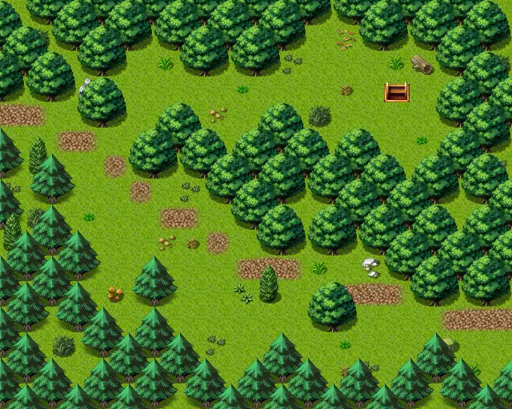

# Wild14

20×16 tiles · outdoors · part of [World1](index.md)

<label class="lg lg-spawn"><input type="checkbox" data-t="spawn" checked> Monsters / NPCs</label><label class="lg lg-mapchange"><input type="checkbox" data-t="mapchange" checked> Exit to another map</label><label class="lg lg-container"><input type="checkbox" data-t="container" checked> Container</label><label class="lg lg-sign"><input type="checkbox" data-t="sign" checked> Sign</label><label class="lg lg-rest"><input type="checkbox" data-t="rest" checked> Resting place</label><label class="lg lg-key"><input type="checkbox" data-t="key" checked> Blocked / needs key or quest</label><label class="lg lg-script"><input type="checkbox" data-t="script"> Scripted event</label><label class="lg lg-replace"><input type="checkbox" data-t="replace"> Changes after a quest</label>

## Exits

- [Wild13](wild13.md)
- [Wild14 cave](wild14_cave.md)
- [Wild15](wild15.md)

## Monsters & NPCs here

| Name | HP |
|---|---|
| [Vicious forest serpent](../monsters/vicious_forest_serpent.md) | 27 |
| [Wolf](../monsters/wolf.md) | 30 |
| [Cave dwelling boar](../monsters/cave_dwelling_boar.md) | 35 |
| [Ancient wolf](../monsters/lonely_wolf.md) | 35 |

<small>Map ID: `wild14` · Data from v0.8.18</small>
