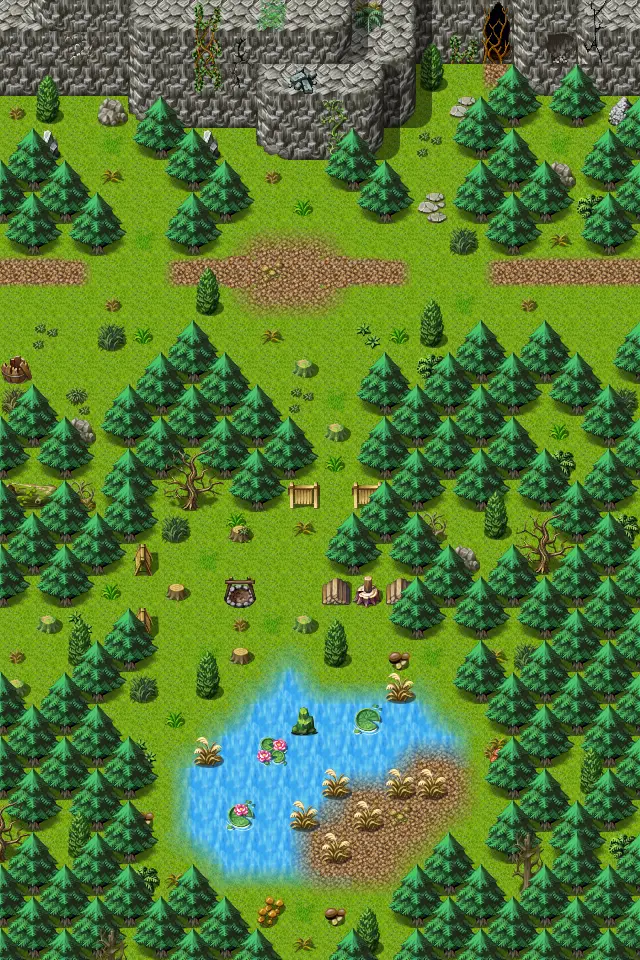

# Wild16

20×30 tiles · outdoors · part of [World1](index.md)

<label class="lg lg-spawn"><input type="checkbox" data-t="spawn" checked> Monsters / NPCs</label><label class="lg lg-mapchange"><input type="checkbox" data-t="mapchange" checked> Exit to another map</label><label class="lg lg-container"><input type="checkbox" data-t="container" checked> Container</label><label class="lg lg-sign"><input type="checkbox" data-t="sign" checked> Sign</label><label class="lg lg-rest"><input type="checkbox" data-t="rest" checked> Resting place</label><label class="lg lg-key"><input type="checkbox" data-t="key" checked> Blocked / needs key or quest</label><label class="lg lg-script"><input type="checkbox" data-t="script"> Scripted event</label><label class="lg lg-replace"><input type="checkbox" data-t="replace"> Changes after a quest</label>

## Exits

- [Blackwater mountain0](blackwater_mountain0.md)
- [Flagstone0](flagstone0.md)
- [Wild16 cave](wild16_cave.md)
- [Wild18](wild18.md)

## Monsters & NPCs here

| Name | HP |
|---|---|
| [Forest beetle](../monsters/forest_beetle.md) | 14 |
| [Wild boar](../monsters/wild_boar.md) | 20 |
| [Anklebiter](../monsters/anklebiter.md) | 31 |
| [Stoutford guard](../monsters/stoutford_guard_camp1.md) | 40 |
| [Stoutford guard](../monsters/stoutford_guard_camp2.md) | 40 |

<small>Map ID: `wild16` · Data from v0.8.18</small>
