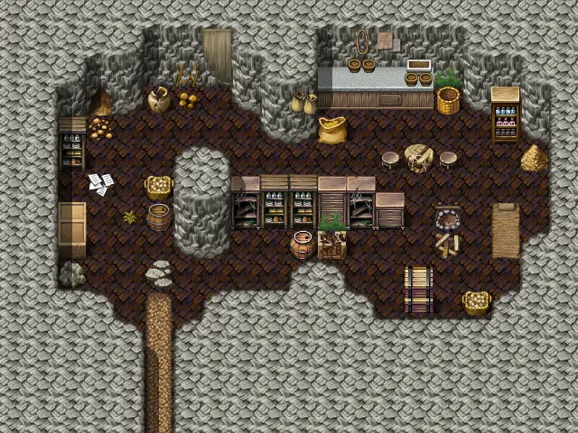
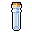
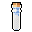
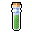

# Wild16 cave

20×15 tiles

<label class="lg"><input type="checkbox" data-t="spawn" checked><b>Red</b>&nbsp;Monsters / NPCs</label><label class="lg"><input type="checkbox" data-t="mapchange" checked><b>Blue</b>&nbsp;Exit to another map</label><label class="lg"><input type="checkbox" data-t="container" checked><b>Yellow</b>&nbsp;Container (click to see contents)</label><label class="lg"><input type="checkbox" data-t="sign" checked><b>Purple</b>&nbsp;Sign</label><label class="lg"><input type="checkbox" data-t="rest" checked><b>Green</b>&nbsp;Resting place</label><label class="lg"><input type="checkbox" data-t="key" checked><b>Orange dashed</b>&nbsp;Blocked until a quest step / item</label><label class="lg"><input type="checkbox" data-t="script"><b>Grey dotted</b>&nbsp;Scripted event</label><label class="lg"><input type="checkbox" data-t="replace"><b>White dotted</b>&nbsp;Changes during a quest</label>

## Containers

<b>Container 1</b><ul><li><a href="../../items/vial_empty1/">Small empty vial</a> <small>100%</small></li><li><a href="../../items/vial_empty2/">Empty vial</a> <small>100% · ×2</small></li><li><a href="../../items/health_minor2/">Minor potion of health</a> <small>100% · ×2</small></li></ul>

<b>Container 2</b><ul><li><a href="../../items/health/">Regular potion of health</a> <small>100% · ×2</small></li><li><a href="../../items/milk/">Milk</a> <small>100% · ×3</small></li><li><a href="../../items/pot_speed_1/">Minor potion of speed</a> <small>5%</small></li><li><a href="../../items/pot_poison_weak/">Weak poison</a> <small>5% · ×3</small></li><li><a href="../../items/pot_poison_weak_antidote/">Weak poison antidote</a> <small>100%</small></li><li><a href="../../items/pot_blind_rage/">Potion of blind rage</a> <small>100%</small></li><li><a href="../../items/pot_bleeding_ointment/">Ointment of bleeding wounds</a> <small>100%</small></li><li><a href="../../items/health_major2/">Major potion of health</a> <small>100%</small></li></ul>

<b>Container 3</b><ul><li><a href="../../items/gold/">Gold coins</a> <small>100% · ×2000</small></li></ul>

## Exits

- [Wild16](wild16.md)

<small>Map ID: `wild16_cave` · Data from v0.8.18</small>
