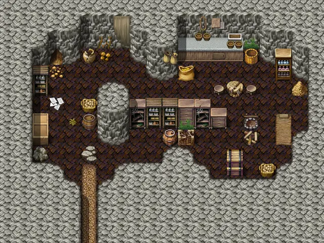
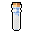

# Wild16 cave

| | |
|---|---|
| **Map ID** | `wild16_cave` |
| **Region** | In Flagstone Prison (other) |
| **Type** | Indoors / underground |
| **Size** | 20×15 tiles |
| **Introduced** | v0.7.0 or earlier |
| **Quests** | 1 |
| **Containers** | 3 |

**Wild16 cave** is an indoor map, in Flagstone Prison (other). It has no NPCs, and no enemies. Exits lead to Wild16.

## Map

<label class="lg"><input type="checkbox" data-t="spawn" checked><b>Red</b>&nbsp;Monsters / NPCs</label><label class="lg"><input type="checkbox" data-t="mapchange" checked><b>Blue</b>&nbsp;Exit to another map</label><label class="lg"><input type="checkbox" data-t="container" checked><b>Yellow</b>&nbsp;Container (click to see contents)</label><label class="lg"><input type="checkbox" data-t="sign" checked><b>Purple</b>&nbsp;Sign</label><label class="lg"><input type="checkbox" data-t="rest" checked><b>Green</b>&nbsp;Resting place</label><label class="lg"><input type="checkbox" data-t="key" checked><b>Orange dashed</b>&nbsp;Blocked until a quest step / item</label><label class="lg"><input type="checkbox" data-t="script"><b>Grey dotted</b>&nbsp;Scripted event</label><label class="lg"><input type="checkbox" data-t="replace"><b>White dotted</b>&nbsp;Changes during a quest</label><label class="lg"><input type="checkbox" data-t="pin" checked><b>Numbers</b>&nbsp;Numbered key points (see the key below the map)</label>

<a class="pin pin-exit" href="#key-1" style="left:27.500%;top:96.667%" title="Exit (south): to [Wild16](wild16.md)">1</a><a class="pin pin-rest" href="#key-2" style="left:87.500%;top:56.667%" title="Resting place: Rest here to heal and set your respawn point">2</a><a class="pin pin-container" href="#key-3" style="left:27.500%;top:43.333%" title="Container 1: Small empty vial, Empty vial, Minor potion of health">3</a><a class="pin pin-container" href="#key-4" style="left:82.500%;top:70.000%" title="Container 2: Regular potion of health, Milk, Minor potion of speed, Weak poison, Weak poison antidote, Potion of blind rage">4</a><a class="pin pin-container" href="#key-5" style="left:92.500%;top:36.667%" title="Container 3: Gold coins">5</a><a class="pin pin-sign" href="#key-6" style="left:27.500%;top:90.000%" title="Sign: A sign">6</a>

??? abstract "Key to the numbers on the map"

    | # | What | Details |
    |---|---|---|
    | 1 | Exit (south) | to [Wild16](wild16.md) |
    | 2 | Resting place | Rest here to heal and set your respawn point |
    | 3 | Container 1 | Small empty vial, Empty vial, Minor potion of health |
    | 4 | Container 2 | Regular potion of health, Milk, Minor potion of speed, Weak poison, Weak poison antidote, Potion of blind rage |
    | 5 | Container 3 | Gold coins |
    | 6 | Sign | A sign |

Verified against v0.8.18 map data.

## Connections

| Direction | Leads to | Region there | Map # |
|---|---|---|---|
| South | [Wild16](wild16.md) | Flagstone Prison | 1 |

## Items & containers

<b>Container 1</b><ul><li><a href="../../items/vial_empty1/">Small empty vial</a> <small>100%</small></li><li><a href="../../items/vial_empty2/">Empty vial</a> <small>100% · ×2</small></li><li><a href="../../items/health_minor2/">Minor potion of health</a> <small>100% · ×2</small></li></ul>

<b>Container 2</b><ul><li><a href="../../items/health/">Regular potion of health</a> <small>100% · ×2</small></li><li><a href="../../items/milk/">Milk</a> <small>100% · ×3</small></li><li><a href="../../items/pot_speed_1/">Minor potion of speed</a> <small>5%</small></li><li><a href="../../items/pot_poison_weak/">Weak poison</a> <small>5% · ×3</small></li><li><a href="../../items/pot_poison_weak_antidote/">Weak poison antidote</a> <small>100%</small></li><li><a href="../../items/pot_blind_rage/">Potion of blind rage</a> <small>100%</small></li><li><a href="../../items/pot_bleeding_ointment/">Ointment of bleeding wounds</a> <small>100%</small></li><li><a href="../../items/health_major2/">Major potion of health</a> <small>100%</small></li></ul>

<b>Container 3</b><ul><li><a href="../../items/gold/">Gold coins</a> <small>100% · ×2000</small></li></ul>

## Quests

- [Old friends?](../quests/kaverin.md): something on this map advances it

## Points of interest

- **Resting place** (#2): Rest here to heal and set your respawn point
- **Sign** (#6): A sign

## Version history

| Version | Change |
|---|---|
| [v0.7.0](../versions/0.7.0.md) | Present in v0.7.0 (earliest release tracked) |
| [v0.7.1](../versions/0.7.1.md) | map layout or objects changed |
| [v0.7.2](../versions/0.7.2.md) | map layout or objects changed |
| [v0.8.2](../versions/0.8.2.md) | map layout or objects changed |

Verified against v0.8.18 and every earlier release back to v0.7.0 (game data compared release by release).

## Community notes

<small>Written by players, not generated from game data. **Observations**: what players notice in-game · **Lore**: the in-world story · **Trivia**: real-world facts, references, development history · **Theory / speculation**: unconfirmed ideas; may just be unfinished content</small>

### Observations

*No notes yet. Contributions are welcome: [add a note](https://github.com/asdfghjkl628/Andor-s-Trail-Wikiiii/new/main/notes/maps?filename=wild16_cave.md&value=%23%23%20Observations%0A%0A%3C%21--%20what%20players%20notice%20in-game%20--%3E%0A%0A%23%23%20Lore%0A%0A%3C%21--%20the%20in-world%20story%20--%3E%0A%0A%23%23%20Trivia%0A%0A%3C%21--%20real-world%20facts%2C%20references%2C%20development%20history%20--%3E%0A%0A%23%23%20Theory%20/%20speculation%0A%0A%3C%21--%20unconfirmed%20ideas%3B%20may%20just%20be%20unfinished%20content%20--%3E%0A).*

### Lore

*No notes yet. Contributions are welcome: [add a note](https://github.com/asdfghjkl628/Andor-s-Trail-Wikiiii/new/main/notes/maps?filename=wild16_cave.md&value=%23%23%20Observations%0A%0A%3C%21--%20what%20players%20notice%20in-game%20--%3E%0A%0A%23%23%20Lore%0A%0A%3C%21--%20the%20in-world%20story%20--%3E%0A%0A%23%23%20Trivia%0A%0A%3C%21--%20real-world%20facts%2C%20references%2C%20development%20history%20--%3E%0A%0A%23%23%20Theory%20/%20speculation%0A%0A%3C%21--%20unconfirmed%20ideas%3B%20may%20just%20be%20unfinished%20content%20--%3E%0A).*

### Trivia

*No notes yet. Contributions are welcome: [add a note](https://github.com/asdfghjkl628/Andor-s-Trail-Wikiiii/new/main/notes/maps?filename=wild16_cave.md&value=%23%23%20Observations%0A%0A%3C%21--%20what%20players%20notice%20in-game%20--%3E%0A%0A%23%23%20Lore%0A%0A%3C%21--%20the%20in-world%20story%20--%3E%0A%0A%23%23%20Trivia%0A%0A%3C%21--%20real-world%20facts%2C%20references%2C%20development%20history%20--%3E%0A%0A%23%23%20Theory%20/%20speculation%0A%0A%3C%21--%20unconfirmed%20ideas%3B%20may%20just%20be%20unfinished%20content%20--%3E%0A).*

### Theory / speculation

*No notes yet. Contributions are welcome: [add a note](https://github.com/asdfghjkl628/Andor-s-Trail-Wikiiii/new/main/notes/maps?filename=wild16_cave.md&value=%23%23%20Observations%0A%0A%3C%21--%20what%20players%20notice%20in-game%20--%3E%0A%0A%23%23%20Lore%0A%0A%3C%21--%20the%20in-world%20story%20--%3E%0A%0A%23%23%20Trivia%0A%0A%3C%21--%20real-world%20facts%2C%20references%2C%20development%20history%20--%3E%0A%0A%23%23%20Theory%20/%20speculation%0A%0A%3C%21--%20unconfirmed%20ideas%3B%20may%20just%20be%20unfinished%20content%20--%3E%0A).*

??? info "Technical information"

    | | |
    |---|---|
    | Map ID | `wild16_cave` |
    | File | `res/xml/wild16_cave.tmx` |
    | Size | 20×15 tiles (640×480 px) |
    | outdoors property | – |
    | Layers drawn | ground, objects, above |
    | Tilesets | map_bed_1, map_border_1, map_bridge_1, map_bridge_2, map_broken_1, map_cavewall_1, map_cavewall_2, map_cavewall_3, map_cavewall_4, map_chair_table_1, map_chair_table_2, map_crate_1, map_cupboard_1, map_curtain_1, map_entrance_1, map_entrance_2, map_fence_1, map_fence_2, map_fence_3, map_fence_4, map_ground_1, map_ground_2, map_ground_3, map_ground_4, map_ground_5, map_ground_6, map_ground_7, map_ground_8, map_house_1, map_house_2, map_indoor_1, map_indoor_2, map_kitchen_1, map_outdoor_1, map_pillar_1, map_pillar_2, map_plant_1, map_plant_2, map_rock_1, map_rock_2, map_roof_1, map_roof_2, map_roof_3, map_shop_1, map_sign_ladder_1, map_table_1, map_trail_1, map_transition_1, map_transition_2, map_transition_3, map_transition_4, map_transition_5, map_tree_1, map_tree_2, map_wall_1, map_wall_2, map_wall_3, map_wall_4, map_window_1, map_window_2 |
    | Map objects | container: 3, mapchange: 1, rest: 1, sign: 1 |
    | World map position | – |

<small>Data from v0.8.18</small>
