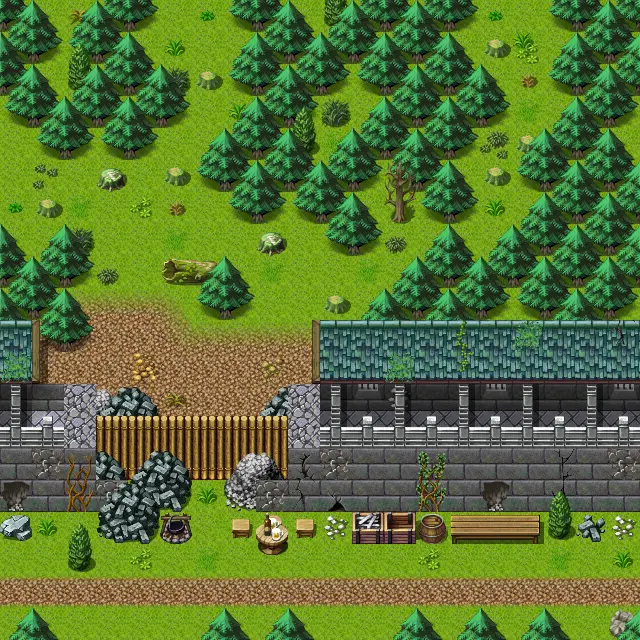

# Wild19

| | |
|---|---|
| **Map ID** | `wild19` |
| **Region** | In Stoutford (settlement) |
| **Type** | Indoors / underground |
| **Size** | 20×20 tiles |
| **World map** | [World1](index.md) |
| **Introduced** | [v0.7.2](../versions/0.7.2.md) |
| **NPCs** | 7 |
| **Enemy types** | 2 |
| **Quests** | 2 |

**Wild19** is an indoor map, in Stoutford (settlement). It has 7 NPCs and 2 kinds of enemy. Exits lead to Blackwater mountain0, Wild18, Stoutford north-east, Wild20.

## Map

<label class="lg"><input type="checkbox" data-t="spawn" checked><b>Red</b>&nbsp;Monsters / NPCs</label><label class="lg"><input type="checkbox" data-t="mapchange" checked><b>Blue</b>&nbsp;Exit to another map</label><label class="lg"><input type="checkbox" data-t="container" checked><b>Yellow</b>&nbsp;Container (click to see contents)</label><label class="lg"><input type="checkbox" data-t="sign" checked><b>Purple</b>&nbsp;Sign</label><label class="lg"><input type="checkbox" data-t="rest" checked><b>Green</b>&nbsp;Resting place</label><label class="lg"><input type="checkbox" data-t="key" checked><b>Orange dashed</b>&nbsp;Blocked until a quest step / item</label><label class="lg"><input type="checkbox" data-t="script"><b>Grey dotted</b>&nbsp;Scripted event</label><label class="lg"><input type="checkbox" data-t="replace"><b>White dotted</b>&nbsp;Changes during a quest</label><label class="lg"><input type="checkbox" data-t="pin" checked><b>Numbers</b>&nbsp;Numbered key points (see the key below the map)</label>

<a class="pin pin-exit" href="#key-1" style="left:30.000%;top:2.500%" title="Exit (north): to [Blackwater mountain0](../blackwater_mountain0.md)">1</a><a class="pin pin-exit" href="#key-1" style="left:80.000%;top:2.500%" title="Exit (north): to [Blackwater mountain0](../blackwater_mountain0.md)">1</a><a class="pin pin-exit" href="#key-2" style="left:97.500%;top:65.000%" title="Exit (east): to [Wild18](../wild18.md)">2</a><a class="pin pin-exit" href="#key-2" style="left:97.500%;top:87.500%" title="Exit (east): to [Wild18](../wild18.md)">2</a><a class="pin pin-exit" href="#key-3" style="left:20.000%;top:97.500%" title="Exit (south): to [Stoutford north-east](../stoutford_ne.md)">3</a><a class="pin pin-exit" href="#key-4" style="left:2.500%;top:92.500%" title="Exit (southwest): to [Wild20](../wild20.md)">4</a><a class="pin pin-exit" href="#key-5" style="left:2.500%;top:30.000%" title="Exit (west): to [Wild20](../wild20.md)">5</a><a class="pin pin-npc" href="#key-6" style="left:92.500%;top:92.500%" title="[Gyra](../../monsters/stn_gyra1.md): NPC">6</a><a class="pin pin-npc" href="#key-7" style="left:47.500%;top:97.500%" title="[Gyra](../../monsters/stn_gyra2.md): NPC">7</a><a class="pin pin-npc" href="#key-8" style="left:77.500%;top:62.500%" title="[Stoutford guard](../../monsters/stoutford_guard1.md): NPC">8</a><a class="pin pin-npc" href="#key-9" style="left:72.500%;top:62.500%" title="[Stoutford guard](../../monsters/stoutford_guard1_b.md): NPC">9</a><a class="pin pin-npc" href="#key-10" style="left:32.500%;top:82.500%" title="[Stoutford guard](../../monsters/stoutford_guard3.md): NPC">10</a><a class="pin pin-npc" href="#key-11" style="left:72.829%;top:58.750%" title="[Stoutford guard](../../monsters/stoutford_guard1_c.md): NPC">11</a><a class="pin pin-npc" href="#key-12" style="left:75.023%;top:65.791%" title="[Stoutford guard](../../monsters/stoutford_guard2.md): NPC">12</a><a class="pin pin-script" href="#key-13" style="left:87.500%;top:92.500%" title="Quest trigger: Scripted event: advances the quest: hidden story flag “stn_nondisplay” to stage 19 (“19=Gyra in wild19”)">13</a><a class="pin pin-script" href="#key-14" style="left:37.500%;top:90.000%" title="Quest trigger: Scripted event: advances the quest: Lost girl looking for lost things to stage 60 (“Once back in Stoutford Gyra knew the way and ran to her father Odirath.”)">14</a><a class="pin pin-key" href="#key-15" style="left:42.500%;top:92.500%" title="Blocked passage: Closed off once you reach this point in the quest: base_nondisplay (stage 2: “2=This stage is never set”)">15</a>

??? abstract "Key to the numbers on the map"

    | # | What | Details |
    |---|---|---|
    | 1 | Exit (north) | to [Blackwater mountain0](../blackwater_mountain0.md) |
    | 2 | Exit (east) | to [Wild18](../wild18.md) |
    | 3 | Exit (south) | to [Stoutford north-east](../stoutford_ne.md) |
    | 4 | Exit (southwest) | to [Wild20](../wild20.md) |
    | 5 | Exit (west) | to [Wild20](../wild20.md) |
    | 6 | [Gyra](../monsters/stn_gyra1.md) | NPC |
    | 7 | [Gyra](../monsters/stn_gyra2.md) | NPC |
    | 8 | [Stoutford guard](../monsters/stoutford_guard1.md) | NPC |
    | 9 | [Stoutford guard](../monsters/stoutford_guard1_b.md) | NPC |
    | 10 | [Stoutford guard](../monsters/stoutford_guard3.md) | NPC |
    | 11 | [Stoutford guard](../monsters/stoutford_guard1_c.md) | NPC |
    | 12 | [Stoutford guard](../monsters/stoutford_guard2.md) | NPC |
    | 13 | Quest trigger | Scripted event: advances the quest: hidden story flag “stn_nondisplay” to stage 19 (“19=Gyra in wild19”) |
    | 14 | Quest trigger | Scripted event: advances the quest: Lost girl looking for lost things to stage 60 (“Once back in Stoutford Gyra knew the way and ran to her father Odirath.”) |
    | 15 | Blocked passage | Closed off once you reach this point in the quest: base_nondisplay (stage 2: “2=This stage is never set”) |

Verified against v0.8.18 map data.

## Connections

| Direction | Leads to | Region there | Map # |
|---|---|---|---|
| North | [Blackwater mountain0](blackwater_mountain0.md) | Flagstone Prison | 1 |
| East | [Wild18](wild18.md) | Flagstone Prison | 2 |
| South | [Stoutford north-east](stoutford_ne.md) | Stoutford | 3 |
| Southwest | [Wild20](wild20.md) | Stoutford | 4 |
| West | [Wild20](wild20.md) | Stoutford | 5 |

## NPCs

- [Gyra](../monsters/stn_gyra1.md) (#6)
- [Gyra](../monsters/stn_gyra2.md) (#7)
- [Stoutford guard](../monsters/stoutford_guard1.md) (#8)
- [Stoutford guard](../monsters/stoutford_guard1_b.md) (#9)
- [Stoutford guard](../monsters/stoutford_guard3.md) (#10)
- [Stoutford guard](../monsters/stoutford_guard1_c.md) (#11)
- [Stoutford guard](../monsters/stoutford_guard2.md) (#12)

## Enemies

| Enemy | HP | Damage | Up to | Notes |
|---|---|---|---|---|
| [Forest beetle](../monsters/forest_beetle.md) | 14 | 2–4 | 2 | – |
| [Wolf](../monsters/wolf.md) | 30 | 3–6 | 4 | – |

<small>“Up to” is the most that can be alive at once from the spawn areas on this map.</small>

## Quests

- [base_nondisplay](../quests/base_nondisplay.md): blocked passage closes at stage 2
- [Lost girl looking for lost things](../quests/stn_quest_gyra.md): something on this map advances it; stepping on a trigger here sets stage 60
- [stn_nondisplay (hidden flag)](../quests/stn_nondisplay.md): [Gyra](../monsters/stn_gyra1.md) is involved; [Gyra](../monsters/stn_gyra2.md) is involved; a scripted event can trigger here from stage 29; something on this map advances it; stepping on a trigger here sets stage 19

## Points of interest

- **Quest trigger** (#13): Scripted event: advances the quest: hidden story flag “stn_nondisplay” to stage 19 (“19=Gyra in wild19”)
- **Quest trigger** (#14): Scripted event: advances the quest: Lost girl looking for lost things to stage 60 (“Once back in Stoutford Gyra knew the way and ran to her father Odirath.”)
- **Blocked passage** (#15): Closed off once you reach this point in the quest: base_nondisplay (stage 2: “2=This stage is never set”)

## Version history

| Version | Change |
|---|---|
| [v0.7.2](../versions/0.7.2.md) | Added |
| [v0.7.17](../versions/0.7.17.md) | map layout or objects changed |
| [v0.8.8](../versions/0.8.8.md) | map layout or objects changed |

Verified against v0.8.18 and every earlier release back to v0.7.0 (game data compared release by release).

## Community notes

<small>Written by players, not generated from game data. **Observations**: what players notice in-game · **Lore**: the in-world story · **Trivia**: real-world facts, references, development history · **Theory / speculation**: unconfirmed ideas; may just be unfinished content</small>

### Observations

*Nothing here yet. Know something? [Add it](https://github.com/asdfghjkl628/Andor-s-Trail-Wikiiii/new/main/notes/maps?filename=wild19.md&value=%23%23%20Observations%0A%0A%3C%21--%20what%20players%20notice%20in-game%20--%3E%0A%0A%23%23%20Lore%0A%0A%3C%21--%20the%20in-world%20story%20--%3E%0A%0A%23%23%20Trivia%0A%0A%3C%21--%20real-world%20facts%2C%20references%2C%20development%20history%20--%3E%0A%0A%23%23%20Theory%20/%20speculation%0A%0A%3C%21--%20unconfirmed%20ideas%3B%20may%20just%20be%20unfinished%20content%20--%3E%0A).*

### Lore

*Nothing here yet. Know something? [Add it](https://github.com/asdfghjkl628/Andor-s-Trail-Wikiiii/new/main/notes/maps?filename=wild19.md&value=%23%23%20Observations%0A%0A%3C%21--%20what%20players%20notice%20in-game%20--%3E%0A%0A%23%23%20Lore%0A%0A%3C%21--%20the%20in-world%20story%20--%3E%0A%0A%23%23%20Trivia%0A%0A%3C%21--%20real-world%20facts%2C%20references%2C%20development%20history%20--%3E%0A%0A%23%23%20Theory%20/%20speculation%0A%0A%3C%21--%20unconfirmed%20ideas%3B%20may%20just%20be%20unfinished%20content%20--%3E%0A).*

### Trivia

*Nothing here yet. Know something? [Add it](https://github.com/asdfghjkl628/Andor-s-Trail-Wikiiii/new/main/notes/maps?filename=wild19.md&value=%23%23%20Observations%0A%0A%3C%21--%20what%20players%20notice%20in-game%20--%3E%0A%0A%23%23%20Lore%0A%0A%3C%21--%20the%20in-world%20story%20--%3E%0A%0A%23%23%20Trivia%0A%0A%3C%21--%20real-world%20facts%2C%20references%2C%20development%20history%20--%3E%0A%0A%23%23%20Theory%20/%20speculation%0A%0A%3C%21--%20unconfirmed%20ideas%3B%20may%20just%20be%20unfinished%20content%20--%3E%0A).*

### Theory / speculation

*Nothing here yet. Know something? [Add it](https://github.com/asdfghjkl628/Andor-s-Trail-Wikiiii/new/main/notes/maps?filename=wild19.md&value=%23%23%20Observations%0A%0A%3C%21--%20what%20players%20notice%20in-game%20--%3E%0A%0A%23%23%20Lore%0A%0A%3C%21--%20the%20in-world%20story%20--%3E%0A%0A%23%23%20Trivia%0A%0A%3C%21--%20real-world%20facts%2C%20references%2C%20development%20history%20--%3E%0A%0A%23%23%20Theory%20/%20speculation%0A%0A%3C%21--%20unconfirmed%20ideas%3B%20may%20just%20be%20unfinished%20content%20--%3E%0A).*

??? info "Technical information"

    | | |
    |---|---|
    | Map ID | `wild19` |
    | File | `res/xml/wild19.tmx` |
    | Size | 20×20 tiles (640×640 px) |
    | outdoors property | – |
    | Layers drawn | ground, objects, above, top |
    | Tilesets | map_bed_1, map_border_1, map_bridge_1, map_bridge_2, map_broken_1, map_cavewall_1, map_cavewall_2, map_cavewall_3, map_cavewall_4, map_chair_table_1, map_chair_table_2, map_crate_1, map_cupboard_1, map_curtain_1, map_entrance_1, map_entrance_2, map_fence_1, map_fence_2, map_fence_3, map_fence_4, map_ground_1, map_ground_2, map_ground_3, map_ground_4, map_ground_5, map_ground_6, map_ground_7, map_ground_8, map_house_1, map_house_2, map_indoor_1, map_indoor_2, map_kitchen_1, map_outdoor_1, map_pillar_1, map_pillar_2, map_plant_1, map_plant_2, map_rock_1, map_rock_2, map_roof_1, map_roof_2, map_roof_3, map_shop_1, map_sign_ladder_1, map_table_1, map_trail_1, map_transition_1, map_transition_2, map_transition_3, map_transition_4, map_transition_5, map_tree_1, map_tree_2, map_wall_1, map_wall_2, map_wall_3, map_wall_4, map_window_1, map_window_2 |
    | Map objects | spawn: 8, mapchange: 7, script: 3, key: 1 |
    | World map position | segment `world1`, x 53, y 500 |

<small>Data from v0.8.18</small>
