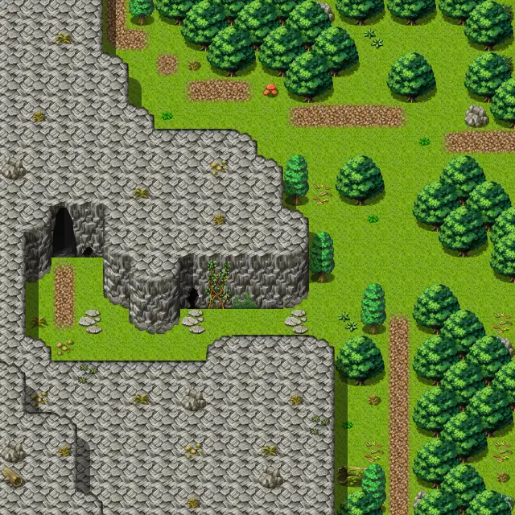

# Wild2

20×20 tiles · outdoors · part of [World1](index.md)

<label class="lg lg-spawn"><input type="checkbox" data-t="spawn" checked> Monsters / NPCs</label><label class="lg lg-mapchange"><input type="checkbox" data-t="mapchange" checked> Exit to another map</label><label class="lg lg-container"><input type="checkbox" data-t="container" checked> Container</label><label class="lg lg-sign"><input type="checkbox" data-t="sign" checked> Sign</label><label class="lg lg-rest"><input type="checkbox" data-t="rest" checked> Resting place</label><label class="lg lg-key"><input type="checkbox" data-t="key" checked> Blocked / needs key or quest</label><label class="lg lg-script"><input type="checkbox" data-t="script"> Scripted event</label><label class="lg lg-replace"><input type="checkbox" data-t="replace"> Changes after a quest</label>

## Exits

- [Bwmfill6](bwmfill6.md)
- [Bwmfill7](bwmfill7.md)
- [Crossglen](crossglen.md)
- [Snakecave1](snakecave1.md)
- [Wild3](wild3.md)
- [Wild5](wild5.md)

## Monsters & NPCs here

| Name | HP |
|---|---|
| [Ewmondold](../monsters/inspiring_snake_master.md) | 0 |
| [Forest ant](../monsters/forest_ant.md) | 4 |
| [Yellow forest ant](../monsters/yellow_forest_ant.md) | 5 |
| [Forest snake](../monsters/forest_snake.md) | 7 |

<small>Map ID: `wild2` · Data from v0.8.18</small>
