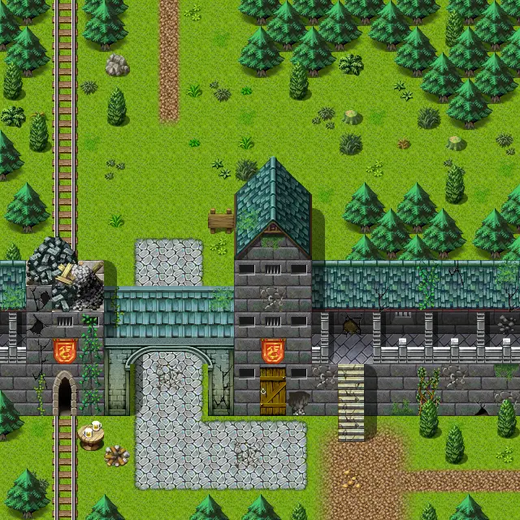

# Wild20

20×20 tiles · part of [World1](index.md)

<label class="lg lg-spawn"><input type="checkbox" data-t="spawn" checked> Monsters / NPCs</label><label class="lg lg-mapchange"><input type="checkbox" data-t="mapchange" checked> Exit to another map</label><label class="lg lg-container"><input type="checkbox" data-t="container" checked> Container</label><label class="lg lg-sign"><input type="checkbox" data-t="sign" checked> Sign</label><label class="lg lg-rest"><input type="checkbox" data-t="rest" checked> Resting place</label><label class="lg lg-key"><input type="checkbox" data-t="key" checked> Blocked / needs key or quest</label><label class="lg lg-script"><input type="checkbox" data-t="script"> Scripted event</label><label class="lg lg-replace"><input type="checkbox" data-t="replace"> Changes after a quest</label>

## Exits

- [Stoutford gate](stoutford_gate.md)
- [Stoutford tower0](stoutford_tower0.md)
- [Stoutford tower1](stoutford_tower1.md)
- [Wild17](wild17.md)
- [Wild19](wild19.md)
- [Wild20a](wild20a.md)
- [Wild21](wild21.md)

## Monsters & NPCs here

| Name | HP |
|---|---|
| [Stoutford guard](../monsters/stoutford_guard2.md) | 0 |
| [Stoutford guard](../monsters/stoutford_guard1_b.md) | 0 |
| [Stoutford guard](../monsters/stoutford_guard1.md) | 0 |
| [Stoutford guard](../monsters/stoutford_gateguard.md) | 0 |
| [Young man](../monsters/stoutford_commoner5.md) | 0 |
| [Stoutford guard](../monsters/stoutford_guard1_c.md) | 0 |
| [Stoutford guard](../monsters/stoutford_guard3.md) | 0 |

<small>Map ID: `wild20` · Data from v0.8.18</small>
