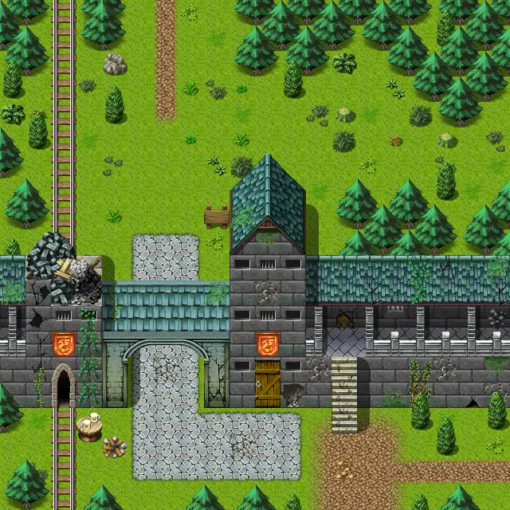

# Wild 20

| | |
|---|---|
| **Map ID** | `wild20` |
| **Region** | In Stoutford (settlement) |
| **Type** | Indoors / underground |
| **Size** | 20×20 tiles |
| **World map** | [World 1](index.md) |
| **Introduced** | [v0.7.2](../versions/0.7.2.md) |
| **NPCs** | 7 |
| **Quests** | 1 |

**Wild 20** is an indoor map, in Stoutford (settlement). It has 7 NPCs, and no enemies. Exits lead to Wild 17, Wild 19, Stoutford gate, Wild 21 and 3 more.

## Map

<label class="lg"><input type="checkbox" data-t="spawn" checked><b>Red</b>&nbsp;Monsters / NPCs</label><label class="lg"><input type="checkbox" data-t="mapchange" checked><b>Blue</b>&nbsp;Exit to another map</label><label class="lg"><input type="checkbox" data-t="container" checked><b>Yellow</b>&nbsp;Container (click to see contents)</label><label class="lg"><input type="checkbox" data-t="sign" checked><b>Purple</b>&nbsp;Sign</label><label class="lg"><input type="checkbox" data-t="rest" checked><b>Green</b>&nbsp;Resting place</label><label class="lg"><input type="checkbox" data-t="key" checked><b>Orange dashed</b>&nbsp;Blocked until a quest step / item</label><label class="lg"><input type="checkbox" data-t="script"><b>Grey dotted</b>&nbsp;Scripted event</label><label class="lg"><input type="checkbox" data-t="replace"><b>White dotted</b>&nbsp;Changes during a quest</label><label class="lg"><input type="checkbox" data-t="pin" checked><b>Numbers</b>&nbsp;Numbered key points (see the key below the map)</label>

<a class="pin pin-exit" href="#key-1" style="left:12.500%;top:2.500%" title="Exit (north): to [Wild 17](wild17.md)">1</a><a class="pin pin-exit" href="#key-1" style="left:35.000%;top:2.500%" title="Exit (north): to [Wild 17](wild17.md)">1</a><a class="pin pin-exit" href="#key-2" style="left:97.500%;top:30.000%" title="Exit (east): to [Wild 19](wild19.md)">2</a><a class="pin pin-exit" href="#key-3" style="left:97.500%;top:92.500%" title="Exit (southeast): to [Wild 19](wild19.md)">3</a><a class="pin pin-exit" href="#key-4" style="left:30.000%;top:97.500%" title="Exit (south): to [Stoutford gate](stoutford_gate.md)">4</a><a class="pin pin-exit" href="#key-4" style="left:70.000%;top:97.500%" title="Exit (south): to [Stoutford gate](stoutford_gate.md)">4</a><a class="pin pin-exit" href="#key-4" style="left:12.500%;top:97.500%" title="Exit (south): to [Stoutford gate](stoutford_gate.md)">4</a><a class="pin pin-exit" href="#key-5" style="left:2.500%;top:90.000%" title="Exit (southwest): to [Wild 21](wild21.md)">5</a><a class="pin pin-exit" href="#key-6" style="left:2.500%;top:37.500%" title="Exit (west): to [Wild 21](wild21.md)">6</a><a class="pin pin-exit" href="#key-7" style="left:52.500%;top:77.500%" title="Exit (stairs / passage): to [Stoutford tower 0](stoutford_tower0.md)">7</a><a class="pin pin-exit" href="#key-8" style="left:62.500%;top:62.500%" title="Exit (stairs / passage): to [Stoutford tower 1](stoutford_tower1.md)">8</a><a class="pin pin-exit" href="#key-9" style="left:12.500%;top:77.500%" title="Exit (exit outside): to [Wild 20a](wild20a.md)">9</a><a id="pin-npc-stoutford_guard1_b" class="pin pin-npc" href="#key-10" style="left:22.500%;top:90.000%" title="[Stoutford guard](../../monsters/stoutford_guard1.md#v-stoutford_guard1_b): NPC">10</a><a id="pin-npc-stoutford_guard1_c" class="pin pin-npc" href="#key-11" style="left:17.500%;top:87.500%" title="[Stoutford guard](../../monsters/stoutford_guard1.md#v-stoutford_guard1_c): NPC">11</a><a id="pin-npc-stoutford_gateguard" class="pin pin-npc" href="#key-12" style="left:22.500%;top:52.500%" title="[Stoutford guard](../../monsters/stoutford_guard1.md#v-stoutford_gateguard): 1 quest">12</a><a id="pin-npc-stoutford_guard3" class="pin pin-npc" href="#key-13" style="left:22.829%;top:86.250%" title="[Stoutford guard](../../monsters/stoutford_guard1.md#v-stoutford_guard3): NPC">13</a><a id="pin-npc-stoutford_guard1" class="pin pin-npc" href="#key-14" style="left:17.500%;top:92.500%" title="[Stoutford guard](../../monsters/stoutford_guard1.md): NPC">14</a><a id="pin-npc-stoutford_guard2" class="pin pin-npc" href="#key-15" style="left:62.500%;top:82.500%" title="[Stoutford guard](../../monsters/stoutford_guard1.md#v-stoutford_guard2): NPC">15</a><a id="pin-npc-stoutford_commoner5" class="pin pin-npc" href="#key-16" style="left:22.500%;top:82.500%" title="[Young man](../../monsters/stoutford_commoner5.md): NPC">16</a><a class="pin pin-sign" href="#key-17" style="left:42.500%;top:42.500%" title="Sign: “Welcome to Stoutford.”">17</a>

??? abstract "Key to the numbers on the map"

    | # | What | Details |
    |---|---|---|
    | 1 | Exit (north) | to [Wild 17](wild17.md) |
    | 2 | Exit (east) | to [Wild 19](wild19.md) |
    | 3 | Exit (southeast) | to [Wild 19](wild19.md) |
    | 4 | Exit (south) | to [Stoutford gate](stoutford_gate.md) |
    | 5 | Exit (southwest) | to [Wild 21](wild21.md) |
    | 6 | Exit (west) | to [Wild 21](wild21.md) |
    | 7 | Exit (stairs / passage) | to [Stoutford tower 0](stoutford_tower0.md) |
    | 8 | Exit (stairs / passage) | to [Stoutford tower 1](stoutford_tower1.md) |
    | 9 | Exit (exit outside) | to [Wild 20a](wild20a.md) |
    | 10 | [Stoutford guard](../monsters/stoutford_guard1.md#v-stoutford_guard1_b) | NPC |
    | 11 | [Stoutford guard](../monsters/stoutford_guard1.md#v-stoutford_guard1_c) | NPC |
    | 12 | [Stoutford guard](../monsters/stoutford_guard1.md#v-stoutford_gateguard) | 1 quest |
    | 13 | [Stoutford guard](../monsters/stoutford_guard1.md#v-stoutford_guard3) | NPC |
    | 14 | [Stoutford guard](../monsters/stoutford_guard1.md) | NPC |
    | 15 | [Stoutford guard](../monsters/stoutford_guard1.md#v-stoutford_guard2) | NPC |
    | 16 | [Young man](../monsters/stoutford_commoner5.md) | NPC |
    | 17 | Sign | “Welcome to Stoutford.” |

Verified against v0.8.18 map data.

## Connections

| Direction | Leads to | Region there | Map # |
|---|---|---|---|
| North | [Wild 17](wild17.md) | Stoutford | 1 |
| East | [Wild 19](wild19.md) | Stoutford | 2 |
| Southeast | [Wild 19](wild19.md) | Stoutford | 3 |
| South | [Stoutford gate](stoutford_gate.md) | Stoutford | 4 |
| Southwest | [Wild 21](wild21.md) | Stoutford | 5 |
| West | [Wild 21](wild21.md) | Stoutford | 6 |
| Stairs / passage | [Stoutford tower 0](stoutford_tower0.md) | Stoutford | 7 |
| Stairs / passage | [Stoutford tower 1](stoutford_tower1.md) | Stoutford | 8 |
| Exit outside | [Wild 20a](wild20a.md) | Stoutford | 9 |

## NPCs

- [Stoutford guard](../monsters/stoutford_guard1.md#v-stoutford_guard1_b) (#10)
- [Stoutford guard](../monsters/stoutford_guard1.md#v-stoutford_guard1_c) (#11)
- [Stoutford guard](../monsters/stoutford_guard1.md#v-stoutford_gateguard) — quests: [Search for Andor](../quests/andor.md) (#12)
- [Stoutford guard](../monsters/stoutford_guard1.md#v-stoutford_guard3) (#13)
- [Stoutford guard](../monsters/stoutford_guard1.md) (#14)
- [Stoutford guard](../monsters/stoutford_guard1.md#v-stoutford_guard2) (#15)
- [Young man](../monsters/stoutford_commoner5.md) (#16)

## Quests

- [Search for Andor](../quests/andor.md): [Stoutford guard](../monsters/stoutford_guard1.md#v-stoutford_gateguard) is involved

## Points of interest

- **Sign** (#17): “Welcome to Stoutford.”

## Version history

| Version | Change |
|---|---|
| [v0.7.2](../versions/0.7.2.md) | Added |
| [v0.7.17](../versions/0.7.17.md) | Map layout or objects changed |

Verified against v0.8.18 and every earlier release back to v0.7.0 (game data compared release by release).

## Community notes

<small>Written by players, not generated from game data. **Observations**: what players notice in-game · **Lore**: the in-world story · **Trivia**: real-world facts, references, development history · **Theory / speculation**: unconfirmed ideas; may just be unfinished content</small>

### Observations

*No notes yet. Contributions are welcome: [add a note](https://github.com/asdfghjkl628/Andor-s-Trail-Wikiiii/new/main/notes/maps?filename=wild20.md&value=%23%23%20Observations%0A%0A%3C%21--%20what%20players%20notice%20in-game%20--%3E%0A%0A%23%23%20Lore%0A%0A%3C%21--%20the%20in-world%20story%20--%3E%0A%0A%23%23%20Trivia%0A%0A%3C%21--%20real-world%20facts%2C%20references%2C%20development%20history%20--%3E%0A%0A%23%23%20Theory%20/%20speculation%0A%0A%3C%21--%20unconfirmed%20ideas%3B%20may%20just%20be%20unfinished%20content%20--%3E%0A).*

### Lore

*No notes yet. Contributions are welcome: [add a note](https://github.com/asdfghjkl628/Andor-s-Trail-Wikiiii/new/main/notes/maps?filename=wild20.md&value=%23%23%20Observations%0A%0A%3C%21--%20what%20players%20notice%20in-game%20--%3E%0A%0A%23%23%20Lore%0A%0A%3C%21--%20the%20in-world%20story%20--%3E%0A%0A%23%23%20Trivia%0A%0A%3C%21--%20real-world%20facts%2C%20references%2C%20development%20history%20--%3E%0A%0A%23%23%20Theory%20/%20speculation%0A%0A%3C%21--%20unconfirmed%20ideas%3B%20may%20just%20be%20unfinished%20content%20--%3E%0A).*

### Trivia

*No notes yet. Contributions are welcome: [add a note](https://github.com/asdfghjkl628/Andor-s-Trail-Wikiiii/new/main/notes/maps?filename=wild20.md&value=%23%23%20Observations%0A%0A%3C%21--%20what%20players%20notice%20in-game%20--%3E%0A%0A%23%23%20Lore%0A%0A%3C%21--%20the%20in-world%20story%20--%3E%0A%0A%23%23%20Trivia%0A%0A%3C%21--%20real-world%20facts%2C%20references%2C%20development%20history%20--%3E%0A%0A%23%23%20Theory%20/%20speculation%0A%0A%3C%21--%20unconfirmed%20ideas%3B%20may%20just%20be%20unfinished%20content%20--%3E%0A).*

### Theory / speculation

*No notes yet. Contributions are welcome: [add a note](https://github.com/asdfghjkl628/Andor-s-Trail-Wikiiii/new/main/notes/maps?filename=wild20.md&value=%23%23%20Observations%0A%0A%3C%21--%20what%20players%20notice%20in-game%20--%3E%0A%0A%23%23%20Lore%0A%0A%3C%21--%20the%20in-world%20story%20--%3E%0A%0A%23%23%20Trivia%0A%0A%3C%21--%20real-world%20facts%2C%20references%2C%20development%20history%20--%3E%0A%0A%23%23%20Theory%20/%20speculation%0A%0A%3C%21--%20unconfirmed%20ideas%3B%20may%20just%20be%20unfinished%20content%20--%3E%0A).*

??? info "Technical information"

    | | |
    |---|---|
    | Map ID | `wild20` |
    | File | `res/xml/wild20.tmx` |
    | Size | 20×20 tiles (640×640 px) |
    | outdoors property | – |
    | Layers drawn | ground, objects, above, top |
    | Tilesets | map_bed_1, map_border_1, map_bridge_1, map_bridge_2, map_broken_1, map_cavewall_1, map_cavewall_2, map_cavewall_3, map_cavewall_4, map_chair_table_1, map_chair_table_2, map_crate_1, map_cupboard_1, map_curtain_1, map_entrance_1, map_entrance_2, map_fence_1, map_fence_2, map_fence_3, map_fence_4, map_ground_1, map_ground_2, map_ground_3, map_ground_4, map_ground_5, map_ground_6, map_ground_7, map_ground_8, map_house_1, map_house_2, map_indoor_1, map_indoor_2, map_kitchen_1, map_outdoor_1, map_pillar_1, map_pillar_2, map_plant_1, map_plant_2, map_rock_1, map_rock_2, map_roof_1, map_roof_2, map_roof_3, map_shop_1, map_sign_ladder_1, map_table_1, map_trail_1, map_transition_1, map_transition_2, map_transition_3, map_transition_4, map_transition_5, map_tree_1, map_tree_2, map_wall_1, map_wall_2, map_wall_3, map_wall_4, map_window_1, map_window_2 |
    | Map objects | mapchange: 12, spawn: 7, sign: 1 |
    | World map position | segment `world1`, x 32, y 500 |

<small>Data from v0.8.18</small>
