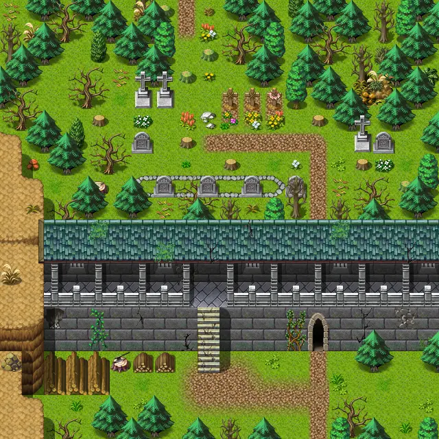

# Wild21

20×20 tiles · part of [World1](index.md)

<label class="lg lg-spawn"><input type="checkbox" data-t="spawn" checked> Monsters / NPCs</label><label class="lg lg-mapchange"><input type="checkbox" data-t="mapchange" checked> Exit to another map</label><label class="lg lg-container"><input type="checkbox" data-t="container" checked> Container</label><label class="lg lg-sign"><input type="checkbox" data-t="sign" checked> Sign</label><label class="lg lg-rest"><input type="checkbox" data-t="rest" checked> Resting place</label><label class="lg lg-key"><input type="checkbox" data-t="key" checked> Blocked / needs key or quest</label><label class="lg lg-script"><input type="checkbox" data-t="script"> Scripted event</label><label class="lg lg-replace"><input type="checkbox" data-t="replace"> Changes after a quest</label>

## Exits

- [Stoutford nw](stoutford_nw.md)
- [Wild20](wild20.md)
- [Wild21a](wild21a.md)
- [Wild23](wild23.md)

## Monsters & NPCs here

| Name | HP |
|---|---|
| [Stoutford guard](../monsters/stoutford_guard2.md) | 0 |
| [Stoutford guard](../monsters/stoutford_guard1.md) | 0 |
| [Stoutford guard](../monsters/stoutford_guard1_b.md) | 0 |
| [Sly Seraphina](../monsters/tt_seraphina.md) | 0 |
| [Stoutford guard](../monsters/stoutford_guard1_c.md) | 0 |
| [Stoutford guard](../monsters/stoutford_guard3.md) | 0 |
| [Stoutford guard](../monsters/stoutford_guard1a.md) | 0 |
| [Seraphina's bodyguard](../monsters/tt_guys.md) | 52 |

<small>Map ID: `wild21` · Data from v0.8.18</small>
