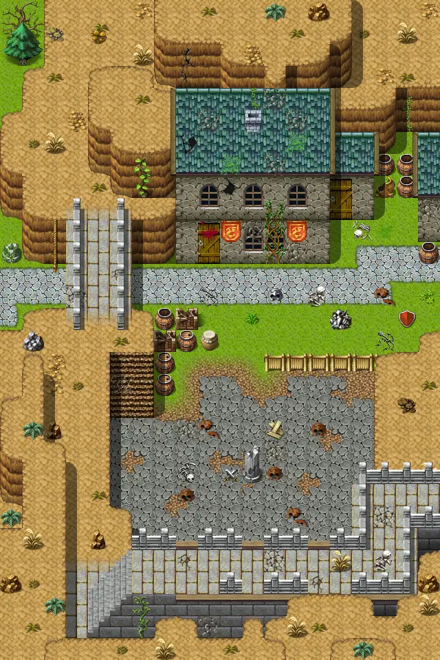
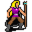
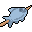

# Wild22

20×30 tiles · part of [World1](index.md)

<label class="lg"><input type="checkbox" data-t="spawn" checked><b>Red</b>&nbsp;Monsters / NPCs</label><label class="lg"><input type="checkbox" data-t="mapchange" checked><b>Blue</b>&nbsp;Exit to another map</label><label class="lg"><input type="checkbox" data-t="container" checked><b>Yellow</b>&nbsp;Container (click to see contents)</label><label class="lg"><input type="checkbox" data-t="sign" checked><b>Purple</b>&nbsp;Sign</label><label class="lg"><input type="checkbox" data-t="rest" checked><b>Green</b>&nbsp;Resting place</label><label class="lg"><input type="checkbox" data-t="key" checked><b>Orange dashed</b>&nbsp;Blocked until a quest step / item</label><label class="lg"><input type="checkbox" data-t="script"><b>Grey dotted</b>&nbsp;Scripted event</label><label class="lg"><input type="checkbox" data-t="replace"><b>White dotted</b>&nbsp;Changes during a quest</label>

## Containers

<b>Container 1</b><ul><li><a href="../../items/gold/">Gold coins</a> <small>100% · ×20</small></li></ul>

<b>Container 2</b><ul><li><a href="../../items/rawperch/">Raw perch</a> <small>100%</small></li></ul>

## Exits

- [Stoutford castle barrack0](stoutford_castle_barrack0.md)
- [Stoutford se](stoutford_se.md)
- [Waytogalmore1](waytogalmore1.md)
- [Wild18](wild18.md)

## Monsters & NPCs here

| Name | HP |
|---|---|
| [Teccow](../monsters/mg2_starwatcher.md) | 0 |
| [Stoutford guard](../monsters/stoutford_guard1_c.md) | 0 |
| [Stoutford guard](../monsters/stoutford_guard1_b.md) | 0 |
| [Stoutford guard](../monsters/stoutford_guard2.md) | 0 |
| [Gyra](../monsters/stn_gyra4.md) | 0 |
| [Stoutford guard](../monsters/stoutford_guard3.md) | 0 |
| [Gyra](../monsters/stn_gyra5.md) | 0 |
| [Gyra](../monsters/stn_gyra3.md) | 0 |
| [Gyra](../monsters/stn_gyra2.md) | 0 |
| [Stoutford guard](../monsters/stoutford_guard1.md) | 0 |
| [Gyra](../monsters/stn_gyra1.md) | 0 |
| [Erwyn's soldier](../monsters/erwyn_soldier2.md) | 65 |
| [Erwyn's soldier](../monsters/erwyn_soldier.md) | 65 |

<small>Map ID: `wild22` · Data from v0.8.18</small>
