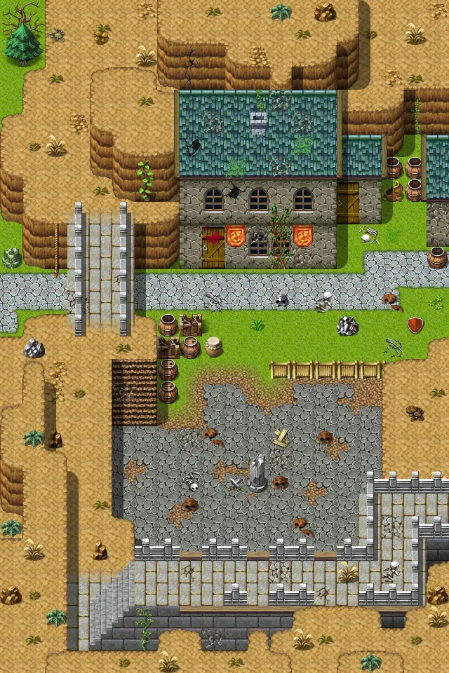

# Wild22

| | |
|---|---|
| **Map ID** | `wild22` |
| **Region** | In Stoutford (settlement) |
| **Type** | Indoors / underground |
| **Size** | 20×30 tiles |
| **World map** | [World1](index.md) |
| **Introduced** | [v0.7.2](../versions/0.7.2.md) |
| **NPCs** | 13 |
| **Quests** | 1 |
| **Containers** | 2 |

**Wild22** is an indoor map, in Stoutford (settlement). It has 13 NPCs, and no enemies. Exits lead to Wild18, Waytogalmore1, Stoutford south-east, Stoutford castle barrack0.

## Map

<label class="lg"><input type="checkbox" data-t="spawn" checked><b>Red</b>&nbsp;Monsters / NPCs</label><label class="lg"><input type="checkbox" data-t="mapchange" checked><b>Blue</b>&nbsp;Exit to another map</label><label class="lg"><input type="checkbox" data-t="container" checked><b>Yellow</b>&nbsp;Container (click to see contents)</label><label class="lg"><input type="checkbox" data-t="sign" checked><b>Purple</b>&nbsp;Sign</label><label class="lg"><input type="checkbox" data-t="rest" checked><b>Green</b>&nbsp;Resting place</label><label class="lg"><input type="checkbox" data-t="key" checked><b>Orange dashed</b>&nbsp;Blocked until a quest step / item</label><label class="lg"><input type="checkbox" data-t="script"><b>Grey dotted</b>&nbsp;Scripted event</label><label class="lg"><input type="checkbox" data-t="replace"><b>White dotted</b>&nbsp;Changes during a quest</label><label class="lg"><input type="checkbox" data-t="pin" checked><b>Numbers</b>&nbsp;Numbered key points (see the key below the map)</label>

<a class="pin pin-exit" href="#key-1" style="left:35.000%;top:1.667%" title="Exit (north): to [Wild18](../wild18.md)">1</a><a class="pin pin-exit" href="#key-2" style="left:97.500%;top:76.667%" title="Exit (east): to [Waytogalmore1](../waytogalmore1.md)">2</a><a class="pin pin-exit" href="#key-2" style="left:97.500%;top:43.333%" title="Exit (east): to [Waytogalmore1](../waytogalmore1.md)">2</a><a class="pin pin-exit" href="#key-3" style="left:2.500%;top:41.667%" title="Exit (west): to [Stoutford south-east](../stoutford_se.md)">3</a><a class="pin pin-exit" href="#key-3" style="left:2.500%;top:46.667%" title="Exit (west): to [Stoutford south-east](../stoutford_se.md)">3</a><a class="pin pin-exit" href="#key-4" style="left:77.500%;top:31.667%" title="Exit (stairs / passage): to [Stoutford castle barrack0](../stoutford_castle_barrack0.md)">4</a><a class="pin pin-exit" href="#key-4" style="left:47.500%;top:38.333%" title="Exit (stairs / passage): to [Stoutford castle barrack0](../stoutford_castle_barrack0.md)">4</a><a class="pin pin-npc" href="#key-5" style="left:27.500%;top:61.667%" title="[Erwyn&#x27;s soldier](../../monsters/erwyn_soldier.md): NPC">5</a><a class="pin pin-npc" href="#key-6" style="left:77.500%;top:88.333%" title="[Erwyn&#x27;s soldier](../../monsters/erwyn_soldier2.md): NPC">6</a><a class="pin pin-npc" href="#key-7" style="left:47.829%;top:35.834%" title="[Gyra](../../monsters/stn_gyra3.md): NPC">7</a><a class="pin pin-npc" href="#key-8" style="left:97.829%;top:72.500%" title="[Gyra](../../monsters/stn_gyra5.md): NPC">8</a><a class="pin pin-npc" href="#key-9" style="left:97.829%;top:39.167%" title="[Gyra](../../monsters/stn_gyra1.md): NPC">9</a><a class="pin pin-npc" href="#key-10" style="left:77.829%;top:29.167%" title="[Gyra](../../monsters/stn_gyra4.md): NPC">10</a><a class="pin pin-npc" href="#key-11" style="left:22.500%;top:1.667%" title="[Gyra](../../monsters/stn_gyra2.md): NPC">11</a><a class="pin pin-npc" href="#key-12" style="left:12.500%;top:11.667%" title="[Stoutford guard](../../monsters/stoutford_guard1.md): NPC">12</a><a class="pin pin-npc" href="#key-13" style="left:12.500%;top:20.000%" title="[Stoutford guard](../../monsters/stoutford_guard1_b.md): NPC">13</a><a class="pin pin-npc" href="#key-14" style="left:12.829%;top:17.500%" title="[Stoutford guard](../../monsters/stoutford_guard3.md): NPC">14</a><a class="pin pin-npc" href="#key-15" style="left:15.023%;top:22.194%" title="[Stoutford guard](../../monsters/stoutford_guard1_c.md): NPC">15</a><a class="pin pin-npc" href="#key-16" style="left:8.100%;top:19.481%" title="[Stoutford guard](../../monsters/stoutford_guard2.md): NPC">16</a><a class="pin pin-npc" href="#key-17" style="left:67.500%;top:8.333%" title="[Teccow](../../monsters/mg2_starwatcher.md): 1 quest">17</a><a class="pin pin-script" href="#key-18" style="left:92.500%;top:76.667%" title="Quest trigger: Scripted event: advances the quest: hidden story flag “stn_nondisplay” to stage 16 (“16=Gyra in wild22”)">18</a><a class="pin pin-script" href="#key-18" style="left:80.000%;top:35.000%" title="Quest trigger: Scripted event: advances the quest: hidden story flag “stn_nondisplay” to stage 16 (“16=Gyra in wild22”)">18</a><a class="pin pin-script" href="#key-18" style="left:47.500%;top:41.667%" title="Quest trigger: Scripted event: advances the quest: hidden story flag “stn_nondisplay” to stage 16 (“16=Gyra in wild22”)">18</a><a class="pin pin-script" href="#key-18" style="left:22.500%;top:5.000%" title="Quest trigger: Scripted event: advances the quest: hidden story flag “stn_nondisplay” to stage 16 (“16=Gyra in wild22”)">18</a><a class="pin pin-script" href="#key-18" style="left:92.500%;top:41.667%" title="Quest trigger: Scripted event: advances the quest: hidden story flag “stn_nondisplay” to stage 16 (“16=Gyra in wild22”)">18</a><a class="pin pin-container" href="#key-19" style="left:35.000%;top:15.000%" title="Container 1: Gold coins">19</a><a class="pin pin-container" href="#key-20" style="left:87.500%;top:28.333%" title="Container 2: Raw perch">20</a>

??? abstract "Key to the numbers on the map"

    | # | What | Details |
    |---|---|---|
    | 1 | Exit (north) | to [Wild18](../wild18.md) |
    | 2 | Exit (east) | to [Waytogalmore1](../waytogalmore1.md) |
    | 3 | Exit (west) | to [Stoutford south-east](../stoutford_se.md) |
    | 4 | Exit (stairs / passage) | to [Stoutford castle barrack0](../stoutford_castle_barrack0.md) |
    | 5 | [Erwyn's soldier](../monsters/erwyn_soldier.md) | NPC |
    | 6 | [Erwyn's soldier](../monsters/erwyn_soldier2.md) | NPC |
    | 7 | [Gyra](../monsters/stn_gyra3.md) | NPC |
    | 8 | [Gyra](../monsters/stn_gyra5.md) | NPC |
    | 9 | [Gyra](../monsters/stn_gyra1.md) | NPC |
    | 10 | [Gyra](../monsters/stn_gyra4.md) | NPC |
    | 11 | [Gyra](../monsters/stn_gyra2.md) | NPC |
    | 12 | [Stoutford guard](../monsters/stoutford_guard1.md) | NPC |
    | 13 | [Stoutford guard](../monsters/stoutford_guard1_b.md) | NPC |
    | 14 | [Stoutford guard](../monsters/stoutford_guard3.md) | NPC |
    | 15 | [Stoutford guard](../monsters/stoutford_guard1_c.md) | NPC |
    | 16 | [Stoutford guard](../monsters/stoutford_guard2.md) | NPC |
    | 17 | [Teccow](../monsters/mg2_starwatcher.md) | 1 quest |
    | 18 | Quest trigger | Scripted event: advances the quest: hidden story flag “stn_nondisplay” to stage 16 (“16=Gyra in wild22”) |
    | 19 | Container 1 | Gold coins |
    | 20 | Container 2 | Raw perch |

Verified against v0.8.18 map data.

## Connections

| Direction | Leads to | Region there | Map # |
|---|---|---|---|
| North | [Wild18](wild18.md) | Flagstone Prison | 1 |
| East | [Waytogalmore1](waytogalmore1.md) | Flagstone Prison | 2 |
| West | [Stoutford south-east](stoutford_se.md) | Stoutford | 3 |
| Stairs / passage | [Stoutford castle barrack0](stoutford_castle_barrack0.md) | Stoutford | 4 |

## NPCs

- [Erwyn's soldier](../monsters/erwyn_soldier.md) (#5)
- [Erwyn's soldier](../monsters/erwyn_soldier2.md) (#6)
- [Gyra](../monsters/stn_gyra3.md) (#7)
- [Gyra](../monsters/stn_gyra5.md) (#8)
- [Gyra](../monsters/stn_gyra1.md) (#9)
- [Gyra](../monsters/stn_gyra4.md) (#10)
- [Gyra](../monsters/stn_gyra2.md) (#11)
- [Stoutford guard](../monsters/stoutford_guard1.md) (#12)
- [Stoutford guard](../monsters/stoutford_guard1_b.md) (#13)
- [Stoutford guard](../monsters/stoutford_guard3.md) (#14)
- [Stoutford guard](../monsters/stoutford_guard1_c.md) (#15)
- [Stoutford guard](../monsters/stoutford_guard2.md) (#16)
- [Teccow](../monsters/mg2_starwatcher.md) — quests: [The exploded star](../quests/mg2_exploded_star.md) (#17)

## Items & containers

<b>Container 1</b><ul><li><a href="../../items/gold/">Gold coins</a> <small>100% · ×20</small></li></ul>

<b>Container 2</b><ul><li><a href="../../items/rawperch/">Raw perch</a> <small>100%</small></li></ul>

## Quests

- [The exploded star](../quests/mg2_exploded_star.md): [Teccow](../monsters/mg2_starwatcher.md) is involved
- [mg2_exploded_star_nd (hidden flag)](../quests/mg2_exploded_star_nd.md): [Teccow](../monsters/mg2_starwatcher.md) is involved
- [stn_nondisplay (hidden flag)](../quests/stn_nondisplay.md): [Gyra](../monsters/stn_gyra1.md) is involved; [Gyra](../monsters/stn_gyra2.md) is involved; [Gyra](../monsters/stn_gyra3.md) is involved; [Gyra](../monsters/stn_gyra4.md) is involved; [Gyra](../monsters/stn_gyra5.md) is involved; something on this map advances it; stepping on a trigger here sets stage 16

## Points of interest

- **Quest trigger** (#18): Scripted event: advances the quest: hidden story flag “stn_nondisplay” to stage 16 (“16=Gyra in wild22”)

## Version history

| Version | Change |
|---|---|
| [v0.7.2](../versions/0.7.2.md) | Added |
| [v0.8.8](../versions/0.8.8.md) | map layout or objects changed |
| [v0.8.14](../versions/0.8.14.md) | map layout or objects changed |

Verified against v0.8.18 and every earlier release back to v0.7.0 (game data compared release by release).

## Community notes

<small>Written by players, not generated from game data. **Observations**: what players notice in-game · **Lore**: the in-world story · **Trivia**: real-world facts, references, development history · **Theory / speculation**: unconfirmed ideas; may just be unfinished content</small>

### Observations

*Nothing here yet. Know something? [Add it](https://github.com/asdfghjkl628/Andor-s-Trail-Wikiiii/new/main/notes/maps?filename=wild22.md&value=%23%23%20Observations%0A%0A%3C%21--%20what%20players%20notice%20in-game%20--%3E%0A%0A%23%23%20Lore%0A%0A%3C%21--%20the%20in-world%20story%20--%3E%0A%0A%23%23%20Trivia%0A%0A%3C%21--%20real-world%20facts%2C%20references%2C%20development%20history%20--%3E%0A%0A%23%23%20Theory%20/%20speculation%0A%0A%3C%21--%20unconfirmed%20ideas%3B%20may%20just%20be%20unfinished%20content%20--%3E%0A).*

### Lore

*Nothing here yet. Know something? [Add it](https://github.com/asdfghjkl628/Andor-s-Trail-Wikiiii/new/main/notes/maps?filename=wild22.md&value=%23%23%20Observations%0A%0A%3C%21--%20what%20players%20notice%20in-game%20--%3E%0A%0A%23%23%20Lore%0A%0A%3C%21--%20the%20in-world%20story%20--%3E%0A%0A%23%23%20Trivia%0A%0A%3C%21--%20real-world%20facts%2C%20references%2C%20development%20history%20--%3E%0A%0A%23%23%20Theory%20/%20speculation%0A%0A%3C%21--%20unconfirmed%20ideas%3B%20may%20just%20be%20unfinished%20content%20--%3E%0A).*

### Trivia

*Nothing here yet. Know something? [Add it](https://github.com/asdfghjkl628/Andor-s-Trail-Wikiiii/new/main/notes/maps?filename=wild22.md&value=%23%23%20Observations%0A%0A%3C%21--%20what%20players%20notice%20in-game%20--%3E%0A%0A%23%23%20Lore%0A%0A%3C%21--%20the%20in-world%20story%20--%3E%0A%0A%23%23%20Trivia%0A%0A%3C%21--%20real-world%20facts%2C%20references%2C%20development%20history%20--%3E%0A%0A%23%23%20Theory%20/%20speculation%0A%0A%3C%21--%20unconfirmed%20ideas%3B%20may%20just%20be%20unfinished%20content%20--%3E%0A).*

### Theory / speculation

*Nothing here yet. Know something? [Add it](https://github.com/asdfghjkl628/Andor-s-Trail-Wikiiii/new/main/notes/maps?filename=wild22.md&value=%23%23%20Observations%0A%0A%3C%21--%20what%20players%20notice%20in-game%20--%3E%0A%0A%23%23%20Lore%0A%0A%3C%21--%20the%20in-world%20story%20--%3E%0A%0A%23%23%20Trivia%0A%0A%3C%21--%20real-world%20facts%2C%20references%2C%20development%20history%20--%3E%0A%0A%23%23%20Theory%20/%20speculation%0A%0A%3C%21--%20unconfirmed%20ideas%3B%20may%20just%20be%20unfinished%20content%20--%3E%0A).*

??? info "Technical information"

    | | |
    |---|---|
    | Map ID | `wild22` |
    | File | `res/xml/wild22.tmx` |
    | Size | 20×30 tiles (640×960 px) |
    | outdoors property | – |
    | Layers drawn | ground, objects, above |
    | Tilesets | map_bed_1, map_border_1, map_bridge_1, map_bridge_2, map_broken_1, map_cavewall_1, map_cavewall_2, map_cavewall_3, map_cavewall_4, map_chair_table_1, map_chair_table_2, map_crate_1, map_cupboard_1, map_curtain_1, map_entrance_1, map_entrance_2, map_fence_1, map_fence_2, map_fence_3, map_fence_4, map_ground_1, map_ground_2, map_ground_3, map_ground_4, map_ground_5, map_ground_6, map_ground_7, map_ground_8, map_house_1, map_house_2, map_indoor_1, map_indoor_2, map_kitchen_1, map_outdoor_1, map_pillar_1, map_pillar_2, map_plant_1, map_plant_2, map_rock_1, map_rock_2, map_roof_1, map_roof_2, map_roof_3, map_shop_1, map_sign_ladder_1, map_table_1, map_trail_1, map_transition_1, map_transition_2, map_transition_3, map_transition_4, map_transition_5, map_tree_1, map_tree_2, map_wall_1, map_wall_2, map_wall_3, map_wall_4, map_window_1, map_window_2 |
    | Map objects | spawn: 9, mapchange: 7, script: 5, container: 2 |
    | World map position | segment `world1`, x 74, y 531 |

<small>Data from v0.8.18</small>
