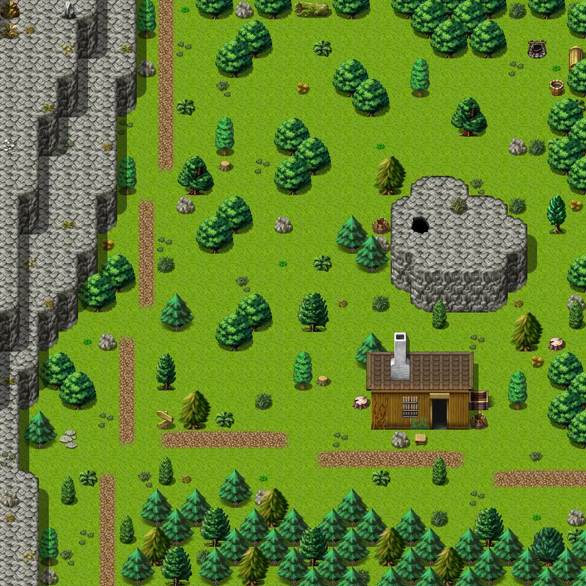

# Wild6

| | |
|---|---|
| **Map ID** | `wild6` |
| **Region** | Near Blackwater Mountain (other) |
| **Type** | Outdoors |
| **Size** | 30×30 tiles |
| **World map** | [World1](index.md) |
| **Introduced** | v0.7.0 or earlier |
| **NPCs** | 2 |
| **Enemy types** | 5 |
| **Quests** | 2 |

**Wild6** is an outdoor map, near Blackwater Mountain (other). It has 2 NPCs and 5 kinds of enemy. Exits lead to Wild5, Wild9, Wild7, Bwmfill8 and 3 more.

## Map

<label class="lg"><input type="checkbox" data-t="spawn" checked><b>Red</b>&nbsp;Monsters / NPCs</label><label class="lg"><input type="checkbox" data-t="mapchange" checked><b>Blue</b>&nbsp;Exit to another map</label><label class="lg"><input type="checkbox" data-t="container" checked><b>Yellow</b>&nbsp;Container (click to see contents)</label><label class="lg"><input type="checkbox" data-t="sign" checked><b>Purple</b>&nbsp;Sign</label><label class="lg"><input type="checkbox" data-t="rest" checked><b>Green</b>&nbsp;Resting place</label><label class="lg"><input type="checkbox" data-t="key" checked><b>Orange dashed</b>&nbsp;Blocked until a quest step / item</label><label class="lg"><input type="checkbox" data-t="script"><b>Grey dotted</b>&nbsp;Scripted event</label><label class="lg"><input type="checkbox" data-t="replace"><b>White dotted</b>&nbsp;Changes during a quest</label><label class="lg"><input type="checkbox" data-t="pin" checked><b>Numbers</b>&nbsp;Numbered key points (see the key below the map)</label>

<a class="pin pin-exit" href="#key-1" style="left:30.000%;top:1.667%" title="Exit (north): to [Wild5](../wild5.md)">1</a><a class="pin pin-exit" href="#key-1" style="left:65.000%;top:1.667%" title="Exit (north): to [Wild5](../wild5.md)">1</a><a class="pin pin-exit" href="#key-2" style="left:98.333%;top:81.667%" title="Exit (east): to [Wild9](../wild9.md)">2</a><a class="pin pin-exit" href="#key-2" style="left:98.333%;top:60.000%" title="Exit (east): to [Wild9](../wild9.md)">2</a><a class="pin pin-exit" href="#key-2" style="left:98.333%;top:40.000%" title="Exit (east): to [Wild9](../wild9.md)">2</a><a class="pin pin-exit" href="#key-3" style="left:15.000%;top:98.333%" title="Exit (south): to [Wild7](../wild7.md)">3</a><a class="pin pin-exit" href="#key-4" style="left:1.667%;top:28.333%" title="Exit (west): to [Bwmfill8](../bwmfill8.md)">4</a><a class="pin pin-exit" href="#key-5" style="left:6.667%;top:1.667%" title="Exit (northwest): to [Bwmfill7](../bwmfill7.md)">5</a><a class="pin pin-exit" href="#key-6" style="left:71.667%;top:38.333%" title="Exit (door): to [Thieves vault](../thieves_vault.md)">6</a><a class="pin pin-exit" href="#key-7" style="left:75.000%;top:71.667%" title="Exit (door): to [Wild6 house](../wild6_house.md)">7</a><a class="pin pin-npc" href="#key-8" style="left:48.333%;top:75.000%" title="[Feygard soldier](../../monsters/patrol_roaming.md): NPC">8</a><a class="pin pin-npc" href="#key-9" style="left:95.000%;top:8.333%" title="[Unzel](../../monsters/unzel.md): 2 quests">9</a><a class="pin pin-sign" href="#key-10" style="left:28.333%;top:71.667%" title="Sign: “North: Crossglen
East: Fallhaven
South: Stoutford”">10</a><a class="pin pin-sign" href="#key-11" style="left:61.667%;top:68.333%" title="Sign: “You notice that the tree-stump is partially hollow, and looks like an excellent hiding place. It is empty now.”">11</a><a class="pin pin-script" href="#key-12" style="left:36.667%;top:66.667%" title="Quest trigger: Scripted event: advances the quest: hidden story flag “brv_nondisplay” to stage 142 (“Confiscated bonemeals”) (+1 more quest(s))">12</a><a class="pin pin-key" href="#key-13" style="left:36.886%;top:64.167%" title="Blocked passage: Closed off once you reach this point in the quest: hidden story flag “brv_nondisplay” (stage 140: “Movement blocked by the Feygard patrol”)">13</a>

??? abstract "Key to the numbers on the map"

    | # | What | Details |
    |---|---|---|
    | 1 | Exit (north) | to [Wild5](../wild5.md) |
    | 2 | Exit (east) | to [Wild9](../wild9.md) |
    | 3 | Exit (south) | to [Wild7](../wild7.md) |
    | 4 | Exit (west) | to [Bwmfill8](../bwmfill8.md) |
    | 5 | Exit (northwest) | to [Bwmfill7](../bwmfill7.md) |
    | 6 | Exit (door) | to [Thieves vault](../thieves_vault.md) |
    | 7 | Exit (door) | to [Wild6 house](../wild6_house.md) |
    | 8 | [Feygard soldier](../monsters/patrol_roaming.md) | NPC |
    | 9 | [Unzel](../monsters/unzel.md) | 2 quests |
    | 10 | Sign | “North: Crossglen East: Fallhaven South: Stoutford” |
    | 11 | Sign | “You notice that the tree-stump is partially hollow, and looks like an excellent hiding place. It is empty now.” |
    | 12 | Quest trigger | Scripted event: advances the quest: hidden story flag “brv_nondisplay” to stage 142 (“Confiscated bonemeals”) (+1 more quest(s)) |
    | 13 | Blocked passage | Closed off once you reach this point in the quest: hidden story flag “brv_nondisplay” (stage 140: “Movement blocked by the Feygard patrol”) |

Verified against v0.8.18 map data.

## Connections

| Direction | Leads to | Region there | Map # |
|---|---|---|---|
| North | [Wild5](wild5.md) | Fallhaven | 1 |
| East | [Wild9](wild9.md) | Fallhaven | 2 |
| South | [Wild7](wild7.md) | Blackwater Mountain | 3 |
| West | [Bwmfill8](bwmfill8.md) | Blackwater Mountain | 4 |
| Northwest | [Bwmfill7](bwmfill7.md) | Blackwater Mountain | 5 |
| Door | [Thieves vault](thieves_vault.md) | Blackwater Mountain | 6 |
| Door | [Wild6 house](wild6_house.md) | Blackwater Mountain | 7 |

## NPCs

- [Feygard soldier](../monsters/patrol_roaming.md) (#8)
- [Unzel](../monsters/unzel.md) — quests: [Missing pieces](../quests/vacor.md), [Old friends?](../quests/kaverin.md) (#9)

## Enemies

| Enemy | HP | Damage | Up to | Notes |
|---|---|---|---|---|
| [Forest wasp](../monsters/forest_wasp.md) | 6 | 1–2 | 2 | – |
| [Forest beetle](../monsters/forest_beetle.md) | 14 | 2–4 | 4 | – |
| [Wild boar](../monsters/wild_boar.md) | 20 | 3–3 | 2 | – |
| [Wild fox](../monsters/wild_fox.md) | 25 | 4–5 | 2 | – |
| [Wolf](../monsters/wolf.md) | 30 | 3–6 | 3 | – |

<small>“Up to” is the most that can be alive at once from the spawn areas on this map.</small>

## Quests

- [Missing pieces](../quests/vacor.md): [Unzel](../monsters/unzel.md) is involved
- [Old friends?](../quests/kaverin.md): [Unzel](../monsters/unzel.md) is involved
- [brv_nondisplay (hidden flag)](../quests/brv_nondisplay.md): [Feygard soldier](../monsters/patrol_roaming.md) is involved; blocked passage closes at stage 140; something on this map advances it; stepping on a trigger here sets stage 140; stepping on a trigger here sets stage 142
- [bwmfill_nondisplay (hidden flag)](../quests/bwmfill_nondisplay.md): something on this map advances it; stepping on a trigger here sets stage 40; stepping on a trigger here sets stage 41; stepping on a trigger here sets stage 42; stepping on a trigger here sets stage 43

## Points of interest

- **Sign** (#10): “North: Crossglen East: Fallhaven South: Stoutford”
- **Sign** (#11): “You notice that the tree-stump is partially hollow, and looks like an excellent hiding place. It is empty now.”
- **Quest trigger** (#12): Scripted event: advances the quest: hidden story flag “brv_nondisplay” to stage 142 (“Confiscated bonemeals”) (+1 more quest(s))
- **Blocked passage** (#13): Closed off once you reach this point in the quest: hidden story flag “brv_nondisplay” (stage 140: “Movement blocked by the Feygard patrol”)

## Version history

| Version | Change |
|---|---|
| [v0.7.0](../versions/0.7.0.md) | Present in v0.7.0 (earliest release tracked) |
| [v0.7.1](../versions/0.7.1.md) | map layout or objects changed |
| [v0.7.2](../versions/0.7.2.md) | map layout or objects changed |
| [v0.7.11](../versions/0.7.11.md) | map layout or objects changed |
| [v0.8.2](../versions/0.8.2.md) | map layout or objects changed |
| [v0.8.8](../versions/0.8.8.md) | map layout or objects changed |
| [v0.8.10](../versions/0.8.10.md) | map layout or objects changed |
| [v0.8.12.1](../versions/0.8.12.1.md) | map layout or objects changed |

Verified against v0.8.18 and every earlier release back to v0.7.0 (game data compared release by release).

## Community notes

<small>Written by players, not generated from game data. **Observations**: what players notice in-game · **Lore**: the in-world story · **Trivia**: real-world facts, references, development history · **Theory / speculation**: unconfirmed ideas; may just be unfinished content</small>

### Observations

*Nothing here yet. Know something? [Add it](https://github.com/asdfghjkl628/Andor-s-Trail-Wikiiii/new/main/notes/maps?filename=wild6.md&value=%23%23%20Observations%0A%0A%3C%21--%20what%20players%20notice%20in-game%20--%3E%0A%0A%23%23%20Lore%0A%0A%3C%21--%20the%20in-world%20story%20--%3E%0A%0A%23%23%20Trivia%0A%0A%3C%21--%20real-world%20facts%2C%20references%2C%20development%20history%20--%3E%0A%0A%23%23%20Theory%20/%20speculation%0A%0A%3C%21--%20unconfirmed%20ideas%3B%20may%20just%20be%20unfinished%20content%20--%3E%0A).*

### Lore

*Nothing here yet. Know something? [Add it](https://github.com/asdfghjkl628/Andor-s-Trail-Wikiiii/new/main/notes/maps?filename=wild6.md&value=%23%23%20Observations%0A%0A%3C%21--%20what%20players%20notice%20in-game%20--%3E%0A%0A%23%23%20Lore%0A%0A%3C%21--%20the%20in-world%20story%20--%3E%0A%0A%23%23%20Trivia%0A%0A%3C%21--%20real-world%20facts%2C%20references%2C%20development%20history%20--%3E%0A%0A%23%23%20Theory%20/%20speculation%0A%0A%3C%21--%20unconfirmed%20ideas%3B%20may%20just%20be%20unfinished%20content%20--%3E%0A).*

### Trivia

*Nothing here yet. Know something? [Add it](https://github.com/asdfghjkl628/Andor-s-Trail-Wikiiii/new/main/notes/maps?filename=wild6.md&value=%23%23%20Observations%0A%0A%3C%21--%20what%20players%20notice%20in-game%20--%3E%0A%0A%23%23%20Lore%0A%0A%3C%21--%20the%20in-world%20story%20--%3E%0A%0A%23%23%20Trivia%0A%0A%3C%21--%20real-world%20facts%2C%20references%2C%20development%20history%20--%3E%0A%0A%23%23%20Theory%20/%20speculation%0A%0A%3C%21--%20unconfirmed%20ideas%3B%20may%20just%20be%20unfinished%20content%20--%3E%0A).*

### Theory / speculation

*Nothing here yet. Know something? [Add it](https://github.com/asdfghjkl628/Andor-s-Trail-Wikiiii/new/main/notes/maps?filename=wild6.md&value=%23%23%20Observations%0A%0A%3C%21--%20what%20players%20notice%20in-game%20--%3E%0A%0A%23%23%20Lore%0A%0A%3C%21--%20the%20in-world%20story%20--%3E%0A%0A%23%23%20Trivia%0A%0A%3C%21--%20real-world%20facts%2C%20references%2C%20development%20history%20--%3E%0A%0A%23%23%20Theory%20/%20speculation%0A%0A%3C%21--%20unconfirmed%20ideas%3B%20may%20just%20be%20unfinished%20content%20--%3E%0A).*

??? info "Technical information"

    | | |
    |---|---|
    | Map ID | `wild6` |
    | File | `res/xml/wild6.tmx` |
    | Size | 30×30 tiles (960×960 px) |
    | outdoors property | 1 |
    | Layers drawn | ground, objects, above |
    | Tilesets | map_bed_1, map_border_1, map_bridge_1, map_bridge_2, map_broken_1, map_cavewall_1, map_cavewall_2, map_cavewall_3, map_cavewall_4, map_chair_table_1, map_chair_table_2, map_crate_1, map_cupboard_1, map_curtain_1, map_entrance_1, map_entrance_2, map_fence_1, map_fence_2, map_fence_3, map_fence_4, map_ground_1, map_ground_2, map_ground_3, map_ground_4, map_ground_5, map_ground_6, map_ground_7, map_ground_8, map_house_1, map_house_2, map_indoor_1, map_indoor_2, map_kitchen_1, map_outdoor_1, map_pillar_1, map_pillar_2, map_plant_1, map_plant_2, map_rock_1, map_rock_2, map_roof_1, map_roof_2, map_roof_3, map_shop_1, map_sign_ladder_1, map_table_1, map_trail_1, map_transition_1, map_transition_2, map_transition_3, map_transition_4, map_transition_5, map_tree_1, map_tree_2, map_tree_3, map_wall_1, map_wall_2, map_wall_3, map_wall_4, map_window_1, map_window_2 |
    | Map objects | mapchange: 10, spawn: 7, sign: 2, script: 1, key: 1 |
    | World map position | segment `world1`, x 155, y 428 |

<small>Data from v0.8.18</small>
