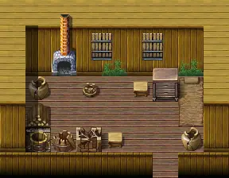
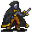

# Wild6 house

| | |
|---|---|
| **Map ID** | `wild6_house` |
| **Region** | In Blackwater Mountain (other) |
| **Type** | Indoors / underground |
| **Size** | 9×7 tiles |
| **Introduced** | v0.7.0 or earlier |
| **NPCs** | 3 |
| **Quests** | 1 |

**Wild6 house** is an indoor map, in Blackwater Mountain (other). It has 3 NPCs, and no enemies. Exits lead to Wild6, Wild6 house basement.

## Map

<label class="lg"><input type="checkbox" data-t="spawn" checked><b>Red</b>&nbsp;Monsters / NPCs</label><label class="lg"><input type="checkbox" data-t="mapchange" checked><b>Blue</b>&nbsp;Exit to another map</label><label class="lg"><input type="checkbox" data-t="container" checked><b>Yellow</b>&nbsp;Container (click to see contents)</label><label class="lg"><input type="checkbox" data-t="sign" checked><b>Purple</b>&nbsp;Sign</label><label class="lg"><input type="checkbox" data-t="rest" checked><b>Green</b>&nbsp;Resting place</label><label class="lg"><input type="checkbox" data-t="key" checked><b>Orange dashed</b>&nbsp;Blocked until a quest step / item</label><label class="lg"><input type="checkbox" data-t="script"><b>Grey dotted</b>&nbsp;Scripted event</label><label class="lg"><input type="checkbox" data-t="replace"><b>White dotted</b>&nbsp;Changes during a quest</label><label class="lg"><input type="checkbox" data-t="pin" checked><b>Numbers</b>&nbsp;Numbered key points (see the key below the map)</label>

<a class="pin pin-exit" href="#key-1" style="left:72.222%;top:92.857%" title="Exit (south): to [Wild6](wild6.md)">1</a><a class="pin pin-exit" href="#key-2" style="left:16.667%;top:78.571%" title="Exit (southwest): to [Wild6 house basement](wild6_house_basement.md)">2</a><a id="pin-npc-alaric_wild6house" class="pin pin-npc" href="#key-3" style="left:27.778%;top:50.000%" title="[Alaric](../../monsters/aidem_base_alaric.md#v-alaric_wild6house): NPC">3</a><a id="pin-npc-defy_wild6house" class="pin pin-npc" href="#key-4" style="left:50.000%;top:50.000%" title="[Defy](../../monsters/g04_defy.md#v-defy_wild6house): 1 quest">4</a><a id="pin-npc-wild6_house_thief" class="pin pin-npc" href="#key-5" style="left:27.778%;top:64.286%" title="[Rennik](../../monsters/wild6_house_thief.md): 1 quest">5</a><a class="pin pin-script" href="#key-6" style="left:33.384%;top:73.687%" title="Quest trigger: Scripted event: advances the quest: Wanted men to stage 77 (“I&#x27;ve unlocked the hatch leading to the vault. It&#x27;s time to head down.”)">6</a><a class="pin pin-key" href="#key-7" style="left:17.398%;top:67.858%" title="Blocked passage: Unlocked during the quest: Wanted men (stage 30: “Defy has asked me to convince Troublemaker to let me borrow the key long enough that I can bring it back to Defy.”)">7</a><a class="pin pin-replace" href="#key-8" style="left:22.273%;top:87.973%" title="Changes during a quest: This area changes during the quest: Wanted men (stage 30: “Defy has asked me to convince Troublemaker to let me borrow the key long enough that I can bring it back to Defy.”)">8</a><a class="pin pin-replace" href="#key-9" style="left:6.888%;top:76.348%" title="Changes during a quest: This area changes during the quest: Wanted men (stage 77: “I&#x27;ve unlocked the hatch leading to the vault. It&#x27;s time to head down.”)">9</a>

??? abstract "Key to the numbers on the map"

    | # | What | Details |
    |---|---|---|
    | 1 | Exit (south) | to [Wild6](wild6.md) |
    | 2 | Exit (southwest) | to [Wild6 house basement](wild6_house_basement.md) |
    | 3 | [Alaric](../monsters/aidem_base_alaric.md#v-alaric_wild6house) | NPC |
    | 4 | [Defy](../monsters/g04_defy.md#v-defy_wild6house) | 1 quest |
    | 5 | [Rennik](../monsters/wild6_house_thief.md) | 1 quest |
    | 6 | Quest trigger | Scripted event: advances the quest: Wanted men to stage 77 (“I've unlocked the hatch leading to the vault. It's time to head down.”) |
    | 7 | Blocked passage | Unlocked during the quest: Wanted men (stage 30: “Defy has asked me to convince Troublemaker to let me borrow the key long enough that I can bring it back to Defy.”) |
    | 8 | Changes during a quest | This area changes during the quest: Wanted men (stage 30: “Defy has asked me to convince Troublemaker to let me borrow the key long enough that I can bring it back to Defy.”) |
    | 9 | Changes during a quest | This area changes during the quest: Wanted men (stage 77: “I've unlocked the hatch leading to the vault. It's time to head down.”) |

Verified against v0.8.18 map data.

## Connections

| Direction | Leads to | Region there | Map # |
|---|---|---|---|
| South | [Wild6](wild6.md) | Blackwater Mountain | 1 |
| Southwest | [Wild6 house basement](wild6_house_basement.md) | Blackwater Mountain | 2 |

## NPCs

- [Alaric](../monsters/aidem_base_alaric.md#v-alaric_wild6house) (#3)
- [Defy](../monsters/g04_defy.md#v-defy_wild6house) — quests: [Wanted men](../quests/wanted_men.md) (#4)
- [Rennik](../monsters/wild6_house_thief.md) — quests: [Wanted men](../quests/wanted_men.md) (#5)

## Quests

- [Wanted men](../quests/wanted_men.md): [Defy](../monsters/g04_defy.md#v-defy_wild6house) is involved; [Rennik](../monsters/wild6_house_thief.md) is involved; blocked passage opens at stage 30; part of the map changes at stage 30; part of the map changes at stage 77; something on this map advances it; stepping on a trigger here sets stage 77
- [Sutdove_nondisplay (hidden flag)](../quests/sutdover_hidden.md): [Rennik](../monsters/wild6_house_thief.md) is involved

## Points of interest

- **Quest trigger** (#6): Scripted event: advances the quest: Wanted men to stage 77 (“I've unlocked the hatch leading to the vault. It's time to head down.”)
- **Blocked passage** (#7): Unlocked during the quest: Wanted men (stage 30: “Defy has asked me to convince Troublemaker to let me borrow the key long enough that I can bring it back to Defy.”)
- **Changes during a quest** (#8): This area changes during the quest: Wanted men (stage 30: “Defy has asked me to convince Troublemaker to let me borrow the key long enough that I can bring it back to Defy.”)
- **Changes during a quest** (#9): This area changes during the quest: Wanted men (stage 77: “I've unlocked the hatch leading to the vault. It's time to head down.”)

## Version history

| Version | Change |
|---|---|
| [v0.7.0](../versions/0.7.0.md) | Present in v0.7.0 (earliest release tracked) |
| [v0.7.1](../versions/0.7.1.md) | map layout or objects changed |
| [v0.7.2](../versions/0.7.2.md) | map layout or objects changed |
| [v0.8.2](../versions/0.8.2.md) | map layout or objects changed |
| [v0.8.8](../versions/0.8.8.md) | map layout or objects changed |
| [v0.8.12.1](../versions/0.8.12.1.md) | map layout or objects changed |

Verified against v0.8.18 and every earlier release back to v0.7.0 (game data compared release by release).

## Community notes

<small>Written by players, not generated from game data. **Observations**: what players notice in-game · **Lore**: the in-world story · **Trivia**: real-world facts, references, development history · **Theory / speculation**: unconfirmed ideas; may just be unfinished content</small>

### Observations

*No notes yet. Contributions are welcome: [add a note](https://github.com/asdfghjkl628/Andor-s-Trail-Wikiiii/new/main/notes/maps?filename=wild6_house.md&value=%23%23%20Observations%0A%0A%3C%21--%20what%20players%20notice%20in-game%20--%3E%0A%0A%23%23%20Lore%0A%0A%3C%21--%20the%20in-world%20story%20--%3E%0A%0A%23%23%20Trivia%0A%0A%3C%21--%20real-world%20facts%2C%20references%2C%20development%20history%20--%3E%0A%0A%23%23%20Theory%20/%20speculation%0A%0A%3C%21--%20unconfirmed%20ideas%3B%20may%20just%20be%20unfinished%20content%20--%3E%0A).*

### Lore

*No notes yet. Contributions are welcome: [add a note](https://github.com/asdfghjkl628/Andor-s-Trail-Wikiiii/new/main/notes/maps?filename=wild6_house.md&value=%23%23%20Observations%0A%0A%3C%21--%20what%20players%20notice%20in-game%20--%3E%0A%0A%23%23%20Lore%0A%0A%3C%21--%20the%20in-world%20story%20--%3E%0A%0A%23%23%20Trivia%0A%0A%3C%21--%20real-world%20facts%2C%20references%2C%20development%20history%20--%3E%0A%0A%23%23%20Theory%20/%20speculation%0A%0A%3C%21--%20unconfirmed%20ideas%3B%20may%20just%20be%20unfinished%20content%20--%3E%0A).*

### Trivia

*No notes yet. Contributions are welcome: [add a note](https://github.com/asdfghjkl628/Andor-s-Trail-Wikiiii/new/main/notes/maps?filename=wild6_house.md&value=%23%23%20Observations%0A%0A%3C%21--%20what%20players%20notice%20in-game%20--%3E%0A%0A%23%23%20Lore%0A%0A%3C%21--%20the%20in-world%20story%20--%3E%0A%0A%23%23%20Trivia%0A%0A%3C%21--%20real-world%20facts%2C%20references%2C%20development%20history%20--%3E%0A%0A%23%23%20Theory%20/%20speculation%0A%0A%3C%21--%20unconfirmed%20ideas%3B%20may%20just%20be%20unfinished%20content%20--%3E%0A).*

### Theory / speculation

*No notes yet. Contributions are welcome: [add a note](https://github.com/asdfghjkl628/Andor-s-Trail-Wikiiii/new/main/notes/maps?filename=wild6_house.md&value=%23%23%20Observations%0A%0A%3C%21--%20what%20players%20notice%20in-game%20--%3E%0A%0A%23%23%20Lore%0A%0A%3C%21--%20the%20in-world%20story%20--%3E%0A%0A%23%23%20Trivia%0A%0A%3C%21--%20real-world%20facts%2C%20references%2C%20development%20history%20--%3E%0A%0A%23%23%20Theory%20/%20speculation%0A%0A%3C%21--%20unconfirmed%20ideas%3B%20may%20just%20be%20unfinished%20content%20--%3E%0A).*

??? info "Technical information"

    | | |
    |---|---|
    | Map ID | `wild6_house` |
    | File | `res/xml/wild6_house.tmx` |
    | Size | 9×7 tiles (288×224 px) |
    | outdoors property | – |
    | Layers drawn | base, ground, objects, above |
    | Tilesets | map_bed_1, map_border_1, map_bridge_1, map_bridge_2, map_broken_1, map_cavewall_1, map_cavewall_2, map_cavewall_3, map_cavewall_4, map_chair_table_1, map_chair_table_2, map_crate_1, map_cupboard_1, map_curtain_1, map_entrance_1, map_entrance_2, map_fence_1, map_fence_2, map_fence_3, map_fence_4, map_ground_1, map_ground_2, map_ground_3, map_ground_4, map_ground_5, map_ground_6, map_ground_7, map_ground_8, map_house_1, map_house_2, map_indoor_1, map_indoor_2, map_kitchen_1, map_outdoor_1, map_pillar_1, map_pillar_2, map_plant_1, map_plant_2, map_rock_1, map_rock_2, map_roof_1, map_roof_2, map_roof_3, map_shop_1, map_sign_ladder_1, map_table_1, map_trail_1, map_transition_1, map_transition_2, map_transition_3, map_transition_4, map_transition_5, map_tree_1, map_tree_2, map_wall_1, map_wall_2, map_wall_3, map_wall_4, map_window_1, map_window_2 |
    | Map objects | spawn: 3, mapchange: 2, replace: 2, script: 1, key: 1 |
    | World map position | – |

<small>Data from v0.8.18</small>
