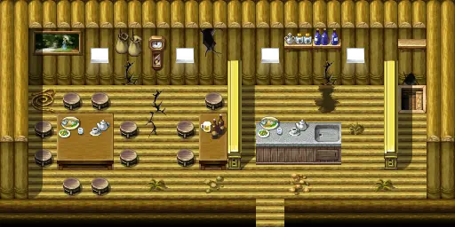

# Woodhouse2

16×8 tiles

<label class="lg lg-spawn"><input type="checkbox" data-t="spawn" checked> Monsters / NPCs</label><label class="lg lg-mapchange"><input type="checkbox" data-t="mapchange" checked> Exit to another map</label><label class="lg lg-container"><input type="checkbox" data-t="container" checked> Container</label><label class="lg lg-sign"><input type="checkbox" data-t="sign" checked> Sign</label><label class="lg lg-rest"><input type="checkbox" data-t="rest" checked> Resting place</label><label class="lg lg-key"><input type="checkbox" data-t="key" checked> Blocked / needs key or quest</label><label class="lg lg-script"><input type="checkbox" data-t="script"> Scripted event</label><label class="lg lg-replace"><input type="checkbox" data-t="replace"> Changes after a quest</label>

## Exits

- [Woodhouse3](woodhouse3.md)
- [Woodsettlement0](woodsettlement0.md)

## Monsters & NPCs here

| Name | HP |
|---|---|
| [Outcast](../monsters/smuggler2.md) | 0 |
| [Rat](../monsters/vermin0.md) | 0 |
| [Knight of Elythom](../monsters/burhczyd8e.md) | 0 |
| [Burhczyd](../monsters/burhczyd8.md) | 0 |
| [Outcast](../monsters/smuggler1.md) | 0 |
| [Lowyna](../monsters/lowyna.md) | 0 |
| [Roach](../monsters/vermin2.md) | 0 |
| [Rat](../monsters/vermin1.md) | 0 |

<small>Map ID: `woodhouse2` · Data from v0.8.18</small>
