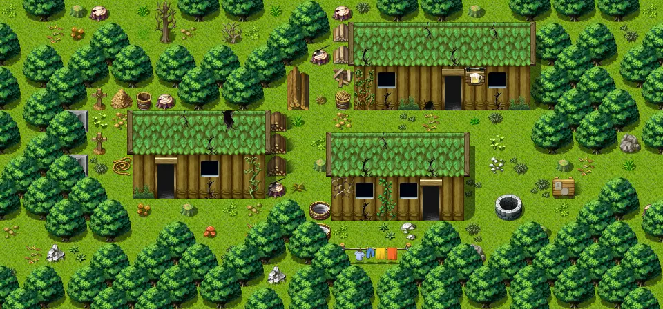
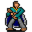

# Woodsettlement0

30×14 tiles · outdoors · part of [World1](index.md)

<label class="lg"><input type="checkbox" data-t="spawn" checked><b>Red</b>&nbsp;Monsters / NPCs</label><label class="lg"><input type="checkbox" data-t="mapchange" checked><b>Blue</b>&nbsp;Exit to another map</label><label class="lg"><input type="checkbox" data-t="container" checked><b>Yellow</b>&nbsp;Container (click to see contents)</label><label class="lg"><input type="checkbox" data-t="sign" checked><b>Purple</b>&nbsp;Sign</label><label class="lg"><input type="checkbox" data-t="rest" checked><b>Green</b>&nbsp;Resting place</label><label class="lg"><input type="checkbox" data-t="key" checked><b>Orange dashed</b>&nbsp;Blocked until a quest step / item</label><label class="lg"><input type="checkbox" data-t="script"><b>Grey dotted</b>&nbsp;Scripted event</label><label class="lg"><input type="checkbox" data-t="replace"><b>White dotted</b>&nbsp;Changes during a quest</label>

## Exits

- [Gapfillerhole](gapfillerhole.md)
- [Roadbeforecrossroads2](roadbeforecrossroads2.md)
- [Woodhouse0](woodhouse0.md)
- [Woodhouse1](woodhouse1.md)
- [Woodhouse2](woodhouse2.md)

## Monsters & NPCs here

| Name | HP |
|---|---|
| [Pig](../monsters/pig.md) | 0 |
| [Rat](../monsters/vermin1.md) | 0 |
| [Rat](../monsters/vermin0.md) | 0 |
| [Outcast](../monsters/smuggler6.md) | 0 |
| [Roach](../monsters/vermin2.md) | 0 |
| [Hagale](../monsters/algore.md) | 150 |

<small>Map ID: `woodsettlement0` · Data from v0.8.18</small>
